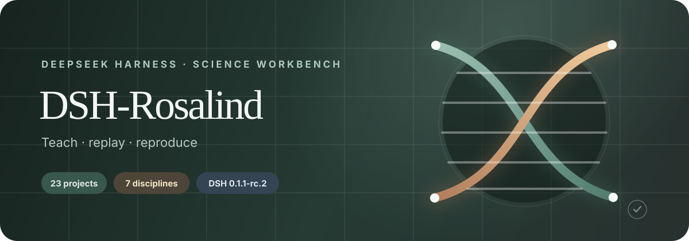
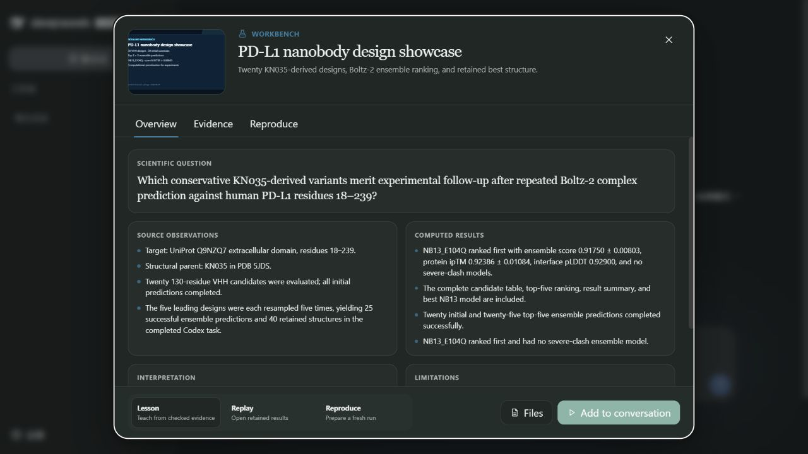
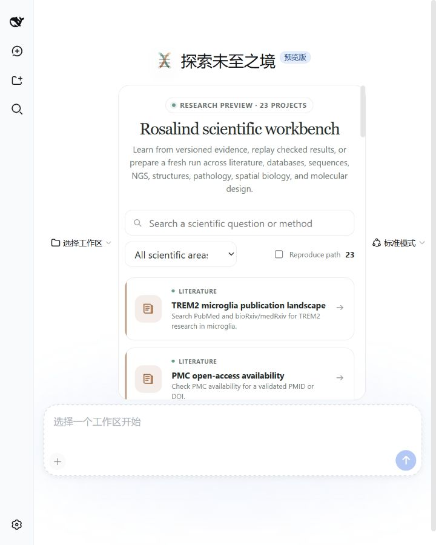

<div align="center">
  

  <p><strong>在 DSH Web 中浏览、讲解、回放并复现 23 个生命科学研究案例。</strong></p>
  <p><a href="README.md">English</a> · <a href="docs/showcases.md">案例目录</a> · <a href="docs/verification.md">验证记录</a></p>
</div>

## 项目简介

DSH-Rosalind 是面向 [DeepSeek Harness](https://github.com/deepseek-ai/deepseek-harness) `0.1.1-rc.2` 的原生科学工作台扩展。它把经过检查的研究案例带入 DSH Web，使任何人都能在一个会话中学习研究问题、查看历史结果，并在本机或已配置的服务上准备新的运行。

每个案例提供三种方式：

- **Lesson**：依次呈现来源观察、计算结果、科学解释、限制与引用。
- **Replay**：打开随版本发布且已经检查的文件和预览。
- **Reproduce**：检查数据、软件、凭据与计算资源，生成步骤清楚的运行计划。

首个版本包含七个科学类别、23 个 ready 案例，以及案例清单引用的 148 个文件。案例内容固定到 `rosalind-science-showcases` 提交 `f81e668c69edbfe7863cc936f2d535b61d8df76b`。

## DSH Web 实际界面

以下截图来自安装到全新 DSH `0.1.1-rc.2` Web 配置后的正式安装包。

| 浅色项目目录 | 深色 PD-L1 详情 |
|---|---|
|  |  |

在 720 像素宽的桌面窗口中，DSH 侧栏自动收起，项目变为单列，并保持无横向滚动。

<p align="center"></p>

## 十分钟开始使用

准备 Node.js 20 或更新版本，并安装准确的 DSH 版本：

```powershell
npm install --global @deepseek-ai/dsh@0.1.1-rc.2 pnpm
dsh --version
```

从 [v0.1.0 Release](https://github.com/ZiChenWang114514/DSH-Rosalind/releases/tag/v0.1.0) 下载 `zichenwang114514-dsh-rosalind-0.1.0.tgz`，然后安装到 DSH Web：

```powershell
dsh plugin --profile web add C:\Downloads\zichenwang114514-dsh-rosalind-0.1.0.tgz
dsh web --no-open
```

打开 DSH 输出的地址。空白会话会显示项目目录；选择案例和 Lesson、Replay 或 Reproduce 后，点击 **Add to conversation**。教学提示会先进入会话输入框，您可以检查后再发送。

从源码构建也很直接：

```powershell
git clone https://github.com/ZiChenWang114514/DSH-Rosalind.git
cd DSH-Rosalind
npm ci
npm run pack:bundle
dsh plugin --profile web add .\zichenwang114514-dsh-rosalind-0.1.0.tgz
```

## 23 个案例

| 类别 | 数量 | 内容 |
|---|---:|---|
| 文献 | 3 | TREM2、PMC 开放获取、预印本与正式发表关联 |
| 数据库 | 3 | IL6R 与哮喘、变异解释、EGFR 知识图谱 |
| 序列 | 3 | Lambda 注释、RAS 比对、FASTQ 质量分析 |
| NGS | 3 | FASTQ、bulk RNA-seq、single-cell RNA-seq 工作流准备 |
| 分子结构 | 3 | MDM2–p53、腺苷酸激酶、GFP 图像与接触分析 |
| 病理与空间组学 | 4 | 全切片、空间表达、分割叠加、研究导出 |
| Workbench | 4 | PD-L1 纳米抗体设计及三个科学分析启动案例 |

完整 ID、历史结果和运行要求见[案例目录](docs/showcases.md)。

## 运行与服务

历史教学和回放不需要凭据。新的运行可以使用本地算法、公共数据库、容器、SSH/HPC，以及可选的 Boltz、Biohub ESM、Modal 或 Runpod。涉及付费服务、GPU、远程计算或外部文件写入时，界面会列出服务、资源与费用估计，并等待用户确认。服务失败后会保留原先的选择并给出诊断信息。

运行模型可选择 DeepSeek V4 Flash 或 V4 Pro；这项选择影响会话中的讲解方式，不会改变已发布的科学文件。配置说明见[服务与计算资源](docs/providers.md)。

## 科学与工程验证

```powershell
npm run validate:showcases
npm run typecheck
npm test
npm run build
npm run check:bundle
npm run test:e2e
```

发布验证会从保留文件重新计算 RAS 比对、FASTQ 质量、结构接触、空间组学导出和 PD-L1 候选统计。详细数值、视觉尺寸与 DSH 安装检查见[验证记录](docs/verification.md)。

## 许可

源代码采用 [Apache-2.0](LICENSE)。项目编写的文档与视觉资源采用 [CC BY 4.0](LICENSE-DOCS)。公共科学数据继续遵循原始来源的许可和引用要求，详见 [THIRD_PARTY_NOTICES.md](THIRD_PARTY_NOTICES.md) 与各案例的 provenance 文件。
