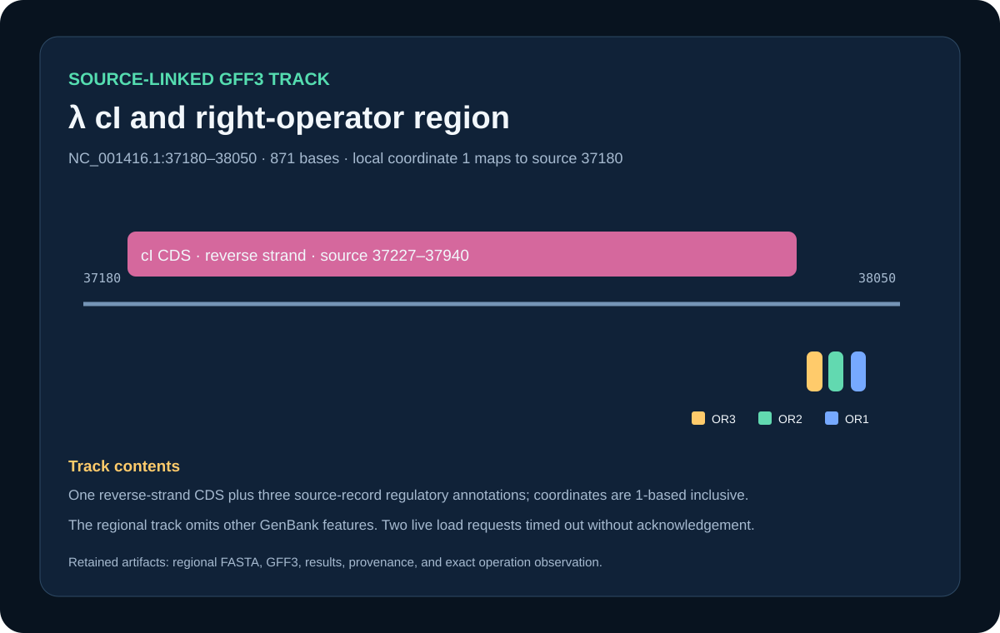

# Codex showcase lesson: Annotation and evidence tracks

## Session prompt

Use $showcase-teacher to import and teach the ready showcase `sequence-annotation-track` (Annotation and evidence tracks). Inspect its README, manifest, prompt, inputs, outputs, previews, and provenance records. Clearly distinguish source observations, computed results, scientific interpretation, and limitations, and show the preview when useful.

## Catalogue record

- Showcase ID: `sequence-annotation-track`
- Plugin: `biological-sequence-viewer` (Biological Sequence & Alignment Viewer v0.1.43)
- Status: `ready`
- Domain: `structure-and-sequence`
- Case type: `analysis`
- Difficulty: `advanced`
- Evidence level: `multi-tool-result`
- Covered operations: `rosalind.rosalind_open`
- Rosalind tasks: none recorded
- Actual tools: `Python 3 standard library`, `Rosalind Workbench mcp__rosalind__rosalind_open`, `Biological Sequence & Alignment Viewer 0.1.43 diagnostic attempts recorded in outputs/viewer-operation-evidence.json`
- Summary: How can public annotations and a regional evidence track be attached and queried?
- Recorded next step: Re-extract the NC_001416.1 regional FASTA and source-linked GFF3 features, then query their coordinate agreement.
- Plugin guide: `showcases/biological-sequence-viewer/README.md`

## Repository files to inspect

- case guide: `showcases/biological-sequence-viewer/cases/sequence-annotation-track/README.md`
- case manifest: `showcases/biological-sequence-viewer/cases/sequence-annotation-track/showcase.json`
- teaching prompt: `showcases/biological-sequence-viewer/cases/sequence-annotation-track/prompt.md`
- input: `showcases/biological-sequence-viewer/cases/sequence-annotation-track/inputs/public-source.md`
- input: `showcases/biological-sequence-viewer/cases/sequence-annotation-track/inputs/NC_001416.1-region-37180-38050.fasta`
- input: `showcases/biological-sequence-viewer/cases/sequence-annotation-track/inputs/NC_001416.1-region-37180-38050.gff3`
- output: `showcases/biological-sequence-viewer/cases/sequence-annotation-track/outputs/annotation-summary.csv`
- output: `showcases/biological-sequence-viewer/cases/sequence-annotation-track/outputs/annotation-track.json`
- output: `showcases/biological-sequence-viewer/cases/sequence-annotation-track/outputs/provenance.json`
- output: `showcases/biological-sequence-viewer/cases/sequence-annotation-track/outputs/sequence-load-track-observation.json`
- output: `showcases/biological-sequence-viewer/cases/sequence-annotation-track/outputs/rosalind-open-observation.json`
- output: `showcases/biological-sequence-viewer/cases/sequence-annotation-track/outputs/viewer-operation-evidence.json`
- preview: `showcases/biological-sequence-viewer/cases/sequence-annotation-track/previews/preview.svg`
- provenance reference: `showcases/biological-sequence-viewer/cases/sequence-annotation-track/build_case.py`

## Public sources

- https://eutils.ncbi.nlm.nih.gov/entrez/eutils/efetch.fcgi?db=nuccore&id=NC_001416.1&rettype=gbwithparts&retmode=text

## Retained case guide

# Source-linked λ cI annotation track



## Scientific question

Can a compact regional FASTA and GFF3 track preserve the exact source coordinates and strand of λ cI and the three right-operator annotations?

## Source observations

- The repository's NCBI RefSeq record `NC_001416.1` is 48,502 bases and has SHA-256 `3c624302adeeb3c00649f549903ab781b9e75bab16069ae655833d536407367f`.
- The source record annotates cI as `complement(37227..37940)`.
- OR3, OR2, and OR1 occur at 37951–37967, 37974–37990, and 37998–38014.

## Derived regional track

`build_case.py` extracts source bases 37180–38050, producing an 871-base FASTA. The GFF3 uses local coordinates with `local = source − 37180 + 1`:

| Feature | Local coordinates | Source coordinates | Strand |
| --- | ---: | ---: | :---: |
| cI CDS | 48–761 | 37227–37940 | − |
| OR3 | 772–788 | 37951–37967 | + |
| OR2 | 795–811 | 37974–37990 | + |
| OR1 | 819–835 | 37998–38014 | + |

Each GFF3 feature retains `source_accession` and `source_location` attributes. The regional sequence SHA-256 is `6b71822a19e6ca619f500720078e49c424a45d4c7f59d764f71ccb1b3f5f6842`.

## Rosalind Workbench observation

`mcp__rosalind__rosalind_open` was genuinely invoked with a case-specific task context at `2026-08-29T17:56:31.789Z`. The exact response, arguments, UTC/local times, and `scientific_job_executed: false` are retained in `outputs/rosalind-open-observation.json`. The call opened only the task chooser; it did not receive the λ sequence or GFF3 track.

## Viewer operation observation

Two read-only attempts were made on 2026-08-30 local time. Each `mcp__sequence_viewer__sequence_open_from_chat` call created a new authorized session for the regional FASTA while reporting `viewerReady: false`. In the fresh attempt, a `records` readiness query, the GFF3 load request, and the subsequent `tracks` query each returned: “The viewer did not acknowledge the requested action before the timeout.”

The FASTA and GFF3 are structurally compatible: the FASTA record and every GFF3 `seqid` are exactly `NC_001416.1_region_37180_38050`, the 1–871 sequence-region matches the 871-base reference, and all four feature intervals lie within it. Exact non-sensitive arguments, responses, UTC/local timestamps, compatibility checks, public source, read-only safety note, and limitations are retained in `outputs/sequence-load-track-observation.json`; internal session identifiers are omitted. Because neither load request nor either follow-up query returned mapping diagnostics or track state, this case does not claim `sequence-viewer.sequence_load_track` coverage.

## Reproduce

```powershell
python showcases/biological-sequence-viewer/cases/sequence-annotation-track/build_case.py
```

Inspect the regional FASTA, GFF3, `outputs/annotation-summary.csv`, `outputs/annotation-track.json`, and `outputs/sequence-load-track-observation.json`.

## Limitations

The regional GFF3 intentionally contains only cI and OR3/OR2/OR1. It is not a complete conversion of every GenBank feature, and the preview is a project graphic rather than a Viewer capture. Both live load operations timed out without acknowledgement, so the record does not prove that the track was parsed, mapped, displayed, or retained.

## Viewer operation review (2026-08-30)

No Sequence Viewer operation is recorded as successful. Server sessions were created for the relevant local public files, but subsequent queries or controls were not acknowledged. `outputs/viewer-operation-evidence.json` separates failed calls from actions that were not attempted after the prerequisite confirmation failed. It omits session identifiers, private paths, and internal resource URIs.

## Retained execution prompt

# Prompt

From the verified NCBI RefSeq record NC_001416.1, extract bases 37180–38050 and create a regional GFF3 track for the reverse-strand cI CDS plus OR3, OR2, and OR1. Invoke `mcp__rosalind__rosalind_open` with this case's task context, cite `outputs/rosalind-open-observation.json`, and state that the chooser response does not prove a scientific job ran. Retain source and local 1-based coordinates, strand, accession provenance, exact checksums, and limitations. Inspect `outputs/sequence-load-track-observation.json` for both genuine Viewer attempts, FASTA/GFF3 compatibility checks, exact non-sensitive `sequence_load_track` arguments, timeout responses, follow-up queries, timestamps, source, and limitations. Internal Viewer session identifiers are omitted from public artifacts. Do not claim the track loaded unless a later acknowledged response supplies mapping diagnostics and live track state.

## Teaching note

Use this bundle to locate the evidence. Read the listed repository artifacts before presenting scientific claims, and keep observations, calculations, interpretation, and limitations distinct.
