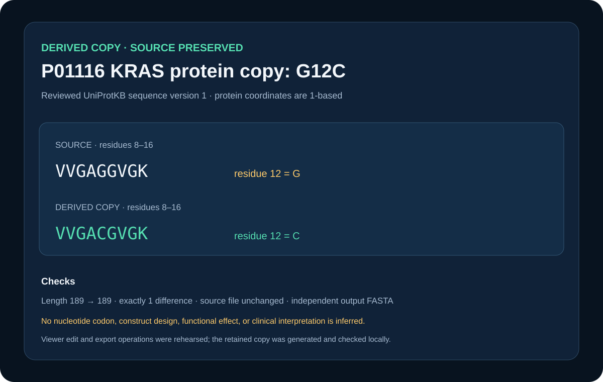

# Verified KRAS G12C protein copy edit



## Scientific question

Can residue 12 of reviewed human KRAS be changed from glycine to cysteine in a derived protein-sequence copy while proving that the source remains unchanged?

## Source observations

- The source is UniProtKB P01116, sequence version 1, extracted without gaps from the verified RAS alignment.
- The source has 189 residues and residue 12 is glycine.
- Its sequence SHA-256 is `1d5a9ab11f64cb886d8ffa08a153c412b2d190fcf70e5690cd4b4c7efcdee53a`.

## Copy transformation and checks

`build_case.py` writes a standalone source FASTA, creates a new `P01116_G12C_COPY` record, and replaces only residue 12. The checks verify:

- length 189 before and after;
- exactly one difference, G12C;
- source-file SHA-256 unchanged during the transformation;
- distinct source and derived FASTA files;
- source and copy sequence digests retained in JSON.

The one-row change record is available as `outputs/before-after.csv`; full checks are in `outputs/edit-checks.json`.

## Rosalind Workbench observation

`mcp__rosalind__rosalind_open` was genuinely invoked with a case-specific task context at `2026-08-29T17:56:31.828Z`. The exact response, arguments, UTC/local times, and `scientific_job_executed: false` are retained in `outputs/rosalind-open-observation.json`. The call opened only the task chooser; it did not submit P01116 or create or export the G12C copy.

## Viewer rehearsal

The retained copy was generated with local Python. No successful Viewer copy edit or export was found, so neither operation is listed as a capability.

## Reproduce

```powershell
python showcases/biological-sequence-viewer/cases/sequence-edit-copy/build_case.py
```

## Limitations

This is a protein-sequence teaching copy. It does not specify a nucleotide codon, cloning strategy, expression construct, biochemical effect, structural effect, or clinical interpretation.

## Viewer operation review (2026-08-30)

No Sequence Viewer operation is recorded as successful. Server sessions were created for the relevant local public files, but subsequent queries or controls were not acknowledged. `outputs/viewer-operation-evidence.json` separates failed calls from actions that were not attempted after the prerequisite confirmation failed. It omits session identifiers, private paths, and internal resource URIs.
