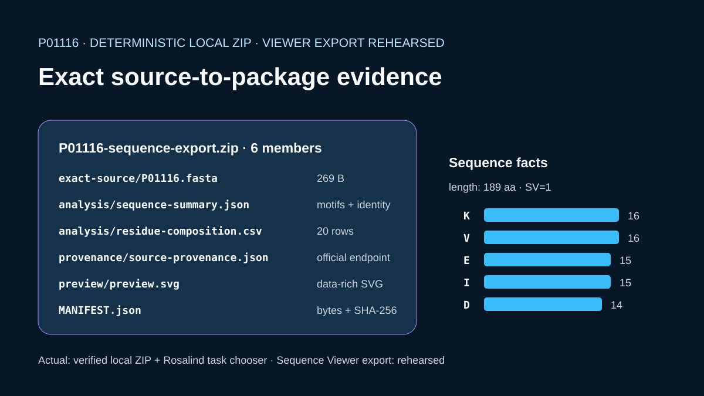

# Codex showcase lesson: Sequence research export

## Session prompt

Use $showcase-teacher to import and teach the ready showcase `sequence-export-package` (Sequence research export). Inspect its README, manifest, prompt, inputs, outputs, previews, and provenance records. Clearly distinguish source observations, computed results, scientific interpretation, and limitations, and show the preview when useful.

## Catalogue record

- Showcase ID: `sequence-export-package`
- Plugin: `biological-sequence-viewer` (Biological Sequence & Alignment Viewer v0.1.43)
- Status: `ready`
- Domain: `structure-and-sequence`
- Case type: `export`
- Difficulty: `intermediate`
- Evidence level: `multi-tool-result`
- Covered operations: `rosalind.rosalind_open`
- Rosalind tasks: none recorded
- Actual tools: `Rosalind Workbench mcp__rosalind__rosalind_open`, `UniProt REST and local Python`, `Biological Sequence & Alignment Viewer 0.1.43 diagnostic attempts recorded in outputs/viewer-operation-evidence.json`
- Summary: How can typed sequence, table, figure, and session artifacts be exported with provenance?
- Recorded next step: Inspect the deterministic P01116 ZIP and confirm that sequence, analysis, provenance, and preview files remain mutually consistent.
- Plugin guide: `showcases/biological-sequence-viewer/README.md`

## Repository files to inspect

- case guide: `showcases/biological-sequence-viewer/cases/sequence-export-package/README.md`
- case manifest: `showcases/biological-sequence-viewer/cases/sequence-export-package/showcase.json`
- teaching prompt: `showcases/biological-sequence-viewer/cases/sequence-export-package/prompt.md`
- input: `showcases/biological-sequence-viewer/cases/sequence-export-package/build_case.py`
- input: `showcases/biological-sequence-viewer/cases/sequence-export-package/inputs/public-source.md`
- input: `showcases/biological-sequence-viewer/cases/sequence-export-package/inputs/P01116.fasta`
- input: `showcases/biological-sequence-viewer/cases/sequence-export-package/inputs/source-provenance.json`
- output: `showcases/biological-sequence-viewer/cases/sequence-export-package/outputs/sequence-summary.json`
- output: `showcases/biological-sequence-viewer/cases/sequence-export-package/outputs/residue-composition.csv`
- output: `showcases/biological-sequence-viewer/cases/sequence-export-package/outputs/export-manifest.json`
- output: `showcases/biological-sequence-viewer/cases/sequence-export-package/outputs/P01116-sequence-export.zip`
- output: `showcases/biological-sequence-viewer/cases/sequence-export-package/outputs/rosalind-open-observation.json`
- output: `showcases/biological-sequence-viewer/cases/sequence-export-package/outputs/teaching-bundle.md`
- output: `showcases/biological-sequence-viewer/cases/sequence-export-package/outputs/viewer-operation-evidence.json`
- preview: `showcases/biological-sequence-viewer/cases/sequence-export-package/previews/preview.svg`

## Public sources

- https://rest.uniprot.org/uniprotkb/P01116.fasta

## Retained case guide

# Deterministic KRAS sequence export package



## Scientific question

Can an exact public sequence, deterministic analyses, source provenance, and a data-rich preview be assembled into one reproducible package whose members can be verified independently?

## Source observations

- The retained source is reviewed human KRAS `P01116`, sequence version 1, from the official UniProtKB FASTA endpoint.
- The exact FASTA response is 269 bytes and contains one 189-residue protein sequence.
- `inputs/source-provenance.json` records the endpoint, retrieval date, accession, sequence version, byte length, and response and sequence digests.

## Computed results

`build_case.py` validates the FASTA, calculates amino-acid composition, and verifies five KRAS coordinate-pinned sequence regions. Inspectable results are retained as `outputs/sequence-summary.json` and `outputs/residue-composition.csv`.

## Package contents

`outputs/P01116-sequence-export.zip` uses stored ZIP members, fixed `1980-01-01 00:00:00` member timestamps, fixed file permissions, and a fixed member order. It contains:

1. `exact-source/P01116.fasta`
2. `analysis/sequence-summary.json`
3. `analysis/residue-composition.csv`
4. `provenance/source-provenance.json`
5. `preview/preview.svg`
6. `MANIFEST.json`

`outputs/export-manifest.json` records every member's byte count and SHA-256 digest plus the final package byte count and digest. The member `MANIFEST.json` covers the five scientific payload files; self-reference is intentionally excluded.

## Viewer workflow status

The export package was created by local Python and is not presented as a viewer-published artifact. No successful Viewer operation produced or confirmed this P01116 package, so opening, analysis, export, and query are not listed as case capabilities.

## Observed Rosalind Workbench invocation

`mcp__rosalind__rosalind_open` was actually invoked for this case at `2026-08-29T17:59:09.829Z` (`2026-08-30T01:59:09+08:00`). It returned the exact message `Rosalind Workbench is ready. Choose a research task in the app.` and the launcher state had `ready=true`. The required record is retained in `outputs/rosalind-open-observation.json`. The invocation only opens the task chooser and does not prove scientific task execution; local Python remains the producer of every package member.

## Interpretation

The ZIP is a compact, independently inspectable teaching package whose source, calculations, provenance, and preview remain connected through exact digests. It is suitable for reproduction exercises, not experimental or clinical inference.

## Limitations

- The calculations are descriptive sequence checks and composition counts.
- ZIP determinism is established for the retained script and standard-library stored-member settings.
- No viewer session, private artifact store, or source-relative viewer publication was used.
- The Rosalind launcher did not produce or export any package member.

## Exact reproduction

From the repository root:

```powershell
python showcases/biological-sequence-viewer/cases/sequence-export-package/build_case.py
python scripts/showcase_session.py bundle sequence-export-package
```

Run the build twice and compare the package SHA-256 in `outputs/export-manifest.json`. The build also reopens the ZIP, verifies its ordered member names, checks every extracted byte string against the retained files, and refreshes all manifest byte counts and digests.

## Viewer operation review (2026-08-30)

No Sequence Viewer operation is recorded as successful. Server sessions were created for the relevant local public files, but subsequent queries or controls were not acknowledged. `outputs/viewer-operation-evidence.json` separates failed calls from actions that were not attempted after the prerequisite confirmation failed. It omits session identifiers, private paths, and internal resource URIs.

## Retained execution prompt

# Deterministic KRAS sequence export package

Package the exact public UniProtKB `P01116` `SV=1` FASTA together with a deterministic sequence summary, residue-composition CSV, Codex-authored source provenance, and a data-rich SVG preview. Use stable ZIP metadata, include a member manifest, verify every member after writing, and retain the final package digest. Invoke `mcp__rosalind__rosalind_open` once, preserve its exact task-chooser response with UTC and local timestamps in `outputs/rosalind-open-observation.json`, and state that it does not prove a Rosalind scientific run. Treat Sequence Viewer open, analysis, export, and query actions as rehearsed unless a mounted viewer produces the artifacts.

## Teaching note

Use this bundle to locate the evidence. Read the listed repository artifacts before presenting scientific claims, and keep observations, calculations, interpretation, and limitations distinct.
