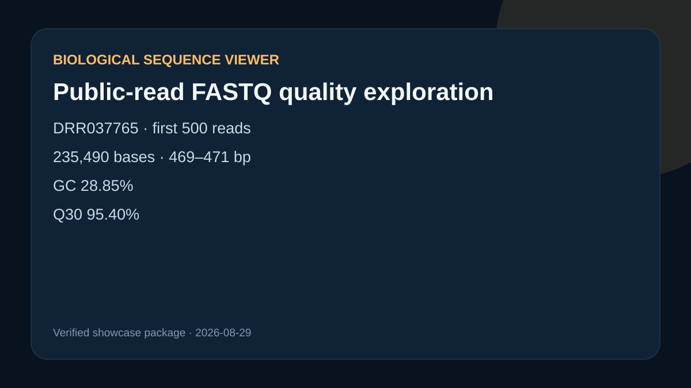

# Public-read FASTQ quality exploration

## Scientific question

What sequence composition and base-quality profile appears in a deterministic subset of a public long-read run?

## Source and method

The source is ENA run `DRR037765`. The preparation script reads the first 500 complete records, verifies sequence/quality length equality, and writes a canonical local subset. Large read files remain outside Git; `outputs/source-provenance.json` records the public URL, ENA MD5, transformation rule, byte count, and subset SHA-256.

## Computed results

- 500 reads and 235,490 bases
- length 469–471 bases
- GC 28.85%
- Q30 95.40%

These values describe this bounded subset only. They do not establish run-wide quality or suitability for a downstream assay.

## Rosalind Workbench observation

`mcp__rosalind__rosalind_open` was genuinely invoked with this case's task context at `2026-08-29T18:14:15.199Z`. It returned `Rosalind Workbench is ready. Choose a research task in the app.` with `ready=true`. The arguments, UTC and local timestamps, response, and `scientific_job_executed=false` are retained in `outputs/rosalind-open-observation.json` and cited by `outputs/provenance.json`. The call opened only the task chooser; the local preparation script produced the subset and quality metrics.

## Reproduce

Download the documented ENA object to the case input path and run `python scripts/prepare_sequence_examples.py`.

## Limitation

The current open attempt created a server session, but the bounded quality query timed out without acknowledgement. The visual is a project-owned numerical summary.

## Viewer operation review (2026-08-30)

No Sequence Viewer operation is recorded as successful. Server sessions were created for the relevant local public files, but subsequent queries or controls were not acknowledged. `outputs/viewer-operation-evidence.json` separates failed calls from actions that were not attempted after the prerequisite confirmation failed. It omits session identifiers, private paths, and internal resource URIs.
