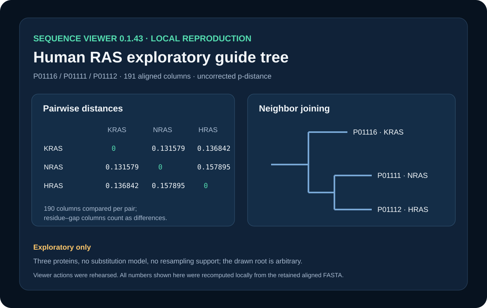

# Exploratory human RAS guide tree



## Scientific question

How do pairwise differences among reviewed human KRAS, NRAS, and HRAS sequences support a small exploratory guide tree?

## Source observations

- The retained aligned FASTA contains UniProtKB accessions P01116, P01111, and P01112, each at sequence version 1.
- Each protein has 189 ungapped residues; the deterministic center-star alignment has 191 columns.
- The aligned FASTA SHA-256 is `cb32dd89ca7855f7666fbdf3f2ff926f935b1dbc9e7f57573f884dda7e59c68f`.

## Computed results

`build_case.py` recalculates uncorrected p-distance. It excludes only a column containing gaps in both rows and counts a residue–gap comparison as different. Each pair therefore uses 190 columns.

- KRAS–NRAS: 25/190 = 0.1315789474
- KRAS–HRAS: 26/190 = 0.1368421053
- NRAS–HRAS: 30/190 = 0.1578947368

The exact three-taxon neighbor-joining limb solution is retained as CSV, JSON, and Newick. KRAS and NRAS are the closest pair under this method. The Newick root is placed halfway along the KRAS limb only for drawing; it has no biological rooting claim.

## Rosalind Workbench observation

`mcp__rosalind__rosalind_open` was genuinely invoked with a case-specific task context at `2026-08-29T17:56:31.751Z`. The exact response, arguments, UTC/local times, and `scientific_job_executed: false` are retained in `outputs/rosalind-open-observation.json`. The call opened only the task chooser; it did not compute the RAS distances or guide tree.

## Viewer rehearsal

Historical completed calls on the same retained alignment support opening, distance and tree analysis, result queries, and Newick export. No successful `sequence_align` or `sequence_restore_session` call was found, so those operations are not claimed. The current retry was not acknowledged and is recorded separately.

## Reproduce

From the repository root, run:

```powershell
python showcases/biological-sequence-viewer/cases/sequence-guide-tree/build_case.py
```

Then inspect `outputs/pairwise-distances.csv`, `outputs/analysis.json`, and `outputs/RAS-exploratory-NJ.nwk`.

## Interpretation and limitations

The result summarizes similarity among three paralogues under one simple distance rule. It is not a publication-grade phylogeny: there is no substitution model, outgroup, or resampling support, and three leaves provide little phylogenetic resolution.

## Viewer operation review (2026-08-30)

Historical completed calls recovered from source task `archived-sequence-viewer-task` support the capabilities listed in `showcase.json`. Exact non-sensitive arguments, response summaries, durations, source turn, and the retained scientific outputs are recorded in `outputs/viewer-operation-evidence.json`. The present retry did not receive viewer acknowledgement; it is recorded separately and does not alter the historical results.
