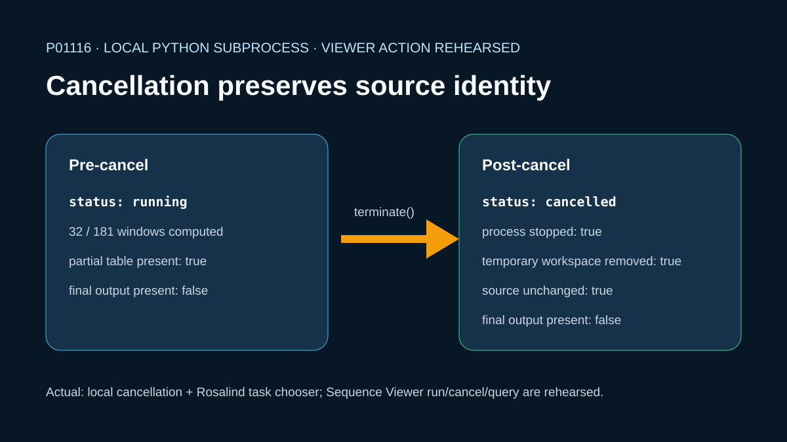

# Safe cancellation of a local KRAS analysis job



## Scientific question

Can a running sequence calculation be stopped without changing its source or leaving a partial result that could be mistaken for a completed analysis?

## Source observations

- The source is reviewed human KRAS `P01116`, sequence version 1, acquired from the official UniProtKB FASTA endpoint.
- The 269-byte FASTA contains one 189-residue sequence and is retained with a Codex-authored provenance record.

## Executed local cancellation

`build_case.py` starts a Python subprocess inside a temporary directory. The child computes the first 32 of 181 possible 9-residue sliding windows, writes a temporary partial table, records a running state, and waits. The parent observes that state, terminates the child, removes the temporary directory, verifies that no completed output exists, and checks that the source digest is unchanged.

The exact source-independent state is retained in:

- `outputs/pre-cancel-state.json`
- `outputs/post-cancel-state.json`
- `outputs/cancellation-receipt.json`

## Viewer workflow status

The local subprocess termination was actually executed. No successful Viewer analysis, cancellation, or job-query response was found, so those operations are not listed as case capabilities.

## Observed Rosalind Workbench invocation

`mcp__rosalind__rosalind_open` was actually invoked for this case at `2026-08-29T17:59:09.785Z` (`2026-08-30T01:59:09+08:00`). Its exact message was `Rosalind Workbench is ready. Choose a research task in the app.` and the returned launcher state had `ready=true`. The required case-specific record is `outputs/rosalind-open-observation.json`. This operation only opens the Rosalind task chooser and does not prove scientific task execution; the local subprocess state files remain the scientific evidence for cancellation.

## Interpretation

This case demonstrates a conservative cancellation property for a disposable local calculation: the source remains unchanged, the partial workspace is removed, and no final artifact is presented. It does not establish the behavior of a mounted Sequence Viewer job.

## Limitations

- The local 9-residue hydrophobic-count scan is a small teaching calculation, not a biological prediction.
- Operating-system process termination is tested through Python's `terminate()` method; the receipt intentionally omits process IDs, temporary paths, and wall-clock timing.
- Sequence Viewer cancellation remains unexecuted until repeated against an exact running viewer job ID.
- The observed Rosalind response confirms only task-chooser readiness; it contains no scientific job or result.

## Exact reproduction

From the repository root:

```powershell
python showcases/biological-sequence-viewer/cases/sequence-job-cancel/build_case.py
python scripts/showcase_session.py bundle sequence-job-cancel
```

The build exits only after it has observed the pre-cancel files, stopped the child, removed the temporary directory, verified source identity, regenerated the SVG, and refreshed manifest byte counts and digests.

## Viewer operation review (2026-08-30)

No Sequence Viewer operation is recorded as successful. Server sessions were created for the relevant local public files, but subsequent queries or controls were not acknowledged. `outputs/viewer-operation-evidence.json` separates failed calls from actions that were not attempted after the prerequisite confirmation failed. It omits session identifiers, private paths, and internal resource URIs.
