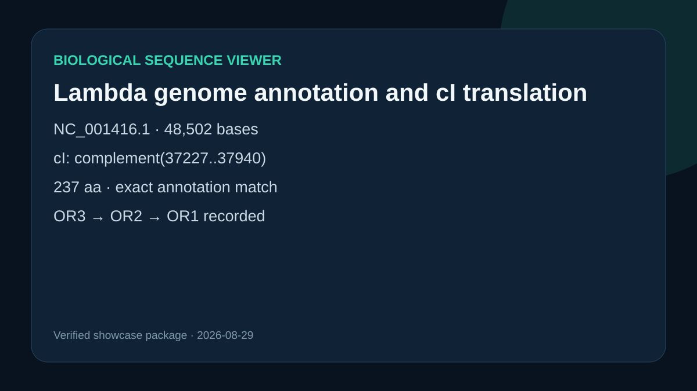

# Lambda genome annotation and cI translation

## Scientific question

Does the versioned λ genome record encode cI on the reverse strand exactly as annotated, and where are the three right-operator elements recorded?

## Source observations

- NCBI record `NC_001416.1` contains a 48,502-base genome.
- The cI CDS is `complement(37227..37940)`, uses translation table 11, and names protein `NP_040628.1`.
- The record annotates OR3, OR2, and OR1 at 37951–37967, 37974–37990, and 37998–38014.

## Computed result

`scripts/prepare_sequence_examples.py` extracted the 714-base interval, reverse-complemented it, translated it, removed the terminal stop, and recovered 237 residues. The sequence matches the GenBank translation exactly. Exact sequence digests are retained in `outputs/analysis.json`.

## Reproduce

Run `python scripts/prepare_sequence_examples.py`, then inspect `outputs/analysis.json` and the source record in `inputs/NC_001416.1.gb`.

## Limitation

The viewer session was created, but its card did not mount in this run. The preview is therefore a verified project summary, not a captured viewer image.
