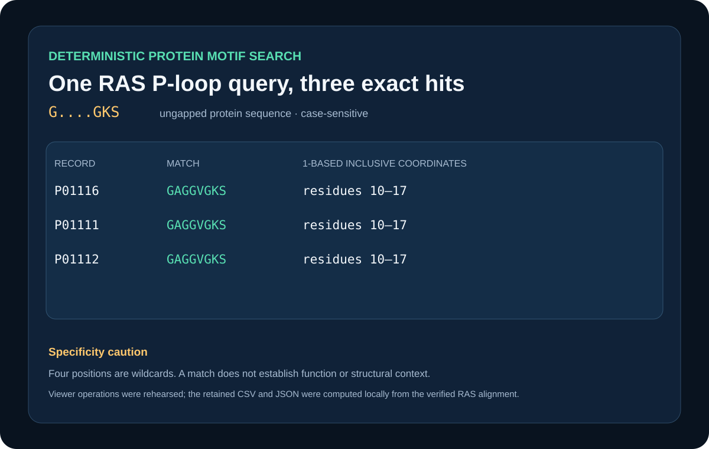

# Exact-coordinate RAS motif search



## Scientific question

Where does the compact protein query `G....GKS` occur in reviewed human KRAS, NRAS, and HRAS, and what can this search establish?

## Source observations

- The retained source is the verified P01116/P01111/P01112 aligned FASTA from `sequence-ras-alignment`.
- All three records are reviewed UniProtKB proteins at sequence version 1 and contain 189 ungapped residues.
- Searching is performed on each ungapped protein sequence; alignment coordinates are reported separately.

## Computed results

The case-sensitive regular expression `G....GKS` returns exactly three hits: one `GAGGVGKS` match per record. Every hit spans protein residues 10–17 and alignment columns 10–17, using 1-based inclusive coordinates. Exact rows are retained in `outputs/motif-hits.csv` and `outputs/motif-search.json`.

## False-positive cautions

Four of the eight positions are unconstrained. An unrelated protein can therefore match by chance. Sequence coincidence alone does not establish nucleotide binding, GTPase activity, or a conserved three-dimensional context. The search covers only these three curated RAS proteins and does not measure proteome-wide specificity.

## Rosalind Workbench observation

`mcp__rosalind__rosalind_open` was genuinely invoked with a case-specific task context at `2026-08-29T17:56:31.771Z`. `outputs/rosalind-open-observation.json` preserves the exact response, arguments, UTC/local times, and `scientific_job_executed: false`. The call opened only the task chooser; it did not search the RAS sequences or create motif hits.

## Viewer rehearsal

The local regular-expression scan remains the case's primary scientific calculation. Historical Viewer controls and column queries independently confirmed the same RAS intervals; no Viewer cancellation or generic analysis capability is claimed for this case.

## Reproduce

```powershell
python showcases/biological-sequence-viewer/cases/sequence-motif-search/build_case.py
```

Compare the retained CSV and JSON; both must report one residue-10–17 hit in each accession.

## Interpretation

The result confirms exact conservation of this short sequence segment in the three retained records. Functional interpretation still depends on broader sequence, structural, and experimental evidence.

## Viewer operation review (2026-08-30)

Historical completed calls recovered from source task `archived-sequence-viewer-task` support the capabilities listed in `showcase.json`. Exact non-sensitive arguments, response summaries, durations, source turn, and the retained scientific outputs are recorded in `outputs/viewer-operation-evidence.json`. The present retry did not receive viewer acknowledgement; it is recorded separately and does not alter the historical results.
