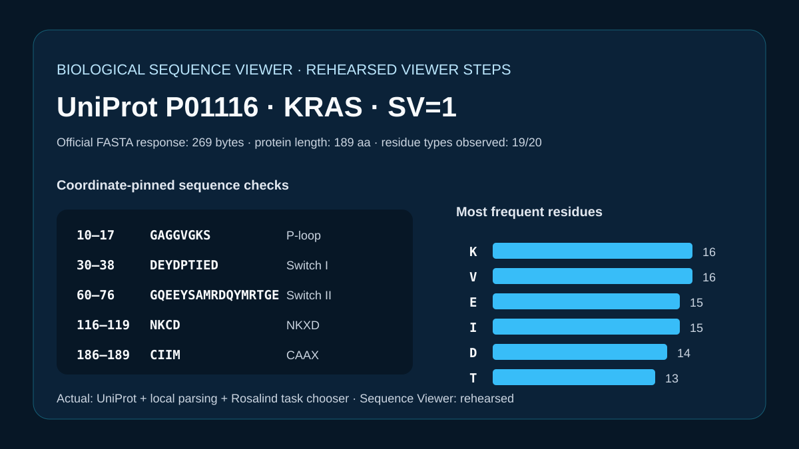

# Codex showcase lesson: Public sequence example acquisition

## Session prompt

Use $showcase-teacher to import and teach the ready showcase `sequence-public-example` (Public sequence example acquisition). Inspect its README, manifest, prompt, inputs, outputs, previews, and provenance records. Clearly distinguish source observations, computed results, scientific interpretation, and limitations, and show the preview when useful.

## Catalogue record

- Showcase ID: `sequence-public-example`
- Plugin: `biological-sequence-viewer` (Biological Sequence & Alignment Viewer v0.1.43)
- Status: `ready`
- Domain: `structure-and-sequence`
- Case type: `interface`
- Difficulty: `beginner`
- Evidence level: `computed-result`
- Covered operations: `rosalind.rosalind_open`
- Rosalind tasks: none recorded
- Actual tools: `Rosalind Workbench mcp__rosalind__rosalind_open`, `UniProt REST and local Python`, `Biological Sequence & Alignment Viewer 0.1.43 diagnostic attempts recorded in outputs/viewer-operation-evidence.json`
- Summary: How can a bundled public example be acquired and opened with source metadata?
- Recorded next step: Revalidate the reviewed UniProt P01116 sequence length and version before opening the public KRAS example.
- Plugin guide: `showcases/biological-sequence-viewer/README.md`

## Repository files to inspect

- case guide: `showcases/biological-sequence-viewer/cases/sequence-public-example/README.md`
- case manifest: `showcases/biological-sequence-viewer/cases/sequence-public-example/showcase.json`
- teaching prompt: `showcases/biological-sequence-viewer/cases/sequence-public-example/prompt.md`
- input: `showcases/biological-sequence-viewer/cases/sequence-public-example/build_case.py`
- input: `showcases/biological-sequence-viewer/cases/sequence-public-example/inputs/public-source.md`
- input: `showcases/biological-sequence-viewer/cases/sequence-public-example/inputs/P01116.fasta`
- input: `showcases/biological-sequence-viewer/cases/sequence-public-example/inputs/source-provenance.json`
- output: `showcases/biological-sequence-viewer/cases/sequence-public-example/outputs/acquisition-analysis.json`
- output: `showcases/biological-sequence-viewer/cases/sequence-public-example/outputs/residue-composition.csv`
- output: `showcases/biological-sequence-viewer/cases/sequence-public-example/outputs/rosalind-open-observation.json`
- output: `showcases/biological-sequence-viewer/cases/sequence-public-example/outputs/teaching-bundle.md`
- output: `showcases/biological-sequence-viewer/cases/sequence-public-example/outputs/viewer-operation-evidence.json`
- preview: `showcases/biological-sequence-viewer/cases/sequence-public-example/previews/preview.svg`

## Public sources

- https://rest.uniprot.org/uniprotkb/P01116.fasta

## Retained case guide

# Versioned KRAS public-record acquisition



## Scientific question

Can a compact public protein record be acquired from its official endpoint, pinned to an accession and sequence version, and checked locally before it is opened in a sequence viewer?

## Source observations

- `inputs/P01116.fasta` is the reviewed human KRAS UniProtKB record `P01116`, sequence version 1.
- The retained official FASTA response is 269 bytes and contains one 189-residue protein sequence.
- `inputs/source-provenance.json` records the exact endpoint, response digest, sequence digest, retrieval date, and the Codex authorship of the provenance record.

## Computed results

`build_case.py` parses the retained FASTA without third-party packages, requires every observed symbol to belong to the 20 canonical amino-acid alphabet, counts all 20 residue types (including zero tryptophan), and verifies five named KRAS regions directly from the sequence. The sequence length, digests, motif coordinates, and composition are retained in `outputs/acquisition-analysis.json` and `outputs/residue-composition.csv`.

## Viewer workflow status

The intended viewer workflow includes public-example acquisition, opening, and record queries. The legacy acquisition route was unavailable, and the current open attempt was not confirmed by a follow-up query. None of these operations is listed as a case capability; the acquisition and calculations were performed with the official UniProt endpoint and local Python.

## Observed Rosalind Workbench invocation

`mcp__rosalind__rosalind_open` was actually invoked for this case at `2026-08-29T17:59:09.762Z` (`2026-08-30T01:59:09+08:00`). Its exact message was `Rosalind Workbench is ready. Choose a research task in the app.` and the returned launcher state had `ready=true`. The required case-specific record is retained in `outputs/rosalind-open-observation.json`. This operation only opens the Rosalind task chooser and does not prove scientific task execution; no Rosalind scientific result is claimed.

## Interpretation

The retained files provide a small, versioned example whose identity can be checked before any interactive viewing. The motif checks confirm sequence identity within this record; they do not test KRAS function.

## Limitations

- The endpoint is live. Reproduction must verify that the response still resolves to `P01116` with `SV=1` before comparing digests.
- The local motif checks are sequence-level checks only.
- Viewer loading, rendering, and interactive query results were not observed.
- The observed Rosalind response confirms only that the task chooser was ready.

## Exact reproduction

From the repository root:

```powershell
python showcases/biological-sequence-viewer/cases/sequence-public-example/build_case.py
python scripts/showcase_session.py bundle sequence-public-example
```

The first command validates the retained FASTA and regenerates the JSON, CSV, SVG, and manifest byte counts. To repeat network acquisition, fetch `https://rest.uniprot.org/uniprotkb/P01116.fasta`, require the exact `P01116`/`SV=1` header, and replace `inputs/P01116.fasta` only after the response identity has been checked.

## Viewer operation review (2026-08-30)

No Sequence Viewer operation is recorded as successful. Server sessions were created for the relevant local public files, but subsequent queries or controls were not acknowledged. `outputs/viewer-operation-evidence.json` separates failed calls from actions that were not attempted after the prerequisite confirmation failed. It omits session identifiers, private paths, and internal resource URIs.

## Retained execution prompt

# Versioned KRAS public-record acquisition

Acquire reviewed human KRAS `P01116` from the official UniProtKB FASTA endpoint, verify `SV=1`, retain exact response provenance, and compute sequence composition plus five coordinate-pinned motif checks locally. Invoke `mcp__rosalind__rosalind_open` once and retain its exact task-chooser response with UTC and local timestamps in `outputs/rosalind-open-observation.json`; state explicitly that this launcher invocation does not prove a Rosalind scientific run. Treat the Sequence Viewer acquisition, open, and query actions as rehearsed unless a mounted viewer supplies live results.

## Teaching note

Use this bundle to locate the evidence. Read the listed repository artifacts before presenting scientific claims, and keep observations, calculations, interpretation, and limitations distinct.
