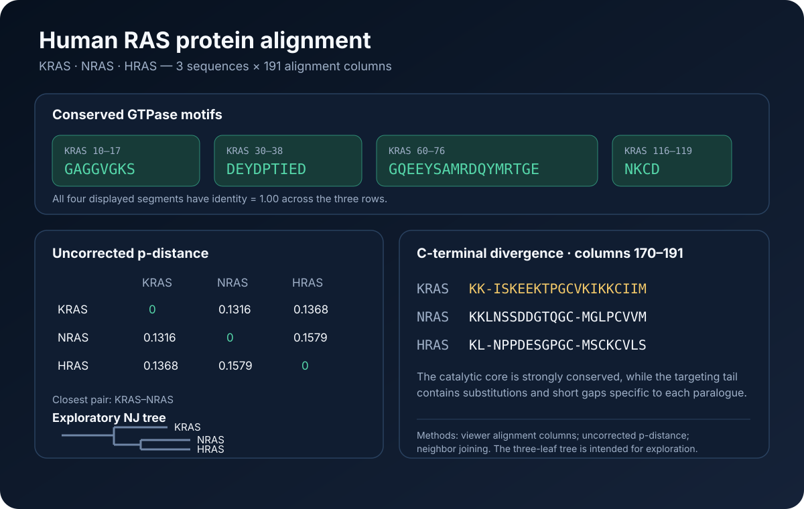

# Human RAS protein alignment

This ready showcase compares reviewed human KRAS, NRAS, and HRAS proteins in Biological Sequence & Alignment Viewer.

## Scientific question

How strongly is the shared RAS GTPase core conserved, and where do the three human paralogues differ most clearly?

## Source observations

- The aligned FASTA contains three 189-residue proteins and 191 alignment columns.
- The rows are P01116 (KRAS), P01111 (NRAS), and P01112 (HRAS), all UniProt sequence version 1.
- The mounted viewer reported mean identity 0.9284467713787081 and normalized conservation 0.6453400570165564 across the full alignment.

## Computed results

- P01116 was used as the reference row.
- KRAS positions 10–17, 30–38, 60–76, and 116–119 were identical across all three sequences in the displayed alignment.
- Pairwise uncorrected p-distances were 0.131579 for KRAS–NRAS, 0.136842 for KRAS–HRAS, and 0.157895 for NRAS–HRAS.
- The neighbor-joining result is stored in `outputs/RAS-P01116-P01111-P01112-NJ.nwk`; the matrix and analysis settings are in `outputs/analysis.json`.
- Columns 170–191 contain the clearest substitutions and short gaps, consistent with greater divergence in the C-terminal targeting region.

## Reproduce

1. Open `inputs/human-RAS-UniProt-SV1.aln-fasta` in Biological Sequence & Alignment Viewer.
2. Set P01116 as the reference row and enable protein-conservation coloring plus identity, gap, conservation, and sequence-logo tracks.
3. Inspect the four conserved KRAS intervals and the 170–191 C-terminal interval.
4. Run `distance-matrix` for all three rows.
5. Run `build-tree` with neighbor joining for the same row order.

## Interpretation

The shared GTPase core is highly conserved, whereas the C-terminal region carries more paralogue-specific sequence variation. The built-in three-sequence tree is an exploratory teaching aid and does not replace a phylogenetic analysis with an explicit substitution model and support assessment.
