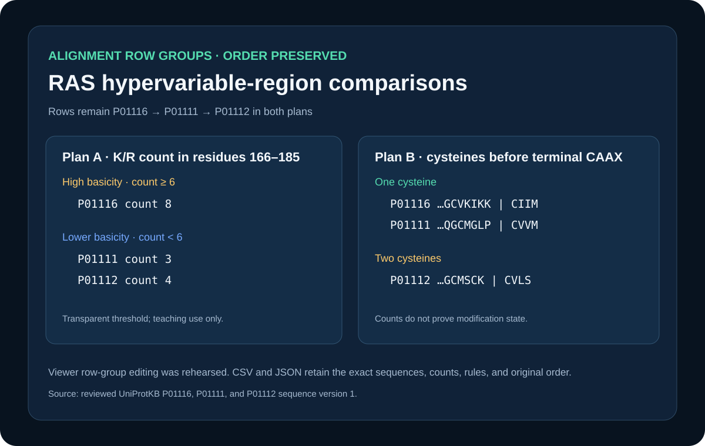

# Codex showcase lesson: Alignment row grouping

## Session prompt

Use $showcase-teacher to import and teach the ready showcase `sequence-row-groups` (Alignment row grouping). Inspect its README, manifest, prompt, inputs, outputs, previews, and provenance records. Clearly distinguish source observations, computed results, scientific interpretation, and limitations, and show the preview when useful.

## Catalogue record

- Showcase ID: `sequence-row-groups`
- Plugin: `biological-sequence-viewer` (Biological Sequence & Alignment Viewer v0.1.43)
- Status: `ready`
- Domain: `structure-and-sequence`
- Case type: `interface`
- Difficulty: `intermediate`
- Evidence level: `interface-observation`
- Covered operations: `rosalind.rosalind_open`
- Rosalind tasks: none recorded
- Actual tools: `Python 3 standard library`, `Rosalind Workbench mcp__rosalind__rosalind_open`, `Biological Sequence & Alignment Viewer 0.1.43 diagnostic attempts recorded in outputs/viewer-operation-evidence.json`
- Summary: How can rows be selected, grouped, hidden, and restored without changing matrix order?
- Recorded next step: Apply the retained HRAS, KRAS, and NRAS grouping plan and confirm that hiding and restoring rows preserves alignment order.
- Plugin guide: `showcases/biological-sequence-viewer/README.md`

## Repository files to inspect

- case guide: `showcases/biological-sequence-viewer/cases/sequence-row-groups/README.md`
- case manifest: `showcases/biological-sequence-viewer/cases/sequence-row-groups/showcase.json`
- teaching prompt: `showcases/biological-sequence-viewer/cases/sequence-row-groups/prompt.md`
- input: `showcases/biological-sequence-viewer/cases/sequence-row-groups/inputs/public-source.md`
- input: `showcases/biological-sequence-viewer/cases/sequence-row-groups/inputs/human-RAS-UniProt-SV1.aln-fasta`
- output: `showcases/biological-sequence-viewer/cases/sequence-row-groups/outputs/row-metrics-and-groups.csv`
- output: `showcases/biological-sequence-viewer/cases/sequence-row-groups/outputs/row-group-plan.json`
- output: `showcases/biological-sequence-viewer/cases/sequence-row-groups/outputs/provenance.json`
- output: `showcases/biological-sequence-viewer/cases/sequence-row-groups/outputs/rosalind-open-observation.json`
- output: `showcases/biological-sequence-viewer/cases/sequence-row-groups/outputs/viewer-operation-evidence.json`
- preview: `showcases/biological-sequence-viewer/cases/sequence-row-groups/previews/preview.svg`
- provenance reference: `showcases/biological-sequence-viewer/cases/sequence-row-groups/build_case.py`

## Public sources

- https://rest.uniprot.org/uniprotkb/P01116.fasta
- https://rest.uniprot.org/uniprotkb/P01111.fasta
- https://rest.uniprot.org/uniprotkb/P01112.fasta

## Retained case guide

# Sequence-derived RAS row groups



## Scientific question

Can human RAS alignment rows be grouped by explicit hypervariable-region features while preserving the original matrix order?

## Source observations

The retained alignment contains reviewed UniProtKB P01116, P01111, and P01112 at sequence version 1. Each ungapped protein has 189 residues. The original row order is P01116, P01111, P01112.

## Computed grouping plans

Two transparent plans are retained:

1. HVR basicity counts K or R in residues 166–185. P01116 has 8 and forms the `high-basicity` group; P01111 and P01112 have 3 and 4 and form `lower-basicity`.
2. Pre-CAAX cysteine count examines residues 166 through the residue before terminal positions 186–189. P01116 and P01111 each have one cysteine; P01112 has two.

`outputs/row-metrics-and-groups.csv` retains every sequence window, count, terminal CAAX segment, and assigned group. `outputs/row-group-plan.json` confirms the original row order is unchanged.

## Rosalind Workbench observation

`mcp__rosalind__rosalind_open` was genuinely invoked with a case-specific task context at `2026-08-29T17:56:31.809Z`. The exact response, arguments, UTC/local times, and `scientific_job_executed: false` are retained in `outputs/rosalind-open-observation.json`. The call opened only the task chooser; it did not submit the RAS alignment or create row groups.

## Viewer rehearsal

A live `sequence.edit_copy` row-group operation was not performed; no in-memory copy or source alignment was modified, and the operation is not listed as a case capability.

## Reproduce

```powershell
python showcases/biological-sequence-viewer/cases/sequence-row-groups/build_case.py
```

## Interpretation and limitations

These plans make contrasting C-terminal composition easy to inspect without changing row order. They are transparent teaching rules for three proteins, not learned classifiers. Residue counts alone do not establish post-translational modification, membrane localization, or evolutionary grouping.

## Viewer operation review (2026-08-30)

No Sequence Viewer operation is recorded as successful. Server sessions were created for the relevant local public files, but subsequent queries or controls were not acknowledged. `outputs/viewer-operation-evidence.json` separates failed calls from actions that were not attempted after the prerequisite confirmation failed. It omits session identifiers, private paths, and internal resource URIs.

## Retained execution prompt

# Prompt

Using the retained P01116/P01111/P01112 alignment, create reproducible row-grouping plans from K/R counts in residues 166–185 and cysteine counts before the terminal CAAX segment. Invoke `mcp__rosalind__rosalind_open` with this case's task context, cite `outputs/rosalind-open-observation.json`, and state that the chooser response does not prove a scientific job ran. Preserve the original row order, retain exact sequences and counts, and state what these rules cannot establish.

## Teaching note

Use this bundle to locate the evidence. Read the listed repository artifacts before presenting scientific claims, and keep observations, calculations, interpretation, and limitations distinct.
