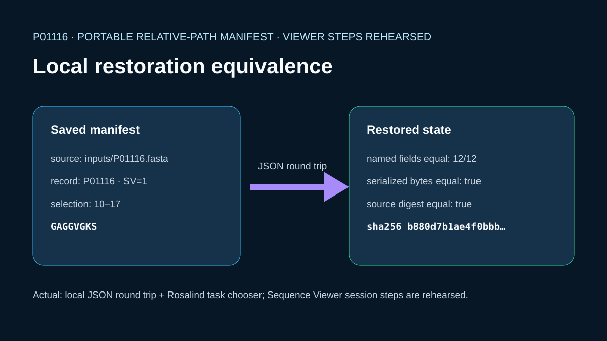

# Portable KRAS session-manifest restoration



## Scientific question

Can source identity, selected coordinates, and view settings be represented without absolute paths and restored to an equivalent local JSON state?

## Source observations

- The session references reviewed human KRAS `P01116`, sequence version 1, through the relative path `inputs/P01116.fasta`.
- The retained FASTA is 269 bytes, its sequence is 189 amino acids, and both response and sequence digests are stored in `inputs/source-provenance.json`.

## Constructed portable manifest

`inputs/portable-session.json` is a Codex-authored, viewer-independent manifest. It contains only repository-relative source identity and deterministic state: sequence mode, record `P01116`, selected range 10–17, the observed motif `GAGGVGKS`, protein palette, 60-residue wrapping, visible features, forward orientation, and a full-record analysis scope. It contains no absolute path, host identifier, viewer session ID, or temporary resource URI.

## Executed local restoration check

`build_case.py` serializes the portable manifest, reloads it into a new Python object, resolves and verifies the relative source, checks the selected motif, writes `outputs/restored-session.json`, and compares 12 named state fields. The input and restored JSON bytes are identical. `outputs/restoration-equivalence.json` retains every comparison plus both digests.

## Viewer workflow status

This portable JSON is a local teaching manifest, not a Sequence Viewer private session artifact. No successful Viewer save or restore response was found, so the intended open, save, restore, and query operations are not listed as case capabilities.

## Observed Rosalind Workbench invocation

`mcp__rosalind__rosalind_open` was actually invoked for this case at `2026-08-29T17:59:09.807Z` (`2026-08-30T01:59:09+08:00`). It returned the exact message `Rosalind Workbench is ready. Choose a research task in the app.` and the launcher state had `ready=true`. `outputs/rosalind-open-observation.json` retains the required arguments, response, and timestamps. The invocation only opens the task chooser and does not prove scientific task execution; the JSON round trip is the executed restoration evidence.

## Interpretation

The local representation is portable within the case directory and can reproduce the retained source-linked state exactly. This establishes equivalence for the documented JSON fields only.

## Limitations

- A real Sequence Viewer session can include additional state such as in-memory edits, tracks, jobs, and private derived artifacts.
- Viewer session restoration requires a mounted viewer, source revalidation, and current workspace authorization; those actions were not performed.
- The selected P-loop sequence is used as an identity check, not as a functional assay.
- The Rosalind launcher response contains no saved session, restored session, or scientific result.

## Exact reproduction

From the repository root:

```powershell
python showcases/biological-sequence-viewer/cases/sequence-session-restore/build_case.py
python scripts/showcase_session.py bundle sequence-session-restore
```

The build requires all 12 state comparisons to pass, equal serialized digests, a valid relative source path, an unchanged source digest, and the exact selected motif.

## Viewer operation review (2026-08-30)

No Sequence Viewer operation is recorded as successful. Server sessions were created for the relevant local public files, but subsequent queries or controls were not acknowledged. `outputs/viewer-operation-evidence.json` separates failed calls from actions that were not attempted after the prerequisite confirmation failed. It omits session identifiers, private paths, and internal resource URIs.
