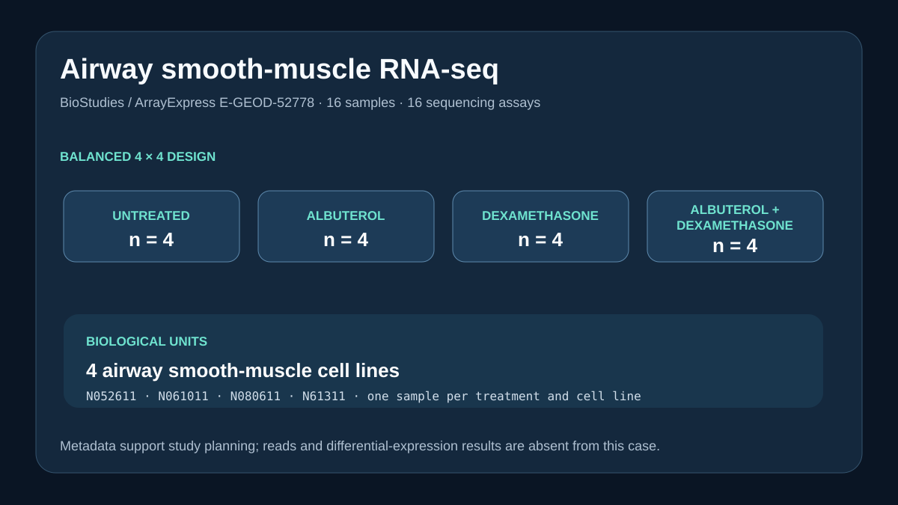

# Codex showcase lesson: Airway RNA-seq dataset discovery

## Session prompt

Use $showcase-teacher to import and teach the ready showcase `databases-airway-rnaseq` (Airway RNA-seq dataset discovery). Inspect its README, manifest, prompt, inputs, outputs, previews, and provenance records. Clearly distinguish source observations, computed results, scientific interpretation, and limitations, and show the preview when useful.

## Catalogue record

- Showcase ID: `databases-airway-rnaseq`
- Plugin: `life-sciences-databases` (Life Sciences Databases v0.1.5)
- Status: `ready`
- Domain: `public-data-integration`
- Case type: `analysis`
- Difficulty: `intermediate`
- Evidence level: `multi-tool-result`
- Covered operations: `life-sciences-databases.public-evidence`, `rosalind.rosalind_open`
- Rosalind tasks: none recorded
- Actual tools: `Life Sciences Databases biostudies-arrayexpress-skill`, `Python 3 standard library`, `Rosalind Workbench mcp__rosalind__rosalind_open`
- Summary: Which public study and sample records support a small airway dexamethasone analysis?
- Recorded next step: Recount dexamethasone treatments and airway cell-line samples from the retained E-GEOD-52778 study metadata.
- Plugin guide: `showcases/life-sciences-databases/README.md`

## Repository files to inspect

- case guide: `showcases/life-sciences-databases/cases/databases-airway-rnaseq/README.md`
- case manifest: `showcases/life-sciences-databases/cases/databases-airway-rnaseq/showcase.json`
- teaching prompt: `showcases/life-sciences-databases/cases/databases-airway-rnaseq/prompt.md`
- input: `showcases/life-sciences-databases/cases/databases-airway-rnaseq/inputs/public-source.md`
- input: `showcases/life-sciences-databases/cases/databases-airway-rnaseq/inputs/biostudies-E-GEOD-52778.json`
- input: `showcases/life-sciences-databases/cases/databases-airway-rnaseq/scripts/build_case.py`
- output: `showcases/life-sciences-databases/cases/databases-airway-rnaseq/outputs/results.json`
- output: `showcases/life-sciences-databases/cases/databases-airway-rnaseq/outputs/provenance.json`
- output: `showcases/life-sciences-databases/cases/databases-airway-rnaseq/outputs/query-verification.json`
- output: `showcases/life-sciences-databases/cases/databases-airway-rnaseq/outputs/rosalind-open-observation.json`
- output: `showcases/life-sciences-databases/cases/databases-airway-rnaseq/outputs/teaching-bundle.md`
- preview: `showcases/life-sciences-databases/cases/databases-airway-rnaseq/previews/preview.svg`

## Public sources

- https://www.ebi.ac.uk/biostudies/studies/E-GEOD-52778

## Retained case guide

# Airway RNA-seq dataset discovery



## Scientific question

Which public study record supports planning a small airway smooth-muscle dexamethasone RNA-seq analysis, and what must be verified before a donor-aware model can be justified?

## Source observations

- BioStudies/ArrayExpress accession E-GEOD-52778 is titled *Human Airway Smooth Muscle Transcriptome Changes in Response to Asthma Medications* and is annotated as human coding-RNA sequencing.
- The study record reports 16 samples and 16 sequencing assays.
- Four treatment groups are present: untreated, albuterol, dexamethasone, and albuterol plus dexamethasone, with four samples in each group.
- Four airway smooth-muscle cell lines are listed: N052611, N061011, N080611, and N61311, each contributing four samples.
- The retained study record lists the 5,045-byte IDF and 18,168-byte SDRF metadata files.

The exact accession response is retained as `inputs/biostudies-E-GEOD-52778.json`; `outputs/provenance.json` records the API path and retrieval time.

## Computed result

`scripts/build_case.py` traverses the BioStudies sample and assay sections, counts treatment groups and cell lines, verifies the balanced 4-by-4 layout, and writes `outputs/results.json` plus the preview.

## Interpretation

The retained study-level metadata show four treatment groups and four airway smooth-muscle cell-line labels. This supports a treatment-group comparison plan, but it does not establish a paired or donor-aware design. The sample-to-donor mapping must first be extracted and checked from the SDRF. The combined-treatment group remains distinct because it tests an additional intervention.

## Rosalind Workbench observation

The genuine `mcp__rosalind__rosalind_open` call at `2026-08-29T18:14:05.307Z` returned `Rosalind Workbench is ready. Choose a research task in the app.` with `ready=true`. Exact arguments, timestamps, response, and `scientific_job_executed: false` are retained in `outputs/rosalind-open-observation.json`.

The operation opened the task chooser only. It did not download reads, normalize counts, or run differential expression.

## Reproduce

```powershell
python showcases/life-sciences-databases/cases/databases-airway-rnaseq/scripts/build_case.py
```

Inspect the retained BioStudies response, `outputs/results.json`, `outputs/provenance.json`, `outputs/rosalind-open-observation.json`, and `previews/preview.svg`.

## Limitations

- Reads were not downloaded and no expression analysis was performed.
- Donor covariates and sample pairing should be checked in the SDRF before model fitting.
- The albuterol-plus-dexamethasone samples must remain separate from dexamethasone alone.

## Retained execution prompt

# Airway RNA-seq dataset discovery

Retrieve BioStudies/ArrayExpress study E-GEOD-52778 and retain the exact public accession response and API path. Run `scripts/build_case.py` to count the samples, assays, treatment groups, and airway smooth-muscle cell lines, and verify the prospective 4-by-4 design. Do not claim that reads were downloaded or differential expression was run.

Inspect `outputs/rosalind-open-observation.json` as the record of a genuine case-specific `mcp__rosalind__rosalind_open` call. State that the exact chooser response did not execute a scientific job and that the retained BioStudies record provides the scientific evidence.

## Teaching note

Use this bundle to locate the evidence. Read the listed repository artifacts before presenting scientific claims, and keep observations, calculations, interpretation, and limitations distinct.
