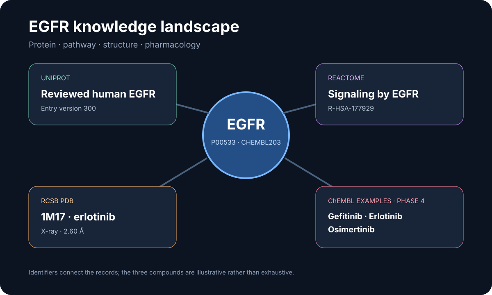

# EGFR structure and pharmacology landscape

This ready showcase connects a reviewed human protein, a curated drug target, three named inhibitors, a ligand-bound kinase structure, and an EGFR signaling pathway.

## Scientific question

How can public life-science databases be connected into a compact, identifier-preserving map of EGFR biology, structure, and pharmacology?

## Source observations

- UniProt P00533 is the reviewed human EGFR entry; the retrieved record was entry version 300.
- ChEMBL target CHEMBL203 is the human epidermal growth factor receptor. All ten returned records in the requested mechanism slice had inhibitor action; eight reported maximum phase 4.
- ChEMBL identifies gefitinib (CHEMBL939), erlotinib (CHEMBL553), and osimertinib (CHEMBL3353410) as phase-4 compounds.
- RCSB PDB 1M17 is a 2.60 Å X-ray structure of the EGFR tyrosine kinase domain with erlotinib.
- Reactome R-HSA-177929 is *Signaling by EGFR*.

## Reproduce

1. Run the prompt in `prompt.md` with Life Sciences Databases 0.1.5.
2. Retrieve UniProt P00533 and ChEMBL target CHEMBL203.
3. Request a ten-record ChEMBL mechanism slice and the three selected compound records.
4. Retrieve RCSB core metadata for 1M17 and verify the official structure record.
5. Query Reactome by P00533; if the API is unavailable, record that outcome and verify the official pathway page separately.

## Interpretation

The stable identifiers form a useful navigation map: P00533 names the protein, CHEMBL203 connects pharmacology, 1M17 supplies a structure-level example, and R-HSA-177929 supplies pathway context. This map helps GPT present related records together, while the chosen compounds remain examples rather than a complete EGFR drug inventory.
