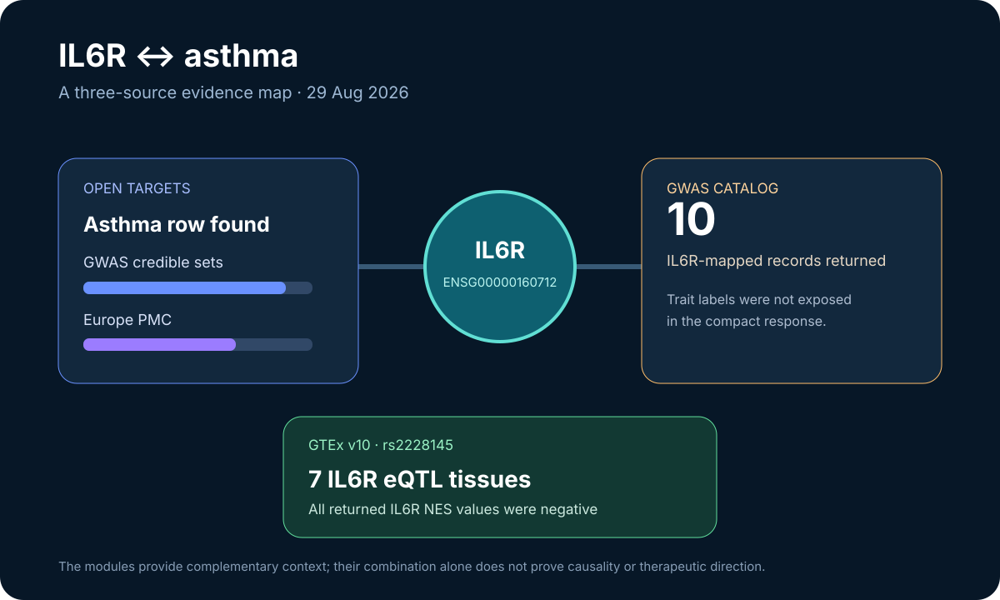

# IL6R and asthma evidence map

This ready showcase connects target–disease evidence, cataloged genetic associations, and tissue eQTL observations for IL6R.

## Scientific question

What complementary evidence do Open Targets, the GWAS Catalog, and GTEx provide for an IL6R–asthma research hypothesis?

## Source observations

- Open Targets returned an asthma row for IL6R with datasource scores of 0.8824 for GWAS credible sets and 0.6642 for Europe PMC.
- A GWAS Catalog query with `mapped_gene=IL6R` returned ten association records in the requested slice.
- GTEx v10 returned 15 single-tissue eQTL rows for rs2228145; seven mapped to IL6R across esophagus muscularis, blood, three arteries, and two colon tissues.
- All seven returned IL6R normalized effect sizes were negative, ranging from −0.3009 to −0.0905.

## Reproduce

1. Run the prompt in `prompt.md` with Life Sciences Databases 0.1.5.
2. Query the Open Targets associated-disease matrix for `ENSG00000160712` and filter for asthma.
3. Request ten GWAS Catalog associations with `mapped_gene=IL6R`.
4. Resolve rs2228145 to GRCh38 and request GTEx single-tissue eQTL associations.
5. Preserve the three result types separately before writing the synthesis.

## Interpretation

The three sources answer different questions: Open Targets summarizes target–disease evidence context, the GWAS Catalog exposes mapped association records, and GTEx shows tissue-specific expression associations for a selected IL6R variant. Their agreement makes the hypothesis richer, but it does not by itself prove causality or predict whether increasing or decreasing IL6R activity would benefit asthma.
