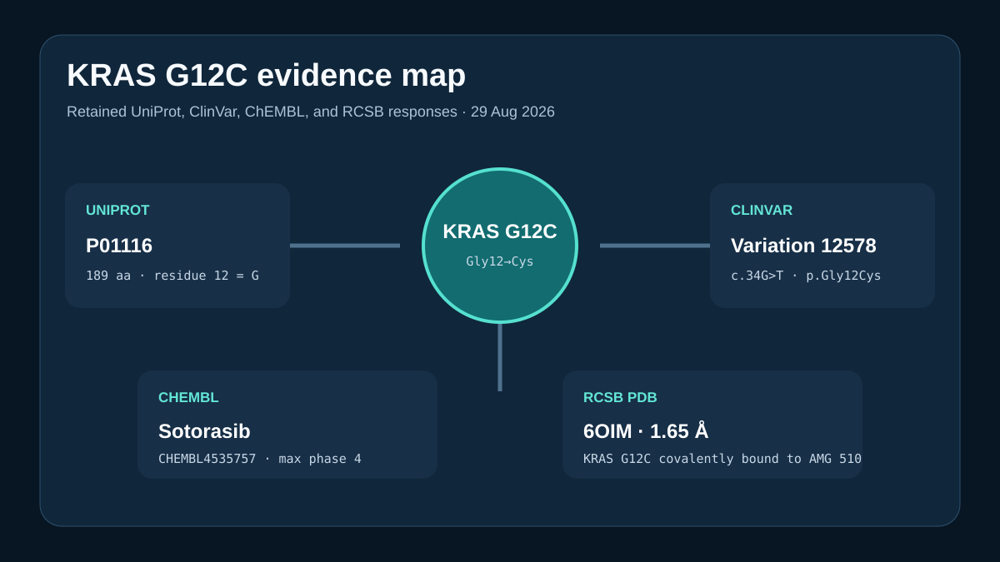

# KRAS G12C public evidence map



## Scientific question

How do exact public protein, variant, compound, and structure records describe the KRAS G12C research theme?

## Source observations

- UniProt P01116 is the reviewed 189-residue human KRAS entry; its canonical sequence has glycine at position 12.
- A ClinVar search for `KRAS G12C` returned twelve matches. The retained ten-record slice includes Variation 12578, `NM_004985.5(KRAS):c.34G>T (p.Gly12Cys)`.
- A ChEMBL molecule search for `sotorasib` returned CHEMBL4535757 as SOTORASIB, with maximum phase 4 and first approval year 2021.
- RCSB PDB 6OIM is the 1.65 Å X-ray structure titled *Crystal Structure of human KRAS G12C covalently bound to AMG 510*.

The exact API responses are retained under `inputs/`; `outputs/provenance.json` records every accession, path, search term, limit, and retrieval time.

## Computed result

`scripts/build_case.py` checks that residue 12 of P01116 is glycine, selects the exact p.Gly12Cys ClinVar row and SOTORASIB ChEMBL row, verifies PDB 6OIM, and writes `outputs/results.json` plus the preview.

## Interpretation

P01116, ClinVar Variation 12578, CHEMBL4535757, and PDB 6OIM connect the protein, allele, named compound, and covalent-complex structure. Their agreement supports an identifier-preserving research map, not a treatment recommendation.

## Rosalind Workbench observation

The genuine `mcp__rosalind__rosalind_open` call at `2026-08-29T18:14:05.242Z` returned `Rosalind Workbench is ready. Choose a research task in the app.` with `ready=true`. The case-specific arguments, timestamps, exact response, and `scientific_job_executed: false` are retained in `outputs/rosalind-open-observation.json`.

The operation opened the task chooser only. It did not query KRAS records, calculate a structure, or compare drugs.

## Reproduce

```powershell
python showcases/life-sciences-databases/cases/databases-kras-g12c/scripts/build_case.py
```

Inspect the four retained API responses, `outputs/results.json`, `outputs/provenance.json`, `outputs/rosalind-open-observation.json`, and `previews/preview.svg`.

## Limitations

- The ClinVar response retains ten of twelve search matches.
- ChEMBL phase and approval fields do not compare efficacy or safety.
- One crystal structure does not describe every conformational or cellular state of KRAS G12C.
