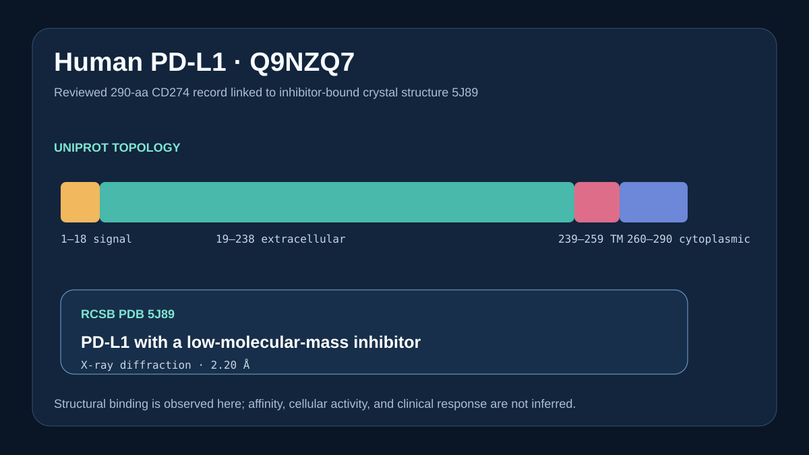

# PD-L1 sequence and structure records



## Scientific question

Which exact public records connect the full-length human PD-L1 sequence and topology to a structure-level observation of small-molecule binding?

## Source observations

- UniProt Q9NZQ7 is the reviewed 290-residue human PD-L1 entry, named `PD1L1_HUMAN` and encoded by `CD274`.
- UniProt annotates residues 1–18 as a signal peptide, 19–238 as extracellular, 239–259 as transmembrane, and 260–290 as cytoplasmic.
- RCSB PDB 5J89 is a 2.20 Å X-ray structure titled *Structure of human Programmed cell death 1 ligand 1 (PD-L1) with low molecular mass inhibitor*.

The exact UniProt and RCSB responses are retained under `inputs/`; `outputs/provenance.json` records both API paths and retrieval time.

## Computed result

`scripts/build_case.py` extracts the topology intervals from the UniProt feature table, verifies PDB 5J89, and writes `outputs/results.json` and the preview. The sequence strip preserves full-length UniProt numbering.

## Interpretation

The UniProt record defines the canonical membrane-protein context, while 5J89 supplies direct structural evidence of a low-molecular-mass inhibitor in a PD-L1 crystal structure. The record pair does not supply an affinity value or cellular checkpoint response.

## Rosalind Workbench observation

The genuine `mcp__rosalind__rosalind_open` call at `2026-08-29T18:14:05.263Z` returned `Rosalind Workbench is ready. Choose a research task in the app.` with `ready=true`. The exact response, arguments, timestamps, and `scientific_job_executed: false` are retained in `outputs/rosalind-open-observation.json`.

The operation opened the task chooser only. It did not analyze PD-L1 binding or run a molecular design task.

## Reproduce

```powershell
python showcases/life-sciences-databases/cases/databases-pdl1/scripts/build_case.py
```

Inspect the retained API responses, `outputs/results.json`, `outputs/provenance.json`, `outputs/rosalind-open-observation.json`, and `previews/preview.svg`.

## Limitations

- 5J89 is one inhibitor-bound crystal structure and does not measure cellular activity.
- UniProt topology annotations describe the canonical sequence and do not represent every proteoform or glycoform.
- No affinity, clinical response, or nanobody ranking is inferred.
