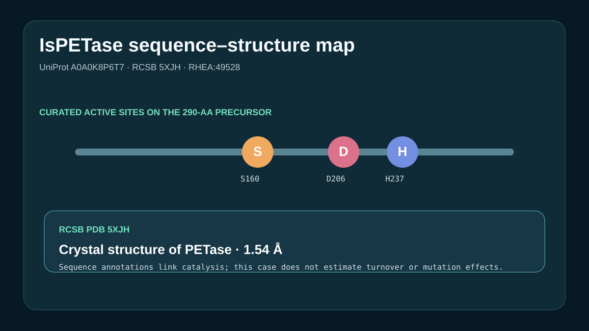

# PETase sequence–structure map



## Scientific question

How do exact public sequence, catalytic-reaction, and crystal-structure records describe IsPETase?

## Source observations

- UniProt A0A0K8P6T7 is the reviewed 290-residue poly(ethylene terephthalate) hydrolase from *Piscinibacter sakaiensis*.
- The record annotates a 1–27 signal peptide, a 28–290 mature chain, and active-site residues S160, D206, and H237 in full-length numbering.
- The PET hydrolysis annotation carries EC 3.1.1.101 and RHEA:49528.
- RCSB PDB 5XJH is the 1.54 Å X-ray structure titled *Crystal structure of PETase from Ideonella sakaiensis*.

The exact UniProt and RCSB responses are retained under `inputs/`; `outputs/provenance.json` records both API paths and retrieval time.

## Computed result

`scripts/build_case.py` reads the UniProt sequence, reconstructs each active-site label from residue identity and position, selects the PET reaction, checks RHEA:49528 and PDB 5XJH, and writes `outputs/results.json` plus the preview.

## Interpretation

The sequence annotations and structure record support a compact catalytic map centered on S160–D206–H237. This is an annotation and structure linkage, not a kinetic or mutation-effect calculation.

## Rosalind Workbench observation

The genuine `mcp__rosalind__rosalind_open` call at `2026-08-29T18:14:05.283Z` returned `Rosalind Workbench is ready. Choose a research task in the app.` with `ready=true`. The exact response, case-specific arguments, timestamps, and `scientific_job_executed: false` are retained in `outputs/rosalind-open-observation.json`.

The operation opened the task chooser only. It did not run a PETase structure or activity calculation.

## Reproduce

```powershell
python showcases/life-sciences-databases/cases/databases-petase/scripts/build_case.py
```

Inspect the retained API responses, `outputs/results.json`, `outputs/provenance.json`, `outputs/rosalind-open-observation.json`, and `previews/preview.svg`.

## Limitations

- The case does not calculate catalytic rates, stability, or mutation effects.
- Residue positions use full-length UniProt numbering, including the signal peptide.
- The preview is a project graphic, not an interactive structure-viewer capture.
