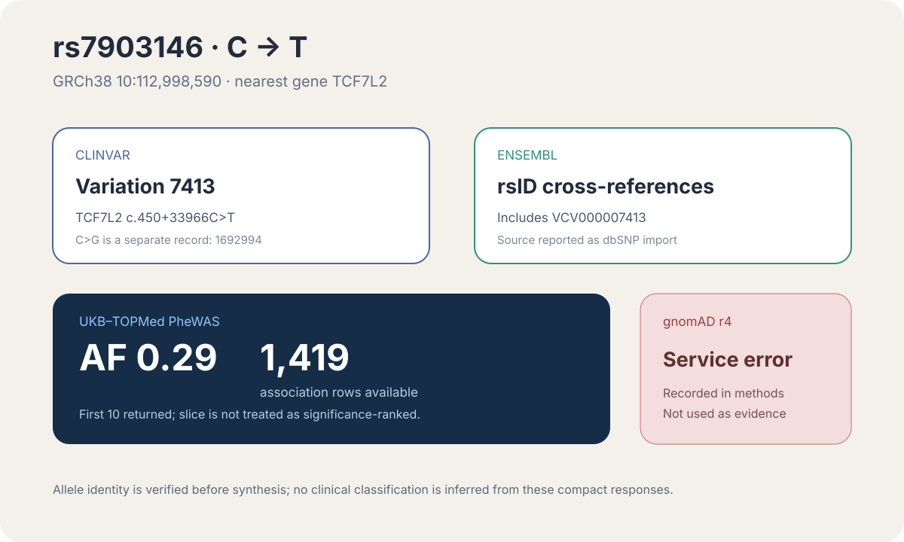

# Codex showcase lesson: Multi-source variant interpretation

## Session prompt

Use $showcase-teacher to import and teach the ready showcase `databases-variant-interpretation` (Multi-source variant interpretation). Inspect its README, manifest, prompt, inputs, outputs, previews, and provenance records. Clearly distinguish source observations, computed results, scientific interpretation, and limitations, and show the preview when useful.

## Catalogue record

- Showcase ID: `databases-variant-interpretation`
- Plugin: `life-sciences-databases` (Life Sciences Databases v0.1.5)
- Status: `ready`
- Domain: `public-data-integration`
- Case type: `analysis`
- Difficulty: `intermediate`
- Evidence level: `multi-tool-result`
- Covered operations: `rosalind.rosalind_open`
- Rosalind tasks: none recorded
- Actual tools: `Life Sciences Databases public API evidence and allele-resolved JSON aggregation`, `Rosalind Workbench mcp__rosalind__rosalind_open`
- Summary: Combine ClinVar, gnomAD, Ensembl, and cohort evidence for one variant.
- Recorded next step: Open the case README to present the allele-resolved rs7903146 report.
- Plugin guide: `showcases/life-sciences-databases/README.md`

## Repository files to inspect

- case guide: `showcases/life-sciences-databases/cases/databases-variant-interpretation/README.md`
- case manifest: `showcases/life-sciences-databases/cases/databases-variant-interpretation/showcase.json`
- teaching prompt: `showcases/life-sciences-databases/cases/databases-variant-interpretation/prompt.md`
- output: `showcases/life-sciences-databases/cases/databases-variant-interpretation/outputs/results.json`
- output: `showcases/life-sciences-databases/cases/databases-variant-interpretation/outputs/sources.json`
- output: `showcases/life-sciences-databases/cases/databases-variant-interpretation/outputs/provenance.json`
- output: `showcases/life-sciences-databases/cases/databases-variant-interpretation/outputs/query-verification.json`
- output: `showcases/life-sciences-databases/cases/databases-variant-interpretation/outputs/rosalind-open-observation.json`
- output: `showcases/life-sciences-databases/cases/databases-variant-interpretation/outputs/teaching-bundle.md`
- preview: `showcases/life-sciences-databases/cases/databases-variant-interpretation/previews/variant-rs7903146.svg`

## Public sources

- https://www.ncbi.nlm.nih.gov/clinvar/variation/7413/
- https://rest.ensembl.org/variation/homo_sapiens/rs7903146
- https://pheweb.org/UKB-TOPMed/variant/10:112998590-C-T

## Retained case guide

# Multi-source variant interpretation

This ready showcase resolves the C>T allele of rs7903146 across clinical, annotation, cohort, and population-frequency databases.

## Scientific question

Can Codex reconcile one rsID across multiple databases without merging different alternate alleles or overstating the compact records?

## Source observations

- ClinVar returned two records for rs7903146. Variation 7413 is the selected TCF7L2 C>T allele; Variation 1692994 is a distinct C>G allele.
- Ensembl identifies the variant as rs7903146 and returned cross-references that include VCV000007413.
- UKB-TOPMed resolved the selected allele to GRCh38 `10:112998590-C-T`, reported a cohort allele frequency of 0.29, and exposed 1,419 association rows.
- The gnomAD r4 GraphQL request returned a service error, so no gnomAD frequency is reported.

## Reproduce

1. Run the prompt in `prompt.md` with Life Sciences Databases 0.1.5.
2. Search ClinVar for rs7903146 and select the C>T record explicitly.
3. Query Ensembl variation metadata for the rsID and compare returned cross-references.
4. Query UKB-TOPMed using the explicit GRCh38 C>T allele, not only the rsID resolver.
5. Attempt the matching gnomAD r4 query and retain the service outcome separately.

## Interpretation

The useful result is the identity-preserving join: the selected C>T allele connects ClinVar Variation 7413, Ensembl cross-references, and a cohort PheWAS record. These compact responses do not justify a new clinical classification, and the initial PheWAS page is not a ranked disease summary.

## Rosalind Workbench observation

The genuine `mcp__rosalind__rosalind_open` call at `2026-08-29T18:14:05.201Z` returned `Rosalind Workbench is ready. Choose a research task in the app.` with `ready=true`. The exact case-specific arguments and timestamps are retained in `outputs/rosalind-open-observation.json`.

This operation opened the task chooser only. It did not resolve, annotate, or classify rs7903146; `outputs/results.json`, `outputs/sources.json`, `outputs/provenance.json`, and `outputs/query-verification.json` carry the allele-specific evidence.

## Limitations

- The retained ClinVar search is not a complete clinical review.
- The first UKB-TOPMed slice is not significance-ranked.
- The verified gnomAD r4 query reports genome AF `0.2739839646` for `10-112998590-C-T`; this population frequency is not a clinical classification.
- An rsID-only UKB-TOPMed lookup selected C>G and returned no records, so the evidence uses the explicit GRCh38 C>T request.

## Retained execution prompt

Use Life Sciences Databases to interpret rs7903146 C>T across ClinVar, Ensembl, gnomAD, and UKB-TOPMed PheWAS. Verify allele and coordinate identity before comparing sources, use the explicit GRCh38 C>T UKB-TOPMed request, and avoid assigning clinical significance that the returned records do not support. Inspect `outputs/query-verification.json` for the current allele-specific queries. Cite `outputs/rosalind-open-observation.json` as the record of a genuine `mcp__rosalind__rosalind_open` call, and state that it opened only the chooser and did not classify the variant.

## Teaching note

Use this bundle to locate the evidence. Read the listed repository artifacts before presenting scientific claims, and keep observations, calculations, interpretation, and limitations distinct.
