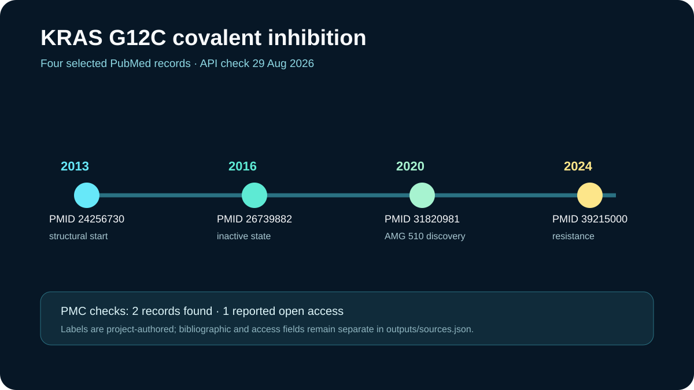

# KRAS G12C literature trail

This ready showcase follows four primary PubMed records from the structural starting point for KRAS G12C covalent inhibition to candidate discovery and later resistance research.

## Scientific question

Which primary studies connect KRAS G12C structural biology and covalent inhibition?

## Public API observations

The retained NCBI calls were made on 29 August 2026. PubMed supplied titles, identifiers, journals, and dates; the PMC Article Dataset API was checked separately for each PMID.

- PMID `24256730` reports the 2013 K-Ras(G12C) allosteric-inhibitor study and resolves to manuscript record `PMC4274051`.
- PMID `26739882` reports the 2016 inactive-state small-molecule study.
- PMID `31820981` reports the AMG 510 discovery study published in 2020.
- PMID `39215000` reports a 2024 resistance study and resolves to open-access record `PMC11364849`.

The exact API arguments, timestamps, identifiers, PMC flags, and canonical PubMed URLs are retained in `outputs/sources.json`.

## Deterministic local summary

`scripts/summarize.py` sorts the four records by date and computes record and PMC-availability counts. Its output, `outputs/results.json`, contains four records, two PMC records, and one record reported as PMC open access. The teaching labels describe each record's place in the trail; they are project-authored classifications rather than systematic-review judgments.

## Rosalind Workbench observation

`mcp__rosalind__rosalind_open` was invoked with a KRAS-literature task context at `2026-08-29T18:09:34.761Z`. The exact arguments and response are retained in `outputs/rosalind-open-observation.json`. The call only opened the task chooser; no structure, inhibitor, or literature record was submitted and no Rosalind scientific job ran.

## Interpretation

The selected records show a useful teaching sequence: structural opportunity, inactive-state covalent pharmacology, a clinical-candidate discovery report, and resistance research. Four deliberately selected records cannot establish completeness, comparative efficacy, or clinical guidance.

## Reproduce

1. Read `inputs/public-source.md` and repeat the two PubMed searches.
2. Retrieve ESummary or EFetch metadata for the four selected PMIDs.
3. Check each PMID with the PMC Article Dataset API and preserve its reported license and manuscript fields.
4. From this case directory, run `python scripts/summarize.py`.
5. Compare `outputs/results.json` and the preview with the retained evidence.
6. Compare any new Rosalind launcher response with `outputs/rosalind-open-observation.json` without treating it as a scientific result.

## Limitations

- The four-record trail is curated for teaching and is not a systematic review.
- PMC presence, open-access status, and licenses can change and should be refreshed for current reuse decisions.
- The summary does not compare experimental designs, potency values, structural coordinates, or clinical outcomes.
