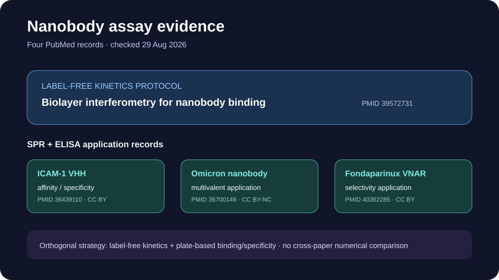

# Nanobody binding assay evidence

This ready showcase combines one public BLI kinetics protocol with three PMC-open nanobody records returned by a PubMed query that required both surface plasmon resonance and ELISA terms.

## Scientific question

Which publicly inspectable records support an orthogonal affinity and specificity measurement strategy for nanobodies?

## Public API observations

The PubMed and PMC checks were made on 29 August 2026.

- PMID `39572731` is a Nature Protocols article on BLI measurement of protein interactions and nanobody binding; the PMC lookup returned no record on the retrieval date.
- PMID `36700149`, `40362285`, and `36439110` were returned by the nanobody plus SPR plus ELISA title-or-abstract query.
- The latter three resolve to PMC records `PMC9869787`, `PMC12071740`, and `PMC9682242`, all reported as PMC open access.

Exact queries, returned identifiers, timestamps, bibliographic fields, query evidence, and PMC status are retained in `outputs/sources.json`.

## Deterministic local summary

`scripts/summarize.py` sorts the four records and groups them into one BLI protocol and three SPR-plus-ELISA application records. `outputs/results.json` also reports that three of the four selected records were marked as PMC open access. The assay-role labels organize the lesson; they are not independent evaluations of assay quality.

## Rosalind Workbench observation

`mcp__rosalind__rosalind_open` was invoked with a nanobody-assay task context at `2026-08-29T18:09:34.805Z`. The exact arguments and response are retained in `outputs/rosalind-open-observation.json`. The call only opened the task chooser; no sequence, assay data, or literature record was submitted and no Rosalind scientific job ran.

## Interpretation

The records support a practical orthogonal strategy: use label-free kinetics such as BLI or SPR together with plate-based binding or specificity measurements such as ELISA. They do not test one common candidate set under harmonized conditions, so their numerical results should not be compared directly.

## Reproduce

1. Read `inputs/public-source.md` and repeat both PubMed searches.
2. Retrieve ESummary or EFetch metadata for the four selected PMIDs.
3. Check each PMID with the PMC Article Dataset API and preserve the reported access fields.
4. From this case directory, run `python scripts/summarize.py`.
5. Compare `outputs/results.json` and the preview with the retained API evidence.
6. Compare any new Rosalind launcher response with `outputs/rosalind-open-observation.json` without treating it as assay evidence.

## Limitations

- PubMed query-term matches show that terms occur in indexed titles or abstracts; they do not verify protocol quality.
- The selected records study different targets and experimental systems, so kinetic or affinity values are not directly comparable.
- The Nature Protocols BLI record had no PMC entry on the retrieval date; bibliographic discoverability does not imply open full text.
