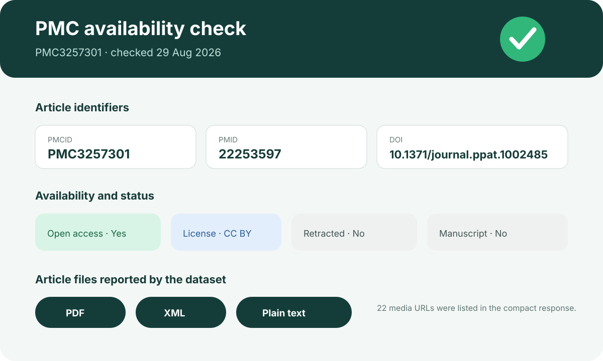

# PMC open-access availability

This ready showcase verifies current article availability for one stable PMCID and preserves the identifier relationships needed for direct display.

## Scientific question

Can one PMCID be resolved to its related PubMed and DOI records while reporting current open-access, license, status, and article-file metadata?

## Source observations

- `PMC3257301` resolves to PMID `22253597` and DOI `10.1371/journal.ppat.1002485`.
- The PMC Article Dataset lookup reported open-access status and a CC BY license.
- PDF, XML, and plain-text article files were present; 22 media URLs were reported.
- The compact record marked the article as neither retracted nor a manuscript submission.

## Result

Exact identifiers, status fields, and canonical links are in `outputs/results.json`. `outputs/sources.json` explains which source supports each claim. The preview translates these machine-readable fields into a compact display without analyzing the paper's scientific conclusions.

## Rosalind Workbench observation

`mcp__rosalind__rosalind_open` was invoked with a PMC-availability task context at `2026-08-29T18:09:34.712Z`. The exact arguments and response are retained in `outputs/rosalind-open-observation.json`. The response only reported that the task chooser was ready; PMCID `PMC3257301` was not submitted and no Rosalind scientific job ran.

## Reproduce

1. Run the prompt in `prompt.md` with Life Sciences Literature 0.1.5.
2. Query the PMC Article Dataset by `PMC3257301`.
3. Record the PMCID, PMID, DOI, access flag, license, status flags, and available article-file types.
4. Open the canonical PMC, PubMed, and DOI links to verify article identity.
5. Compare any new Rosalind launcher response with `outputs/rosalind-open-observation.json` without treating the launcher as a literature lookup.

## Interpretation

The case demonstrates how Codex can turn one article identifier into a transparent availability report suitable for downstream reading or lawful artifact acquisition. Dataset status can change, so applications should refresh it when the current state matters.
