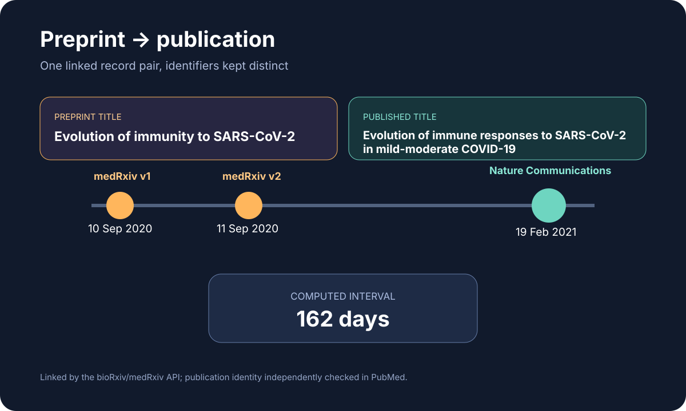

# Preprint to publication linkage

This ready showcase follows one medRxiv record through two preprint versions to a linked journal publication.

## Scientific question

How can Codex verify a preprint-to-publication relationship while preserving the distinct identifiers, titles, dates, and version history of both records?

## Source observations

- medRxiv DOI `10.1101/2020.09.09.20191205` has two returned versions dated 10 and 11 September 2020.
- The preprint title is *Evolution of immunity to SARS-CoV-2*.
- The publication-link endpoint reports Nature Communications DOI `10.1038/s41467-021-21444-5`.
- PubMed PMID `33608522` records the published title as *Evolution of immune responses to SARS-CoV-2 in mild-moderate COVID-19.* and the publication date as 19 February 2021.

## Computed results

- The interval from the first preprint date to the publication date is 162 days.
- The published title differs from the preprint title.
- `outputs/results.json` retains the two records and the computed comparison; `outputs/sources.json` assigns a source to every factual field.

## Rosalind Workbench observation

`mcp__rosalind__rosalind_open` was invoked with a preprint-linkage task context at `2026-08-29T18:09:34.737Z`. The exact arguments and response are retained in `outputs/rosalind-open-observation.json`. The response only reported that the task chooser was ready; neither DOI was submitted and no Rosalind scientific job ran.

## Reproduce

1. Run the prompt in `prompt.md` with Life Sciences Literature 0.1.5.
2. Query the medRxiv details endpoint for the preprint DOI and retain every returned version.
3. Query the publication-link endpoint for the same DOI.
4. Search PubMed by the linked journal DOI and verify PMID `33608522`.
5. Compare dates and titles only after preserving the two record identities.
6. Compare any new Rosalind launcher response with `outputs/rosalind-open-observation.json` without treating the launcher as publication-link evidence.

## Interpretation

The case illustrates why a preprint and its journal article should remain distinct research objects even when an authoritative service links them. The relationship supports provenance and chronology; it does not establish that every statement, analysis, or dataset stayed unchanged.
