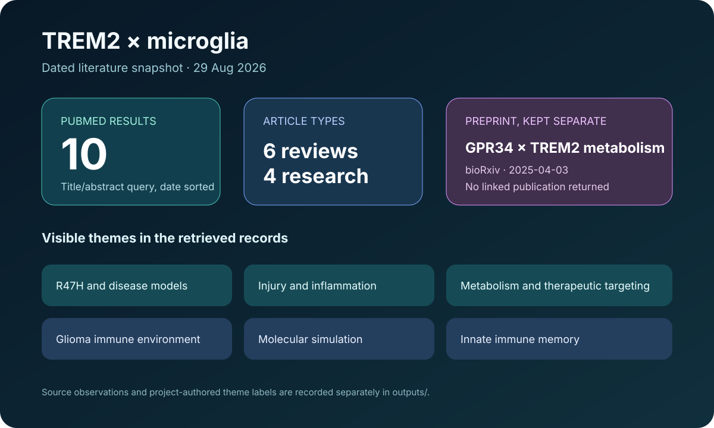

# TREM2 microglia publication landscape

This ready showcase combines a dated PubMed query with one separately identified bioRxiv preprint.

## Scientific question

What topics are visible in a compact, reproducible snapshot of recent literature that mentions both TREM2 and microglia?

## Source observations

- The PubMed query `TREM2[Title/Abstract] AND microglia[Title/Abstract]`, sorted by publication date, returned ten identifiers on 29 August 2026.
- Six retrieved titles were reviews or perspectives; four described primary or model-focused research.
- A relevant bioRxiv record, `10.1101/2025.03.28.646038`, concerns GPR34 loss of function and TREM2 metabolic dysfunction in microglia.
- The bioRxiv publication-link endpoint returned no linked publication record for that DOI on the retrieval date.

## Computed summary

Project-authored theme labels identify work on R47H and disease models, brain injury, immunometabolism, glioma, molecular simulation, innate immune memory, and therapeutic targeting. Exact records and labels are retained in `outputs/results.json`; source roles and retrieval evidence are in `outputs/sources.json`.

## Reproduce

1. Run the prompt in `prompt.md` with Life Sciences Literature 0.1.5.
2. Use PubMed `esearch` with the stored query, `retmax=10`, and publication-date sorting.
3. Retrieve `esummary` metadata for every returned PMID.
4. Check the selected bioRxiv DOI and its publication-link endpoint.
5. Keep preprint status separate from PubMed-indexed publication status.

## Interpretation

Even this small snapshot shows that TREM2 research is distributed across molecular mechanism, disease models, systemic metabolism, inflammation, and therapeutic strategy. Because the sample is deliberately compact and date-sorted, it supports exploration and demonstration rather than prevalence estimates or systematic conclusions.
