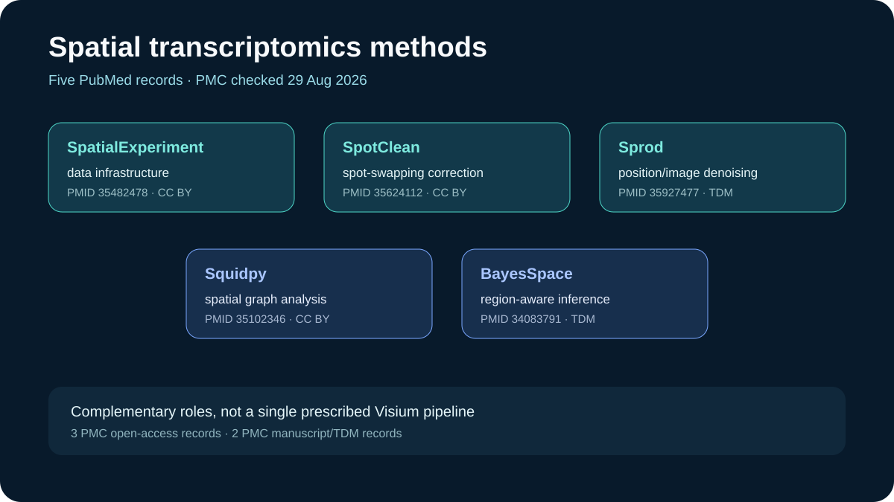

# Spatial transcriptomics methods

This ready showcase assembles five complementary PubMed records for handling spatial transcriptomics data, including Visium-compatible workflows.

## Scientific question

Which publicly inspectable methods papers support data handling, artifact correction, denoising, spatial analysis, and region-aware inference?

## Public API observations

The PubMed and PMC checks were made on 29 August 2026.

- BayesSpace, PMID `34083791`, addresses subspot resolution and resolves to manuscript record `PMC8763026`.
- Squidpy, PMID `35102346`, is a spatial-omics analysis framework and has CC BY record `PMC8828470`.
- SpotClean, PMID `35624112`, addresses spot swapping and has CC BY record `PMC9142522`.
- Sprod, PMID `35927477`, addresses position- and image-aware denoising and resolves to manuscript record `PMC10229080`.
- SpatialExperiment, PMID `35482478`, provides Bioconductor infrastructure and has CC BY record `PMC9154247`.

Exact query arguments, timestamps, bibliographic metadata, and PMC status fields are retained in `outputs/sources.json`.

## Deterministic local summary

`scripts/summarize.py` sorts the records and maps their retained method-role labels into a workflow-oriented list. `outputs/results.json` reports five PMC records, three reported as PMC open access, with three CC BY and two TDM status records. These counts describe the retained API response, not a universal judgment about access outside PMC.

## Rosalind Workbench observation

`mcp__rosalind__rosalind_open` was invoked with a Visium-methods task context at `2026-08-29T18:09:34.783Z`. The exact arguments and response are retained in `outputs/rosalind-open-observation.json`. The call only opened the task chooser; no expression matrix, tissue image, or literature record was submitted and no Rosalind scientific job ran.

## Interpretation

The five papers form a useful complementary set: infrastructure, artifact correction, denoising, spatial graphs, and region-aware inference. They should be read as method options whose assumptions and benchmarks require inspection, not as one prescribed analysis pipeline.

## Reproduce

1. Read `inputs/public-source.md` and repeat the exact PubMed title query.
2. Retrieve ESummary or EFetch metadata for all five PMIDs.
3. Check each PMID with the PMC Article Dataset API and preserve license and manuscript fields.
4. From this case directory, run `python scripts/summarize.py`.
5. Compare `outputs/results.json` and the preview with the retained API evidence.
6. Compare any new Rosalind launcher response with `outputs/rosalind-open-observation.json` without treating it as an analysis result.

## Limitations

- The five named methods are a teaching selection, not a systematic review or benchmark ranking.
- The classification is title- and abstract-informed and does not replace reading each full method and validation study.
- PMC status is time-sensitive; a PMC manuscript or TDM record must not be described as CC BY open access.
