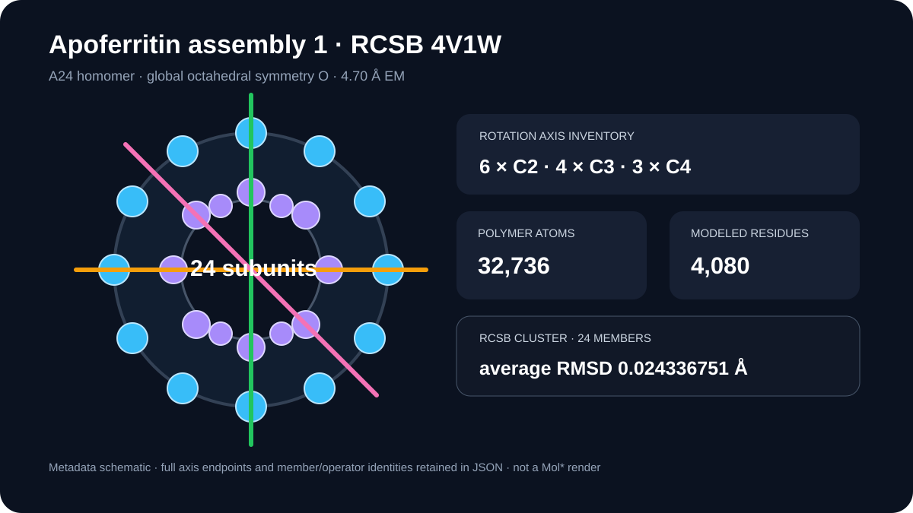

# Apoferritin assembly and octahedral symmetry

This case retains RCSB assembly 1 metadata for 4V1W and summarizes its 24-subunit ferritin shell without presenting a schematic as a molecular render.

## Scientific question

How does the public assembly record describe the organization of the 4V1W apoferritin shell?

## Public metadata snapshot

- Method and resolution: electron microscopy, 4.70 Å; linked map EMD-2788.
- Biological assembly 1: homomeric protein, 24 polymer instances, 32,736 polymer atoms, 4,080 modeled polymer residues, and 96 unmodeled polymer residues.
- Global symmetry: octahedral type, symbol O, oligomeric state Homo 24-mer, stoichiometry A24.
- Rotation-axis inventory: six order-2 axes, four order-3 axes, and three order-4 axes.
- The one returned cluster contains 24 members with an average within-cluster RMSD of 0.024336751 Å.

The full returned axis endpoints and all member/operator identities are retained in `outputs/assembly-symmetry.json`.

## Interpretation and limitations

Octahedral symmetry is consistent with the cage-like ferritin assembly and its 24 homologous subunits. The record describes RCSB biological assembly 1; it does not independently prove oligomerization in every solution condition. The preview is a metadata diagram, so it does not claim a current Mol* camera, displayed assembly construction, axes, cage, or cluster coloring.

## Rosalind Workbench observation

`mcp__rosalind__rosalind_open` was genuinely invoked with this case's task context at `2026-08-29T18:07:20.154Z`. The exact arguments and response are retained in the 642-byte `outputs/rosalind-open-observation.json`. The call opened only the task chooser; it did not submit 4V1W, retrieve assembly metadata, analyze symmetry, or execute a Rosalind scientific job.

## Reproduce

Run `python scripts/fetch_assembly_metadata.py`. The script retrieves the official RCSB entry and assembly endpoints and regenerates the compact dated record.
