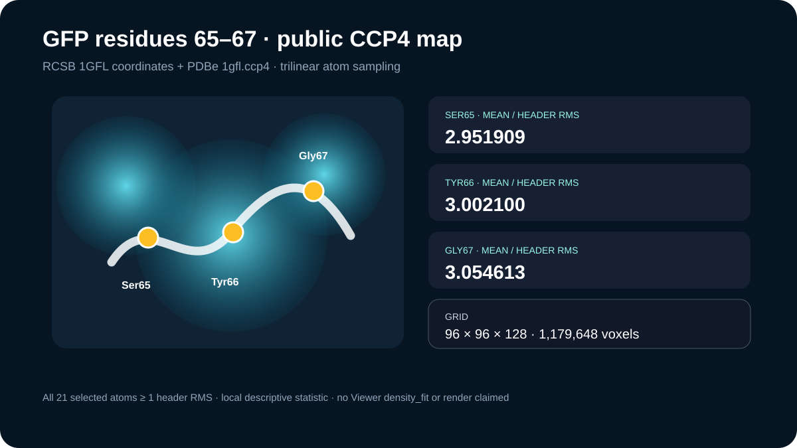

# GFP chromophore-segment density support

This case retains the 1GFL coordinates, deposited structure factors, and a public PDBe CCP4 map, then samples the map at author chain A residues Ser65, Tyr66, and Gly67.

## Scientific question

Does the retained public map contain positive density at the deposited atoms of GFP residues 65–67 under a stated, reproducible sampling method?

## Map and calculation

The CCP4 file contains a 96 × 96 × 128 float32 grid in space group 92. Its unit cell is 89.225998 × 89.225998 × 119.771004 Å with 90° angles; the header RMS is 0.288208067 map units.

Periodic unit-cell mapping followed by trilinear interpolation gives mean sampled values of 2.951909, 3.002100, and 3.054613 header-RMS units for Ser65, Tyr66, and Gly67. Every retained atom in these three residues is at or above one header RMS.

## Evidence status

The numerical values in `outputs/density-map-inspection.json` come from direct local sampling of the retained public CCP4 bytes. A Molecular Structure Viewer session was issued, but the density-discovery call exceeded its acknowledgement deadline. Therefore these values are not described as a Viewer `density_fit` result, and no Viewer render or density acquisition receipt is claimed.

## Rosalind Workbench observation

`mcp__rosalind__rosalind_open` was genuinely invoked with this case's task context at `2026-08-29T18:07:20.129Z`. The exact arguments and response are retained in the 637-byte `outputs/rosalind-open-observation.json`. The call opened only the task chooser; it did not submit the 1GFL coordinates, structure factors, or map, inspect density, or execute a Rosalind scientific job.

## Limitations

- Atom-sampled values depend on the distributed map, grid convention, periodic mapping, and interpolation method.
- A positive sample does not independently validate refinement, chemical identity, chromophore maturation, or mechanism.
- No contour-optimized visual assessment or difference-map analysis was performed.

## Reproduce

Run `python scripts/inspect_density_map.py`, then inspect the map header, array statistics, residue summaries, atom values, and retained file hashes in `outputs/density-map-inspection.json`.
