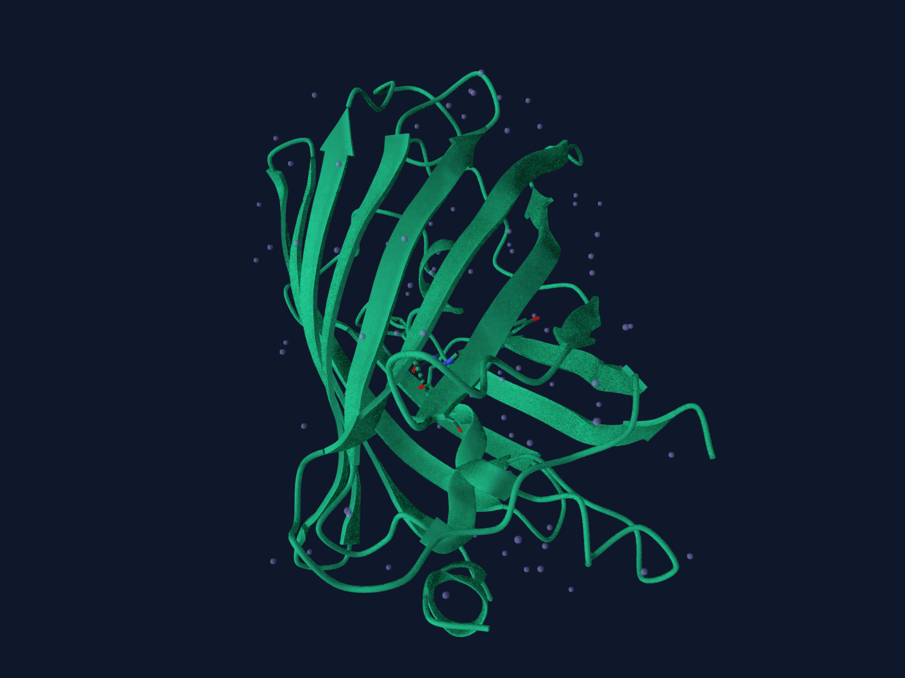

# GFP chromophore structure showcase

This ready showcase uses Molecular Structure Viewer and RCSB entry 1EMA to present the GFP beta barrel and its CRO chromophore.

## Scientific question

Where is the mature GFP chromophore located within the protein fold, and which nearby residues lie within a 4 Å heavy-atom distance in the displayed crystal coordinates?

## Source observations

- 1EMA is an X-ray structure reported at 1.9 Å resolution.
- The displayed model contains one protein chain, 225 polymer residues, 1,866 atoms, and one CRO component.
- CRO is identified by author chain A and residue 66.

## Viewer analysis

- CRO was focused in operator `ASM_1`, instance `ASM-1`.
- The viewer found 18 polymer residues within 4.0 Å using the closest heavy-atom Euclidean distance in the displayed coordinates.
- Examples below 3.1 Å include Thr203 (2.666 Å), Arg96 (2.730 Å), Val61 (2.778 Å), Thr62 (2.795 Å), Glu222 (2.813 Å), His148 (2.850 Å), and Gln94 (3.028 Å).
- The 1600×1200 PNG uses a dark background, studio lighting, a protein cartoon, element-colored ligand sticks, and no displayed hydrogens.

## Artifacts

- `previews/gfp.png` — inspected PNG preview.
- `previews/gfp.png.render.json` — render settings and provenance.

## Interpretation

The chromophore lies in the protected interior of the GFP beta barrel. The contact list describes coordinate proximity; it does not measure bond energy or binding affinity. The very short 1.332 Å records reflect CRO's covalent incorporation into the GFP polypeptide and should not be discussed as ordinary noncovalent ligand contacts.
