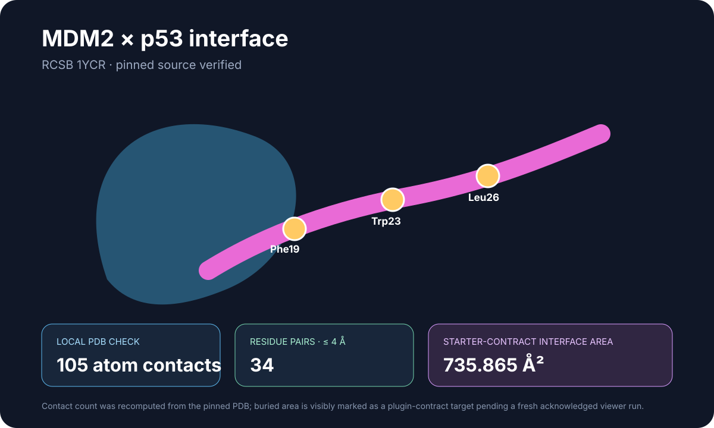

# MDM2–p53 interface analysis

This display-ready showcase packages the pinned 1YCR source, a locally recomputed 4 Å contact result, the Molecular Structure Viewer starter contract, and a transparent current-host status record.

## Scientific question

What does a 4 Å coordinate-contact analysis reveal about the MDM2–p53 peptide interface, and how should the viewer's buried-area metric be reported?

## Source observations and computed result

- The downloaded RCSB 1YCR file matched the plugin contract: 94,041 bytes, 818 atoms, and the declared SHA-256 digest.
- Chain A contains 705 atoms and chain B contains 113 atoms.
- A direct coordinate calculation over all cross-chain atom pairs found exactly 105 contacts at or below 4.0 Å, spanning 34 residue pairs.
- Author-numbered p53 Phe19, Trp23, and Leu26 are present in chain B and are the workflow's labeled hotspots.

## Starter-contract metric

The plugin's shipped contract specifies a Shrake–Rupley calculation with a 1.4 Å probe and 240 samples. Its expected one-sided interface area is 735.864963 Ų, while total SASA loss across both partners is 1471.729925 Ų. These are distinct geometric quantities and are not affinity or energy estimates.

The current viewer session mounted in headless mode but remained render-pending and did not acknowledge analysis commands. Therefore, the buried-area values are explicitly retained as starter-contract targets rather than presented as a new current-host run.

## Reproduce

1. Open `inputs/1YCR.pdb` once with Molecular Structure Viewer 0.1.80.
2. Confirm chains A and B and run `contacts` with a 4.0 Å cutoff.
3. Run `buried_area` between atom-disjoint chains A and B with a 1.4 Å probe and 240 samples.
4. Keep the complete complex as cartoon and add chain-B Phe19, Trp23, and Leu26 as labeled sticks.
5. Report interface area and total SASA loss separately with method provenance.
