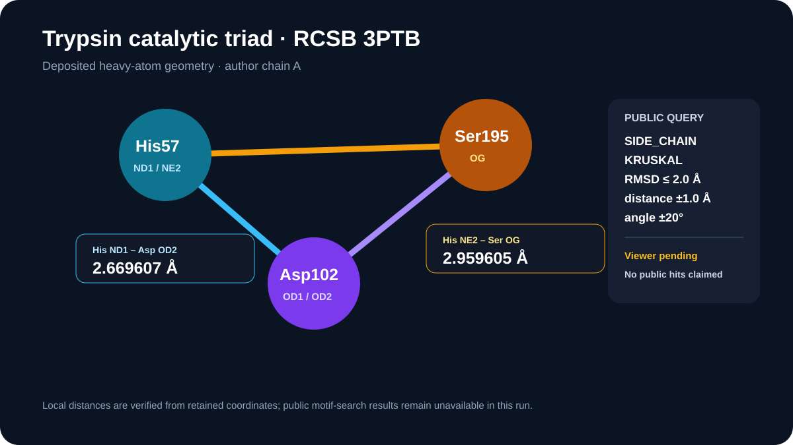

# Trypsin catalytic-triad geometry

This case retains the public 3PTB source, calculates its His57–Asp102–Ser195 geometry, and records an exact public motif-search request without inventing archive hits.

## Scientific question

Can the deposited geometry of the trypsin catalytic triad serve as an explicit query for similar residue arrangements in public PDB assemblies?

## Source observations and local calculation

- RCSB 3PTB is bovine beta-trypsin determined by X-ray diffraction at 1.70 Å.
- Author chain A contains His57, Asp102, and Ser195 with the expected deposited heavy atoms.
- His57 ND1–Asp102 OD2 is 2.669607 Å; His57 NE2–Ser195 OG is 2.959605 Å.
- The three Cα pair distances are 6.419413, 8.245237, and 10.215604 Å.

## Public search status

`outputs/triad-geometry.json` contains the complete request parameters and public residue/operator identities. The Molecular Structure Viewer session was issued, but two state calls exceeded the acknowledgement deadline. Consequently, `outputs/viewer-attempt.json` states that the public motif search was not executed. This case reports no hit count, match identity, query hash, RMSD, or normalized score.

## Interpretation

The retained distances describe one experimentally deposited arrangement. A future low-RMSD match would indicate geometric similarity under the stated pairing and tolerances; it would not establish common catalysis, protonation, function, or evolutionary origin.

## Reproduce

1. Run `python scripts/compute_triad_geometry.py`.
2. Inspect the exact request under `public_motif_request` in `outputs/triad-geometry.json`.
3. In an acknowledged viewer session, run the request once and save its complete returned page and query hash separately.

## Rosalind Workbench observation

`outputs/rosalind-open-observation.json` records a case-specific `mcp__rosalind__rosalind_open` call and the exact ready message returned by the launcher. The call only opened the research-task chooser; it did not select a task or execute a Rosalind scientific job. This launcher observation is independent of the unexecuted public motif search described above.
