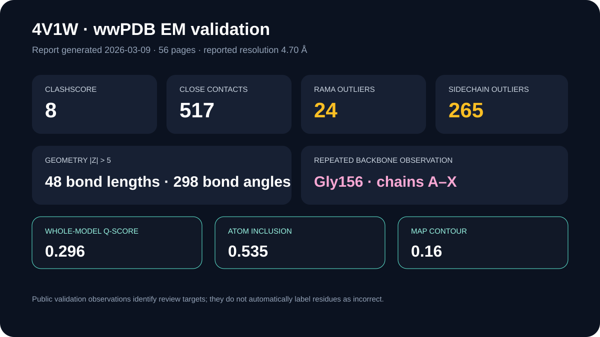

# 4V1W wwPDB quality assessment

This case retains the current 56-page wwPDB EM validation report for 4V1W and extracts named metrics from the report text.

## Scientific question

Which public quality observations identify parts of the deposited 4.70 Å apoferritin model that merit closer inspection?

## Retained report observations

The report was generated on 2026-03-09 at 05:35 UTC using wwPDB Validation Pipeline 2.49, MolProbity 4-5-2 with Phenix 2.0, and MapQ 1.9.13.

- All-atom clashscore: 8; close contacts listed: 517.
- Bond-length and bond-angle outliers with |Z| > 5: 48 and 298.
- Ramachandran outliers: 24; the report lists Gly156 once in every chain A–X.
- Non-rotameric sidechains: 265; suggested sidechain flips: 24.
- Chirality and planarity outliers: none reported.
- Whole-model atom inclusion: 0.535; Q-score: 0.296.
- At the recommended contour level 0.16, 86% of backbone atoms and 54% of all non-hydrogen atoms are inside the map.

## Interpretation and limitations

The repeated Gly156 observation and the other counts identify review targets in the deposited model. At 4.70 Å, local atom-level interpretation is constrained, and an outlier does not by itself establish that a residue is modeled incorrectly. Q-score and atom inclusion describe agreement with the linked EM map; they are not AlphaFold confidence, PAE, affinity, or energetic quantities.

## Rosalind Workbench observation

`mcp__rosalind__rosalind_open` was genuinely invoked with this case's task context at `2026-08-29T18:07:20.174Z`. The exact arguments and response are retained in the 635-byte `outputs/rosalind-open-observation.json`. The call opened only the task chooser; it did not submit 4V1W or its validation report, assess residue quality, or execute a Rosalind scientific job.

## Reproduce

Run `python scripts/extract_validation_summary.py`, then compare `outputs/quality-assessment.json` with the retained PDF and its hash.
