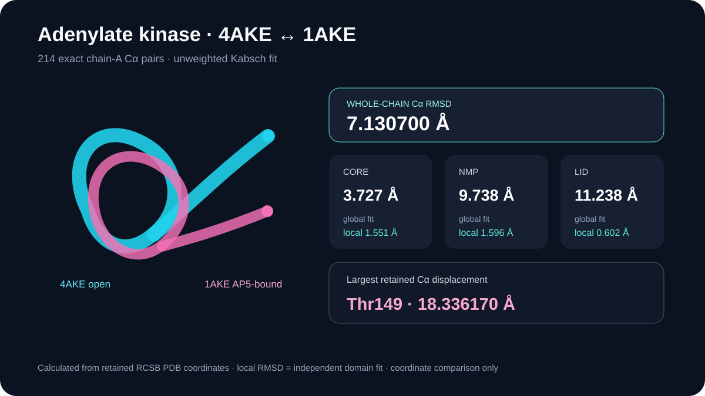

# Adenylate kinase open/closed Cα alignment

This case compares the open, unligated 4AKE chain A with AP5-bound 1AKE chain A using an explicitly retained Kabsch calculation.

## Scientific question

Which parts of *E. coli* adenylate kinase move most between the deposited open and AP5-bound conformations?

## Source observations

- RCSB reports 4AKE as an unligated 2.20 Å X-ray structure and 1AKE as an AP5 complex at 2.00 Å.
- Both retained chain-A models contain 214 Cα atoms, and all 214 pairs match by author residue number, insertion code, and residue name.

## Computed result

The unweighted whole-chain Kabsch fit gives a 7.130700 Å Cα RMSD. After that global fit, the CORE, NMP, and LID subsets have RMSDs of 3.726713, 9.738001, and 11.238005 Å, respectively. When each domain is fitted independently, its internal RMSD falls to 1.550812 Å for CORE, 1.596268 Å for NMP, and 0.601789 Å for LID.

The contrast between low independent-domain RMSDs and larger deviations after the whole-chain fit supports a rigid-domain displacement description. Thr149 has the largest retained Cα deviation at 18.336170 Å.

## Method

`scripts/compute_alignment.py` reads blank/A alternate-location Cα atoms with positive occupancy, pairs exact author identities, and applies an unweighted Kabsch least-squares fit. Domain ranges are CORE 1–29, 68–117, 161–214; NMP 30–67; and LID 118–160.

## Limitations

- RMSD depends on atom selection and correspondence; these values are chain-A Cα diagnostics.
- The calculation does not estimate conformational populations, free energy, or catalytic kinetics.
- Crystal packing, resolution, and AP5 binding differ between the two entries.

## Reproduce

Run `python scripts/compute_alignment.py` from this case directory, then compare `outputs/alignment-results.json` with the preview and retained source hashes.

## Rosalind Workbench observation

`outputs/rosalind-open-observation.json` records a case-specific `mcp__rosalind__rosalind_open` call and the exact ready message returned by the launcher. The call only opened the research-task chooser; it did not select a task or execute a Rosalind scientific job.
