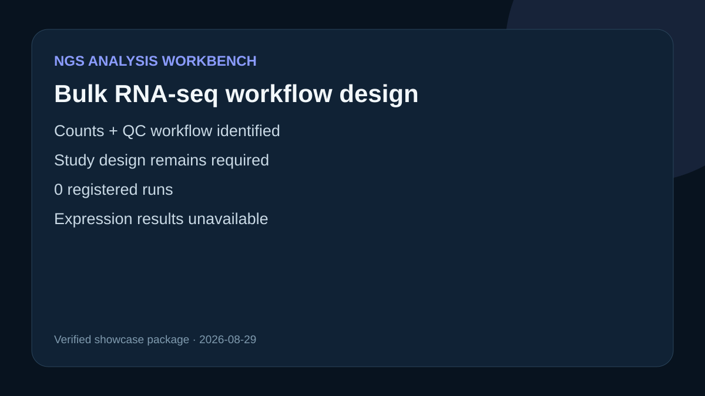

# Bulk RNA-seq workflow design

## Scientific objective

Design a compact bulk RNA-seq counts-and-QC analysis while preserving sample design, reference identity, and reproducible workflow evidence.

## Verified observations

- Bundled workflow: `oai_bulk_rnaseq_counts_qc`
- Active version: `version-a99d0908ddacd176e3b77e9ec2e482f3`
- Workflow source digest: `sha256:eddf2cd523b62c20b3fa4496c4d441b9dfb48a303de9c5b922bad30d7e30f9cc`
- The local target is currently unable to launch this Snakemake workflow, and the configured Ubuntu target was unreachable.
- The registered run list was empty; no dataset was fetched and no analysis result exists.

## Proposed analysis

See `outputs/analysis-plan.md` for the assay-aware design. `outputs/readiness-review.md` separates observed runtime facts from unknown scientific results.

## Rosalind Workbench observation

One case-specific `mcp__rosalind__rosalind_open` call returned `Rosalind Workbench is ready. Choose a research task in the app.` with `ready: true`. The exact arguments, response, and timestamps are retained in `outputs/rosalind-open-observation.json`; `outputs/provenance.json` identifies it separately from the earlier NGS Workbench observations. The call opened only the task chooser and did not quantify RNA, test a contrast, or execute a scientific job.

## Interpretation

This case demonstrates live workflow discovery and an evidence-labelled scientific plan. It does not report QC, expression, cell types, or differential biology.

## Teaching bundle

`outputs/session-bundle.md` indexes the case guide, prompt, retained evidence, provenance, launcher observation, and preview for a reproducible lesson.

## 2026-08-30 operation evidence review

The current review retains only operations with explicit successful responses as capabilities. The case-specific machine-readable record is `outputs/operation-evidence.json`.

- Successful operations: `ngs-analysis-workbench.list_workflows`, `ngs-analysis-workbench.check_nextflow_readiness`.
- Failed operations: `mcp__ngs_analysis_workbench__plan_nextflow`.
- Operations not executed: `mcp__ngs_analysis_workbench__execute_plan`.
- SSH and runtime responses are stored without private device names, user paths, task identifiers, or credentials.
