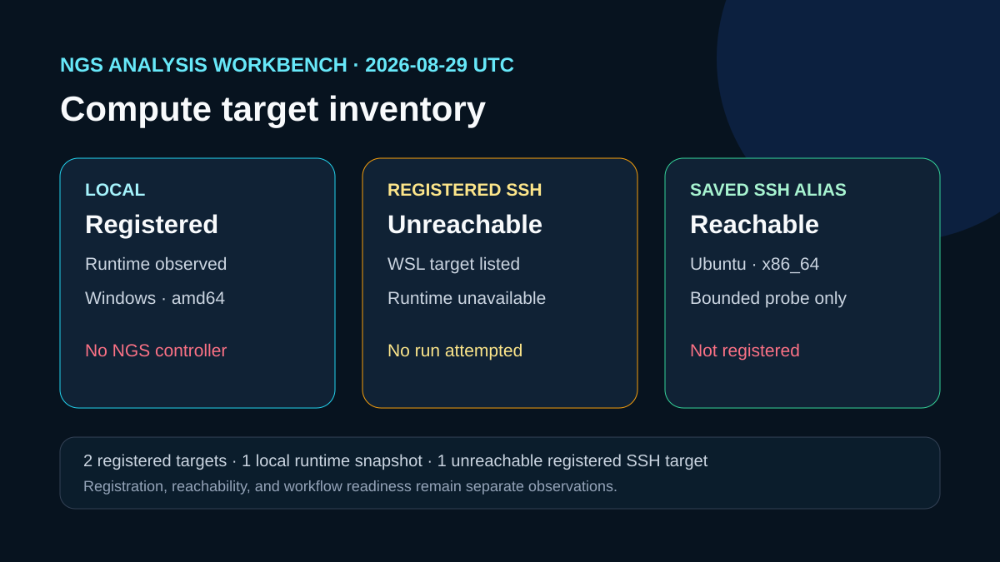

# Compute target inventory

## Question

Which local and SSH compute contexts are currently visible, registered, and inspectable for NGS work?

## Observed inventory

- NGS Analysis Workbench listed three registered contexts: the local controller, one previously registered SSH context, and the authorized SSH compute target used for this verification.
- The local runtime snapshot completed on Windows amd64.
- The registered WSL SSH target could not be reached during inspection.
- The authorized SSH compute target accepted a read-only BatchMode probe, was registered successfully, and was reached by bounded Workbench inspection.
- The registration created only a nonsecret target reference. No workspace, workflow plan, or workflow run was created.

`outputs/compute-target-inventory.json` preserves the structured inventory, `outputs/target-status.csv` supports direct comparison, and `outputs/inspection-notes.txt` records the attempted operations.

## Rosalind Workbench invocation

`mcp__rosalind__rosalind_open` returned `Rosalind Workbench is ready. Choose a research task in the app.` with `ready: true`. The exact response and timestamps are retained in `outputs/rosalind-open-observation.json`. This operation opened only the task chooser; it does not show that a Rosalind scientific task, NGS workflow, or computation was selected or executed.

## Interpretation

The local controller and the newly registered authorized SSH compute target both have bounded runtime observations. The earlier registered SSH context remains unavailable in this observation. The authorized target still lacks Snakemake and Nextflow, so registration alone does not support workflow execution.

## Limitations

The inventory establishes registration and bounded reachability only. It does not establish engine, workflow, task-software, scheduler-worker, shared-filesystem, or scientific readiness.

## Reproduce

1. Run `ngs-compute.list_compute_targets` and retain only nonsecret target metadata.
2. Run `ngs-analysis-workbench.get_runtime_environment` for `local`.
3. Attempt `ngs-compute.inspect_compute_target` for registered SSH targets.
4. Probe the authorized SSH compute target with BatchMode and a short timeout, omitting aliases and identifying connection fields from the retained output.
5. Compare the new observations with the dated JSON and CSV files.

## 2026-08-30 operation evidence review

The current review retains only operations with explicit successful responses as capabilities. The case-specific machine-readable record is `outputs/operation-evidence.json`.

- Successful operations: `ngs-compute.list_compute_targets`, `ngs-compute.inspect_compute_target`, `ngs-analysis-workbench.get_runtime_environment`.
- Failed operations: none.
- Operations not executed: none.
- SSH and runtime responses are stored without private device names, user paths, task identifiers, or credentials.
