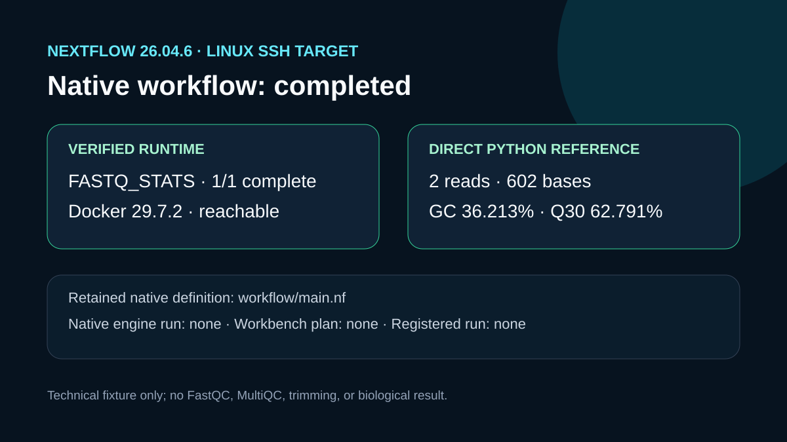

# Nextflow readiness report

## Question

Can the repaired local SSH target execute the retained FASTQ statistics workflow through Nextflow, and can Workbench prepare the catalogued Docker-profile workflow?

## Workbench readiness result

The repaired Linux target exposes Nextflow 26.04.6, Java 21.0.12, Docker 29.7.2, and a reachable Linux Docker daemon. A refreshed `get_runtime_environment` call returned an active Nextflow controller candidate. The later `check_nextflow_readiness` call still failed before readiness evaluation because the Windows-hosted plugin converted the remote POSIX run directory to a backslash-prefixed path. No immutable plan or registered Workbench run was created.

The sanitized response is retained in `outputs/readiness.json`. `workflow/main.nf` is the exact minimal native definition used for this case's offline FASTQ structural-statistics test; `inputs/params.json` and `inputs/samplesheet.csv` retain its input contract.

## Direct reference computation

After correcting `workflow/main.nf` so its script and fixture paths resolve from the `workflow/` directory, Nextflow executed `FASTQ_STATS` successfully with one completed task and exit code 0. The same fixture contains two complete 301-base records: 602 total bases, 36.213% GC, 62.791% Q30 bases under a Phred+33 assumption, and mean Phred 29.402. These values confirm parser behavior for the tiny fixture only.

## Rosalind Workbench invocation

`mcp__rosalind__rosalind_open` returned `Rosalind Workbench is ready. Choose a research task in the app.` with `ready: true`. The exact response and timestamps are retained in `outputs/rosalind-open-observation.json`. This operation opened only the task chooser; it does not show that a Rosalind scientific task, Nextflow workflow, or computation was selected or executed.

## Interpretation

The case now demonstrates a native Nextflow run of the retained minimal FASTQ statistics workflow. It does not demonstrate a successful Workbench readiness decision, plan, registered run, FastQC, MultiQC, adapter detection, trimming, or scientific QC acceptance.

## Limitations

The two-record prefix is too small and nonrepresentative for library-quality inference. The completed native workflow is a structural-statistics check and does not replace the catalogued nf-core workflow. Its task did not use a container image.

## Reproduce

1. Refresh `get_runtime_environment` for the registered Linux SSH target.
2. Run `check_nextflow_readiness` for `fastq_qc`, the same target, Docker profile, controller candidate, and a new absolute POSIX run directory.
3. Run `nextflow run workflow/main.nf` from a temporary Linux launch directory and record its exit status.
4. Run `python scripts/reference_fastq_stats.py inputs/public-fixture.fastq` and compare the JSON with `outputs/reference-fastq-stats.json`.

## 2026-08-30 operation evidence review

The current review retains only operations with explicit successful responses as capabilities. The case-specific machine-readable record is `outputs/operation-evidence.json`.

- Successful operations: `ngs-analysis-workbench.list_workflows`, `ngs-analysis-workbench.get_runtime_environment`, `ngs-analysis-workbench.check_nextflow_readiness`.
- Additional verified action: native Nextflow 26.04.6 completed the retained `FASTQ_STATS` process with exit code 0.
- Failed operations: `mcp__ngs_analysis_workbench__check_nextflow_readiness` (invalid local path and later POSIX-path conversion), `mcp__ngs_analysis_workbench__plan_nextflow`.
- Operations not executed: `mcp__ngs_analysis_workbench__execute_plan`.
- SSH and runtime responses are stored without private device names, user paths, task identifiers, or credentials.
