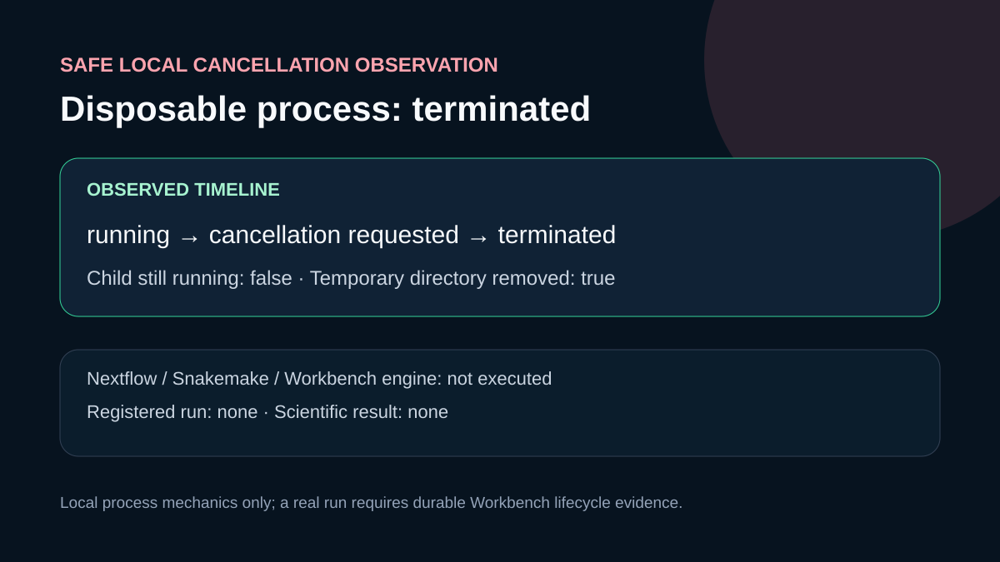

# Codex showcase lesson: Disposable run cancellation

## Session prompt

Use $showcase-teacher to import and teach the ready showcase `ngs-run-cancellation` (Disposable run cancellation). Inspect its README, manifest, prompt, inputs, outputs, previews, and provenance records. Clearly distinguish source observations, computed results, scientific interpretation, and limitations, and show the preview when useful.

## Catalogue record

- Showcase ID: `ngs-run-cancellation`
- Plugin: `ngs-analysis-workbench` (NGS Analysis Workbench v0.2.16)
- Status: `ready`
- Domain: `genomics-and-pathology`
- Case type: `recovery`
- Difficulty: `advanced`
- Evidence level: `multi-tool-result`
- Covered operations: `ngs-analysis-workbench.list_workflows`, `rosalind.rosalind_open`
- Rosalind tasks: none recorded
- Actual tools: `mcp__ngs_analysis_workbench__list_workflows`, `Python 3.14 subprocess and tempfile`, `mcp__rosalind__rosalind_open`
- Summary: How is a temporary run cancelled and its terminal state verified?
- Recorded next step: Repeat the disposable Python child-process cancellation and verify both terminal state and temporary-file cleanup.
- Plugin guide: `showcases/ngs-analysis-workbench/README.md`

## Repository files to inspect

- case guide: `showcases/ngs-analysis-workbench/cases/ngs-run-cancellation/README.md`
- case manifest: `showcases/ngs-analysis-workbench/cases/ngs-run-cancellation/showcase.json`
- teaching prompt: `showcases/ngs-analysis-workbench/cases/ngs-run-cancellation/prompt.md`
- input: `showcases/ngs-analysis-workbench/cases/ngs-run-cancellation/inputs/public-source.md`
- input: `showcases/ngs-analysis-workbench/cases/ngs-run-cancellation/scripts/run_cancellation_demo.py`
- output: `showcases/ngs-analysis-workbench/cases/ngs-run-cancellation/outputs/cancellation-observation.json`
- output: `showcases/ngs-analysis-workbench/cases/ngs-run-cancellation/outputs/provenance.json`
- output: `showcases/ngs-analysis-workbench/cases/ngs-run-cancellation/outputs/cancel-ngs-run-receipt.json`
- output: `showcases/ngs-analysis-workbench/cases/ngs-run-cancellation/outputs/rosalind-open-observation.json`
- output: `showcases/ngs-analysis-workbench/cases/ngs-run-cancellation/outputs/session-bundle.md`
- output: `showcases/ngs-analysis-workbench/cases/ngs-run-cancellation/outputs/operation-evidence.json`
- preview: `showcases/ngs-analysis-workbench/cases/ngs-run-cancellation/previews/preview.svg`

## Public sources

- installed-plugin://ngs-analysis-workbench/0.2.16/tool-contract
- installed-plugin://rosalind-workbench/tool-contract
- https://www.nextflow.io/docs/latest/reference/cli.html

## Retained case guide

# Disposable run cancellation

## Scientific question

What cancellation evidence is available when a planned temporary Workbench run could not be registered?

## Local cancellation observation

`scripts/run_cancellation_demo.py` created a temporary directory, started one case-owned Python child, waited for its explicit started marker, sent termination to that child, observed its exit, and then allowed the temporary directory to be removed. `outputs/cancellation-observation.json` records the observed `running` and `terminated` states, cancellation time, exit code, `child_running_after_cancellation: false`, and `temporary_directory_removed: true`.

This is a local reference computation for cancellation mechanics. It did not call Nextflow, Snakemake, or `execute_plan`, and it produced no immutable plan, registered run, result artifact, or biological finding.

## Workbench cancellation response

`ngs-analysis-workbench.cancel_ngs_run` was called only with the reserved temporary identity `verification-temp-no-run-20260830`. Workbench returned `{"ok": false, "errors": ["registry run does not exist: verification-temp-no-run-20260830"]}`. The exact arguments, response, and timestamps are retained in `outputs/cancel-ngs-run-receipt.json` and cited by `outputs/provenance.json`. Because the planning step did not create the temporary run, no existing run or scientific workflow was affected.

## Rosalind Workbench observation

One case-specific `mcp__rosalind__rosalind_open` call returned `Rosalind Workbench is ready. Choose a research task in the app.` with `ready: true`. The exact arguments, response, and timestamps are retained in `outputs/rosalind-open-observation.json` and cited by `outputs/provenance.json`. This call opened only the task chooser; it did not start or cancel a Workbench engine run.

## Interpretation

The case now records two distinct observations: successful termination of an owned local child and a rejected Workbench cancellation request for a temporary identity that did not exist. A completed Workbench cancellation would still require a genuinely registered temporary run and final `get_ngs_run` evidence.

## Limitations

- The child process performed no NGS computation and produced no scientific output.
- Exit code `1` is the observed Windows termination result for this child and is interpreted only with the explicit termination timeline.
- No Nextflow, Snakemake, NGS Workbench engine, or Rosalind scientific task executed.
- The Workbench cancellation operation did not succeed because no temporary registry run had been created.

## Reproduce

1. Run `python scripts/run_cancellation_demo.py outputs/cancellation-observation.json`.
2. Confirm the retained terminal state, stopped-child flag, and temporary-directory cleanup flag.
3. Call `mcp__rosalind__rosalind_open` with the case-specific `task_context` retained in `outputs/rosalind-open-observation.json` and compare the exact response.
4. Call `cancel_ngs_run` only for the reserved verification identity or a newly created temporary run owned by this case, and compare the response with `outputs/cancel-ngs-run-receipt.json`.
5. Generate `outputs/session-bundle.md` with the repository showcase-session script and inspect every listed artifact.

## 2026-08-30 operation evidence review

The current review retains only operations with explicit successful responses as capabilities. The case-specific machine-readable record is `outputs/operation-evidence.json`.

- Successful operations: `ngs-analysis-workbench.list_workflows`.
- Failed operations: `mcp__ngs_analysis_workbench__cancel_ngs_run`.
- Operations not executed: `registered run lifecycle`.
- SSH and runtime responses are stored without private device names, user paths, task identifiers, or credentials.

## Retained execution prompt

# Disposable run cancellation

Demonstrate local cancellation only with the case-owned Python child created by `scripts/run_cancellation_demo.py`. Retain its running state, cancellation request, terminal process state, stopped-child check, and temporary-directory cleanup in `outputs/cancellation-observation.json`. Separately call `ngs-analysis-workbench.cancel_ngs_run` only for the reserved temporary verification identity or a genuinely registered temporary run created for this case. Preserve exact arguments, response, and timestamps in `outputs/cancel-ngs-run-receipt.json`, and state plainly whether any registered run was affected.

Call `mcp__rosalind__rosalind_open` with the case-specific `task_context` retained in `outputs/rosalind-open-observation.json`. Preserve the exact response and timestamps, cite the observation from `outputs/provenance.json`, and state that the launcher call did not start or cancel a Rosalind scientific job.

## Teaching note

Use this bundle to locate the evidence. Read the listed repository artifacts before presenting scientific claims, and keep observations, calculations, interpretation, and limitations distinct.
