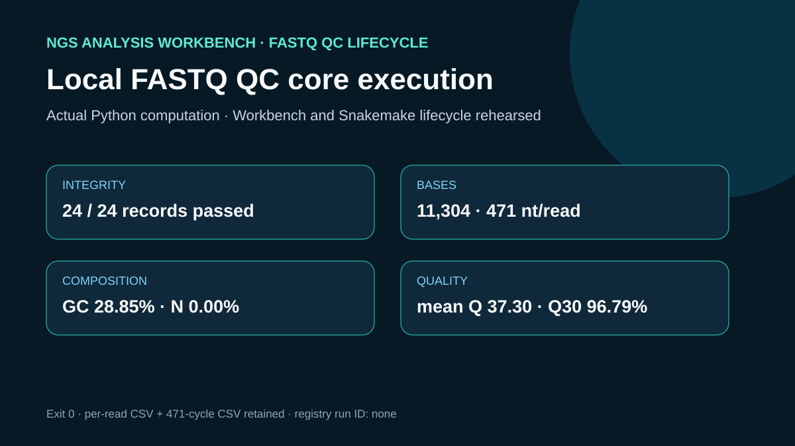

# Codex showcase lesson: Small workflow execution

## Session prompt

Use $showcase-teacher to import and teach the ready showcase `ngs-run-execution` (Small workflow execution). Inspect its README, manifest, prompt, inputs, outputs, previews, and provenance records. Clearly distinguish source observations, computed results, scientific interpretation, and limitations, and show the preview when useful.

## Catalogue record

- Showcase ID: `ngs-run-execution`
- Plugin: `ngs-analysis-workbench` (NGS Analysis Workbench v0.2.16)
- Status: `ready`
- Domain: `genomics-and-pathology`
- Case type: `workflow`
- Difficulty: `advanced`
- Evidence level: `computed-result`
- Covered operations: `ngs-analysis-workbench.get_runtime_environment`, `rosalind.rosalind_open`
- Rosalind tasks: none recorded
- Actual tools: `mcp__ngs_analysis_workbench__get_runtime_environment`, `Python 3.14 standard library`, `mcp__rosalind__rosalind_open`
- Summary: How is an approved small plan executed and its registry identifier retained?
- Recorded next step: Recompute the local FASTQ quality metrics and distinguish that execution from the rehearsed Workbench and Snakemake operations.
- Plugin guide: `showcases/ngs-analysis-workbench/README.md`

## Repository files to inspect

- case guide: `showcases/ngs-analysis-workbench/cases/ngs-run-execution/README.md`
- case manifest: `showcases/ngs-analysis-workbench/cases/ngs-run-execution/showcase.json`
- teaching prompt: `showcases/ngs-analysis-workbench/cases/ngs-run-execution/prompt.md`
- input: `showcases/ngs-analysis-workbench/cases/ngs-run-execution/inputs/public-source.md`
- input: `showcases/ngs-analysis-workbench/cases/ngs-run-execution/inputs/DRR037765-first-24.fastq`
- input: `showcases/ngs-analysis-workbench/cases/ngs-run-execution/workflow/Snakefile`
- input: `showcases/ngs-analysis-workbench/cases/ngs-run-execution/workflow/config/config.json`
- input: `showcases/ngs-analysis-workbench/cases/ngs-run-execution/workflow/scripts/qc_core.py`
- output: `showcases/ngs-analysis-workbench/cases/ngs-run-execution/outputs/runtime-snapshot.json`
- output: `showcases/ngs-analysis-workbench/cases/ngs-run-execution/outputs/qc-summary.json`
- output: `showcases/ngs-analysis-workbench/cases/ngs-run-execution/outputs/read-metrics.csv`
- output: `showcases/ngs-analysis-workbench/cases/ngs-run-execution/outputs/cycle-quality.csv`
- output: `showcases/ngs-analysis-workbench/cases/ngs-run-execution/outputs/run-log.txt`
- output: `showcases/ngs-analysis-workbench/cases/ngs-run-execution/outputs/local-run-receipt.json`
- output: `showcases/ngs-analysis-workbench/cases/ngs-run-execution/outputs/rosalind-open-observation.json`
- output: `showcases/ngs-analysis-workbench/cases/ngs-run-execution/outputs/session-bundle.md`
- output: `showcases/ngs-analysis-workbench/cases/ngs-run-execution/outputs/operation-evidence.json`
- preview: `showcases/ngs-analysis-workbench/cases/ngs-run-execution/previews/preview.svg`

## Public sources

- https://ftp.sra.ebi.ac.uk/vol1/fastq/DRR037/DRR037765/DRR037765.fastq.gz

## Retained case guide

# Local FASTQ QC core execution



## Scientific question

What integrity, composition, and bounded Phred-quality measurements are produced when the transparent version 2 QC core runs on the compact public fixture?

## Runtime observation

NGS Analysis Workbench runtime inspection found both `snakemake` and `nextflow` missing from the local target, no controller candidates, and an unreachable Docker daemon. Consequently, `execute_plan` and a workflow engine were not invoked. `outputs/runtime-snapshot.json` preserves the concise runtime evidence.

## Rosalind Workbench invocation

The case called `mcp__rosalind__rosalind_open` at 2026-08-29T17:56:41.600Z (2026-08-30 01:56:41.600 +08:00) with the case-specific `task_context` retained in the observation file. The exact response was `Rosalind Workbench is ready. Choose a research task in the app.` with `ready: true` and `view: launcher`.

This operation only opened the Rosalind task chooser. It did not select or execute a Rosalind scientific task and does not support a scientific-result claim. `outputs/rosalind-open-observation.json` retains the exact response and the case-specific context.

## Actual local computation

Python 3.14 executed `workflow/scripts/qc_core.py` directly and exited with code 0. The public receipt uses only the interpreter name and repository-relative paths. The parser confirmed 24 unique complete records and 11,304 bases, all 471 bases long. GC was 28.85%, mean Phred was 37.30, Q20 was 99.27%, Q30 was 96.79%, and N content was 0.00%. Per-read and per-cycle tables are retained.

## Interpretation

This small fixture has high base-call quality under the recorded Phred+33 interpretation, and its FASTQ structure is internally consistent. These measurements describe only the retained 24 records. They do not support a claim about the entire run, sample identity, adapters, contaminants, or downstream suitability.

## Limitations

- Workbench execution and Snakemake execution were rehearsed only; there is no registry run ID.
- The first 24 records may not represent later records or the full run.
- No FastQC, MultiQC, adapter classification, contamination screen, pairing check, or assay-specific QC was performed.
- Direct Python execution tests the scientific core but does not establish engine readiness.

## Reproduce

From `showcases/ngs-analysis-workbench/cases/ngs-run-execution`, run:

```powershell
python workflow/scripts/qc_core.py --input inputs/DRR037765-first-24.fastq --summary outputs/qc-summary.json --reads outputs/read-metrics.csv --cycles outputs/cycle-quality.csv --q20 20 --q30 30 --timeline ../ngs-run-observation/outputs/local-run-timeline.jsonl --log outputs/run-log.txt
```

Then compare the exit code, file identities, summary JSON, read table, and cycle table with `outputs/local-run-receipt.json`.

## 2026-08-30 operation evidence review

The current review retains only operations with explicit successful responses as capabilities. The case-specific machine-readable record is `outputs/operation-evidence.json`.

- Successful operations: `ngs-analysis-workbench.get_runtime_environment`.
- Failed operations: none.
- Operations not executed: `mcp__ngs_analysis_workbench__execute_plan`.
- SSH and runtime responses are stored without private device names, user paths, task identifiers, or credentials.

## Retained execution prompt

# Execute the transparent QC core locally

Inspect the local runtime. If neither Snakemake nor Nextflow is available, do not claim an engine or Workbench run. Execute the retained Python QC core directly on the 24-record public FASTQ fixture, preserve the command, exit code, output identities, and metrics, and label the Workbench execution lifecycle as rehearsed. Publish only the interpreter name and repository-relative paths; do not retain local absolute paths.

Call `mcp__rosalind__rosalind_open` with a case-specific `task_context` and retain the exact launcher observation in `outputs/rosalind-open-observation.json`. Treat it only as evidence that the task chooser opened.

## Teaching note

Use this bundle to locate the evidence. Read the listed repository artifacts before presenting scientific claims, and keep observations, calculations, interpretation, and limitations distinct.
