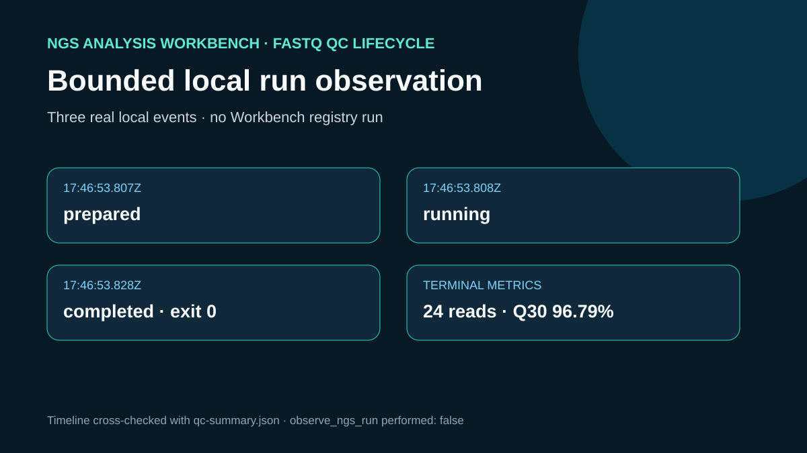

# Bounded local run observation

## Scientific question

What does Workbench history report before a short local state timeline is compared with actual QC artifacts?

## Observed timeline

`outputs/local-run-timeline.jsonl` contains exactly three ordered events: `prepared`, `running`, and `completed`. The terminal event records exit code 0, 24 records, 11,304 bases, Q30 96.788747%, and the summary path. `outputs/observed-metrics.json` verifies the terminal state against the local QC summary.

## Workbench history observation

`ngs-analysis-workbench.list_ngs_runs(limit=20)` and `ngs-analysis-workbench.list_ngs_run_lineages(limit=20)` both completed successfully. Each returned `{"ok": true, "runs": []}`. Exact arguments, responses, and UTC timestamps are retained in `outputs/run-history-receipt.json` and cited by `outputs/provenance.json`. The empty results confirm that the local JSONL event ID has no Workbench registry identity or parent-child history.

## Rosalind Workbench invocation

The case called `mcp__rosalind__rosalind_open` at 2026-08-29T17:56:41.641Z (2026-08-30 01:56:41.641 +08:00) with the case-specific `task_context` retained in the observation file. The exact response was `Rosalind Workbench is ready. Choose a research task in the app.` with `ready: true` and `view: launcher`.

This operation only opened the Rosalind task chooser. It did not select or execute a Rosalind scientific task and does not support a scientific-result claim. `outputs/rosalind-open-observation.json` retains the exact response and the case-specific context.

## Interpretation

The Workbench queries and local files describe different evidence. Workbench observed no durable runs or lineage; the local state sequence and output metrics show that the separate Python reference computation completed. The local timeline is not evidence of `execute_plan`, `observe_ngs_run`, a workflow-engine controller, recovery, or Workbench persistence.

## Limitations

- `observe_ngs_run` and `get_ngs_run` could not be applied because both history operations returned no registered run.
- Millisecond timestamps describe a very small local fixture and are not performance benchmarks.
- The terminal event confirms process completion; scientific interpretation still depends on the retained summary and tables.
- The subset limitations from the execution case still apply.

## Reproduce

1. Run `../ngs-workflow-save/build_cases.py` from the repository root; it recreates the timeline while executing the QC core.
2. Read the JSONL events in file order and require the final state to be `completed` with exit code 0.
3. Compare records, bases, and Q30 in the terminal event with `../ngs-run-execution/outputs/qc-summary.json`.
4. Inspect the per-read and per-cycle CSV files for the underlying measurements.
5. Do not substitute a local event identifier for a Workbench registry run ID.
6. Call `list_ngs_runs(limit=20)` and `list_ngs_run_lineages(limit=20)` and compare their exact responses with `outputs/run-history-receipt.json`.

## 2026-08-30 operation evidence review

The current review retains only operations with explicit successful responses as capabilities. The case-specific machine-readable record is `outputs/operation-evidence.json`.

- Successful operations: `ngs-analysis-workbench.list_ngs_runs`, `ngs-analysis-workbench.list_ngs_run_lineages`.
- Failed operations: `mcp__ngs_analysis_workbench__get_ngs_run`, `mcp__ngs_analysis_workbench__observe_ngs_run`.
- Operations not executed: `registered run lifecycle`.
- SSH and runtime responses are stored without private device names, user paths, task identifiers, or credentials.
