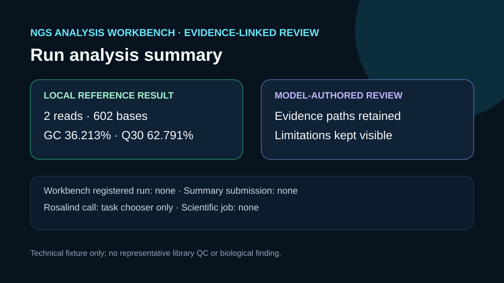

# Run analysis summary

## Scientific question

What happens when an evidence-linked scientific summary is submitted while no registered Workbench run exists?

## Source and local reference computation

`inputs/source-and-fixture.md` identifies a public nf-core test-dataset file and the retained two-record prefix. Local Python processed the two complete 301-base records and wrote `outputs/reference-fastq-stats.json`: 602 total bases, 36.213% GC, 62.791% Q30 under a Phred+33 assumption, and mean Phred 29.402. `outputs/reference-computation-receipt.json` records the command and makes clear that this was a local reference computation, not an NGS Analysis Workbench engine run.

## Model-authored review

`outputs/analysis-summary.md` follows the NGS Analysis Workbench review structure: a short takeaway, a plain-language lifecycle paragraph, evidence-linked findings, artifact groups, limitations, and a justified next action. `ngs-analysis-workbench.update_ngs_run_analysis_summary` was called with the reserved temporary identity `verification-temp-no-run-20260830`. Workbench returned `run does not exist: verification-temp-no-run-20260830`, so the summary was not saved and no existing run was modified. The exact safe arguments, response, and timestamps are retained in `outputs/update-analysis-summary-receipt.json` and cited by `outputs/provenance.json`.

## Rosalind Workbench observation

One case-specific `mcp__rosalind__rosalind_open` call returned `Rosalind Workbench is ready. Choose a research task in the app.` with `ready: true`. The exact arguments, response, and timestamps are retained in `outputs/rosalind-open-observation.json` and cited by `outputs/provenance.json`. This call opened only the task chooser; it did not create a run, inspect the FASTQ, or submit the summary to Workbench history.

## Limitations

- The two-record prefix is a parser fixture and cannot represent the full public library.
- No FastQC, MultiQC, adapter analysis, trimming, workflow engine, immutable plan, registered run, or Workbench summary submission occurred.
- The genuine summary operation was rejected because no registered temporary run existed; its failure does not convert the local reference computation into a Workbench run.
- The Rosalind launcher observation provides no scientific result.

## Reproduce

1. Run `python scripts/reference_fastq_stats.py inputs/public-fixture.fastq.txt outputs/reference-fastq-stats.json`.
2. Compare the result with the values and evidence paths in `outputs/analysis-summary.md`.
3. Call `mcp__rosalind__rosalind_open` with the case-specific `task_context` retained in `outputs/rosalind-open-observation.json` and compare the exact response.
4. Call `update_ngs_run_analysis_summary` only with a temporary verification identity or a genuinely registered run owned by the task, and compare the response with `outputs/update-analysis-summary-receipt.json`.
5. Generate `outputs/session-bundle.md` with the repository showcase-session script and inspect every listed artifact.

## 2026-08-30 operation evidence review

The current review retains only operations with explicit successful responses as capabilities. The case-specific machine-readable record is `outputs/operation-evidence.json`.

- Successful operations: `ngs-analysis-workbench.list_workflow_versions`.
- Failed operations: `mcp__ngs_analysis_workbench__update_ngs_run_analysis_summary`.
- Operations not executed: `registered run lifecycle`.
- SSH and runtime responses are stored without private device names, user paths, task identifiers, or credentials.
