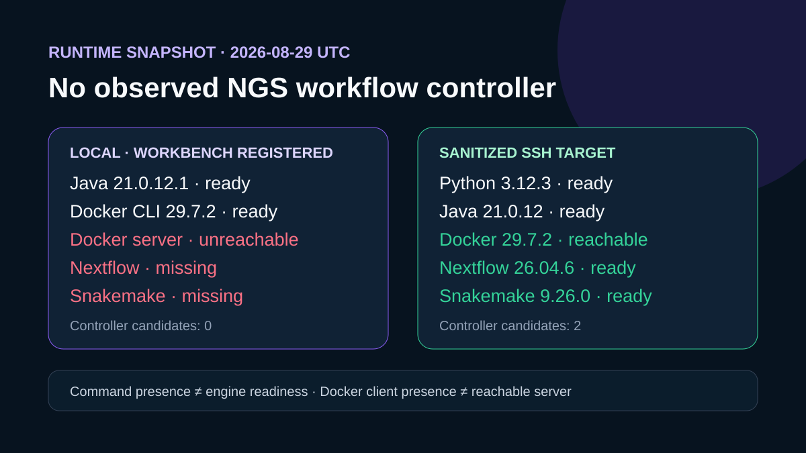

# Runtime environment inspection

## Question

Which workflow controllers and supporting runtimes are visible on the current local controller and the authorized SSH compute target?

## Local Workbench snapshot

The server-authored local snapshot identified Windows amd64 with Java 21.0.12.1, Docker client 29.7.2, Conda 25.11.1, and Mamba 0.11.3. Nextflow and Snakemake were missing, no compatible controller candidate was returned, and the Docker client could not reach its server. Thirteen managed environments were scanned, with no compatible managed controller found.

## Authorized SSH compute target

After repair, the registered Linux SSH target exposed Python 3.12.3, Java 21.0.12, Nextflow 26.04.6, Snakemake 9.26.0, Micromamba 2.9.0, and Docker 29.7.2. Workbench confirmed two active host-path controller candidates and a reachable local Linux Docker daemon. A cached `hello-world` container completed with exit code 0; environment-specific connection identifiers are not retained.

## Rosalind Workbench invocation

`mcp__rosalind__rosalind_open` returned `Rosalind Workbench is ready. Choose a research task in the app.` with `ready: true`. The exact response and timestamps are retained in `outputs/rosalind-open-observation.json`. This operation opened only the task chooser; it does not show that a Rosalind scientific task, runtime inspection, or computation was selected or executed.

## Interpretation

The Windows controller remains unsuitable for direct workflow execution, while the repaired Linux SSH target supplies both workflow controllers and a reachable Docker daemon. A fresh runtime snapshot is still required before each later readiness or planning attempt because snapshot identities expire quickly.

## Limitations

The Workbench snapshot did not exhaustively search unactivated environments. The Docker smoke test used only the public `hello-world` image; no scientific container image or task-software stack was resolved by Workbench.

## Reproduce

1. Call `ngs-analysis-workbench.get_runtime_environment(target_id="local")`.
2. Call it for registered SSH targets and retain any reachability error.
3. When authorized, run the bounded SSH probe from `inputs/runtime-inspection-method.md`.
4. Compare `outputs/runtime-environment.json` and `outputs/runtime-comparison.csv`, treating `missing` as scoped to the observed command context.

## 2026-08-30 operation evidence review

The current review retains only operations with explicit successful responses as capabilities. The case-specific machine-readable record is `outputs/operation-evidence.json`.

- Successful operations: `ngs-analysis-workbench.get_runtime_environment`.
- Failed operations: none.
- Operations not executed: none.
- SSH and runtime responses are stored without private device names, user paths, task identifiers, or credentials.
