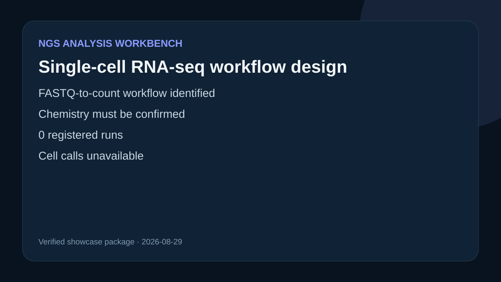

# Single-cell RNA-seq workflow design

## Scientific objective

Design a FASTQ-to-count single-cell RNA-seq analysis with explicit chemistry, reference, cell-calling, and quality-review requirements.

## Verified observations

- Bundled workflow: `oai_scrnaseq_fastq_to_count`
- Active version: `version-f3c773924a7ebc534c3adc131d4356ec`
- Workflow source digest: `sha256:6f7aa0dcf4ed6fdb6e187ff0f8d1128b6ffa93504bc688aee341fe250a893510`
- The local target is currently unable to launch this Snakemake workflow, and the configured Ubuntu target was unreachable.
- The registered run list was empty; no dataset was fetched and no analysis result exists.

## Proposed analysis

See `outputs/analysis-plan.md` for the assay-aware design. `outputs/readiness-review.md` separates observed runtime facts from unknown scientific results.

## Interpretation

This case demonstrates live workflow discovery and an evidence-labelled scientific plan. It does not report QC, expression, cell types, or differential biology.
