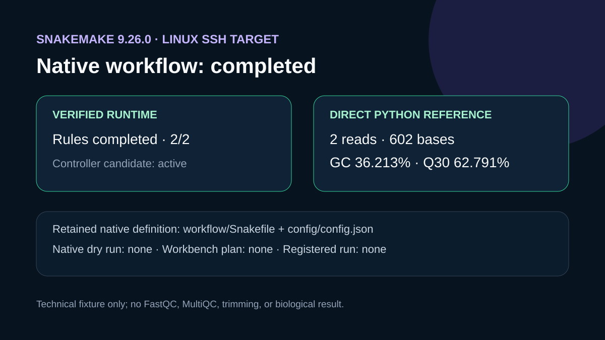

# Codex showcase lesson: Snakemake readiness report

## Session prompt

Use $showcase-teacher to import and teach the ready showcase `ngs-snakemake-readiness` (Snakemake readiness report). Inspect its README, manifest, prompt, inputs, outputs, previews, and provenance records. Clearly distinguish source observations, computed results, scientific interpretation, and limitations, and show the preview when useful.

## Catalogue record

- Showcase ID: `ngs-snakemake-readiness`
- Plugin: `ngs-analysis-workbench` (NGS Analysis Workbench v0.2.16)
- Status: `ready`
- Domain: `genomics-and-pathology`
- Case type: `workflow`
- Difficulty: `advanced`
- Evidence level: `multi-tool-result`
- Covered operations: `ngs-analysis-workbench.list_workflows`, `ngs-analysis-workbench.get_runtime_environment`, `ngs-analysis-workbench.check_snakemake_readiness`, `rosalind.rosalind_open`
- Rosalind tasks: none recorded
- Actual tools: `mcp__ngs_analysis_workbench__list_workflows`, `mcp__ngs_analysis_workbench__get_runtime_environment`, `mcp__ngs_analysis_workbench__check_snakemake_readiness`, `Python 3.14`, `mcp__rosalind__rosalind_open`
- Summary: Is a selected pipeline and environment ready for a Snakemake plan?
- Recorded next step: Recheck the Snakemake environment and compare its blocked readiness result with the retained Python FASTQ reference metrics.
- Plugin guide: `showcases/ngs-analysis-workbench/README.md`

## Repository files to inspect

- case guide: `showcases/ngs-analysis-workbench/cases/ngs-snakemake-readiness/README.md`
- case manifest: `showcases/ngs-analysis-workbench/cases/ngs-snakemake-readiness/showcase.json`
- teaching prompt: `showcases/ngs-analysis-workbench/cases/ngs-snakemake-readiness/prompt.md`
- input: `showcases/ngs-analysis-workbench/cases/ngs-snakemake-readiness/inputs/source-and-fixture.md`
- input: `showcases/ngs-analysis-workbench/cases/ngs-snakemake-readiness/inputs/public-fixture.fastq`
- input: `showcases/ngs-analysis-workbench/cases/ngs-snakemake-readiness/config/config.json`
- input: `showcases/ngs-analysis-workbench/cases/ngs-snakemake-readiness/config/README.md`
- input: `showcases/ngs-analysis-workbench/cases/ngs-snakemake-readiness/workflow/Snakefile`
- input: `showcases/ngs-analysis-workbench/cases/ngs-snakemake-readiness/scripts/reference_fastq_stats.py`
- output: `showcases/ngs-analysis-workbench/cases/ngs-snakemake-readiness/outputs/readiness.json`
- output: `showcases/ngs-analysis-workbench/cases/ngs-snakemake-readiness/outputs/reference-fastq-stats.json`
- output: `showcases/ngs-analysis-workbench/cases/ngs-snakemake-readiness/outputs/native-check.txt`
- output: `showcases/ngs-analysis-workbench/cases/ngs-snakemake-readiness/outputs/plan-snakemake-receipt.json`
- output: `showcases/ngs-analysis-workbench/cases/ngs-snakemake-readiness/outputs/provenance.json`
- output: `showcases/ngs-analysis-workbench/cases/ngs-snakemake-readiness/outputs/rosalind-open-observation.json`
- output: `showcases/ngs-analysis-workbench/cases/ngs-snakemake-readiness/outputs/operation-evidence.json`
- output: `showcases/ngs-analysis-workbench/cases/ngs-snakemake-readiness/outputs/session-bundle.md`
- preview: `showcases/ngs-analysis-workbench/cases/ngs-snakemake-readiness/previews/preview.svg`

## Public sources

- installed-plugin://ngs-analysis-workbench/0.2.16/tool-contract
- installed-plugin://rosalind-workbench/tool-contract
- https://snakemake.readthedocs.io/
- https://raw.githubusercontent.com/nf-core/test-datasets/5f09ab078a7459db38c1ec86712a98d369cf7863/illumina/amplicon/sample1_R1.fastq.gz

## Retained case guide

# Snakemake readiness report

## Question

Can the repaired local SSH target execute the retained FASTQ statistics workflow through Snakemake, and can Workbench prepare the bundled workflow?

## Workbench readiness result

The repaired Linux target exposes Snakemake 9.26.0, Python, Java, Docker 29.7.2, and a reachable Linux Docker daemon. A refreshed `get_runtime_environment` call returned an active Snakemake controller candidate. The later `check_snakemake_readiness` call failed before readiness evaluation because the Windows-hosted plugin converted the remote POSIX run directory to a backslash-prefixed path. The earlier planner call returned `module 'os' has no attribute 'fchmod'`; no immutable plan or registered Workbench run was created.

The earlier sanitized readiness response remains in `outputs/readiness.json`; the refreshed readiness result and planner response are retained in `outputs/plan-snakemake-receipt.json` and cited by `outputs/provenance.json`. `workflow/Snakefile` and `config/config.json` remain the exact minimal native definition and configuration for this case's offline FASTQ structural-statistics test.

## Direct reference computation

After changing `config/config.json` to call `python3`, Snakemake executed the `fastq_stats` and `all` rules successfully with exit code 0. The output validated two complete 301-base records: 602 total bases, 36.213% GC, 62.791% Q30 bases under a Phred+33 assumption, and mean Phred 29.402.

## Rosalind Workbench invocation

`mcp__rosalind__rosalind_open` returned `Rosalind Workbench is ready. Choose a research task in the app.` with `ready: true`. The exact response and timestamps are retained in `outputs/rosalind-open-observation.json`. This operation opened only the task chooser; it does not show that a Rosalind scientific task, Snakemake workflow, or computation was selected or executed.

## Interpretation

The retained configuration and result now demonstrate native Snakemake execution and expected output structure. Workbench still records Windows path and plan-registry compatibility errors. The evidence does not demonstrate a Workbench run, FastQC, MultiQC, adapter detection, trimming, or scientific QC acceptance.

## Limitations

The two-record prefix is too small and nonrepresentative for library-quality inference. This retained workflow contains only the structural-statistics rule; FastQC, MultiQC, trimming, and download rules were not run. The planner error prevented creation of an immutable plan, so there was no plan identity to execute.

## Reproduce

1. Read `config/README.md` and refresh `get_runtime_environment` for the registered Linux SSH target.
2. Run `check_snakemake_readiness` for `oai_fastq_qc`, the same target, controller candidate, configuration, and a new absolute POSIX run directory.
3. Call `plan_snakemake` with the same runtime snapshot and record either the immutable plan identity or the exact returned error without claiming execution.
4. Run `snakemake --cores 1 --snakefile workflow/Snakefile --configfile config/config.json` in a temporary Linux copy and record its exit status.
5. Compare the generated JSON with `outputs/reference-fastq-stats.json`.

## 2026-08-30 operation evidence review

The current review retains only operations with explicit successful responses as capabilities. The case-specific machine-readable record is `outputs/operation-evidence.json`.

- Successful operations: `ngs-analysis-workbench.list_workflows`, `ngs-analysis-workbench.get_runtime_environment`, `ngs-analysis-workbench.check_snakemake_readiness`.
- Additional verified action: native Snakemake 9.26.0 completed both retained rules with exit code 0.
- Failed operations: `mcp__ngs_analysis_workbench__check_snakemake_readiness` (invalid local path and later POSIX-path conversion), `mcp__ngs_analysis_workbench__plan_snakemake`.
- Operations not executed: `mcp__ngs_analysis_workbench__execute_plan`.
- SSH and runtime responses are stored without private device names, user paths, task identifiers, or credentials.

## Retained execution prompt

# Snakemake readiness report

Check the bundled `oai_fastq_qc` workflow on the local target. Retain its exact catalogue identity and a minimal native Snakemake definition. Refresh runtime and readiness, then call `ngs-analysis-workbench.plan_snakemake` with the same workflow, target, runtime snapshot, configuration, and temporary run directory. Preserve the exact safe arguments, timestamps, and returned plan identity or error in `outputs/plan-snakemake-receipt.json`. Do not claim that a plan or run exists when the call fails. Execute the shared Python FASTQ reference computation separately on the public two-record fixture.

Call `mcp__rosalind__rosalind_open` for this case and retain its exact launcher response with UTC and local timestamps in `outputs/rosalind-open-observation.json`. State plainly that the operation opens only the Rosalind task chooser and provides no evidence that a scientific task ran.

## Teaching note

Use this bundle to locate the evidence. Read the listed repository artifacts before presenting scientific claims, and keep observations, calculations, interpretation, and limitations distinct.
