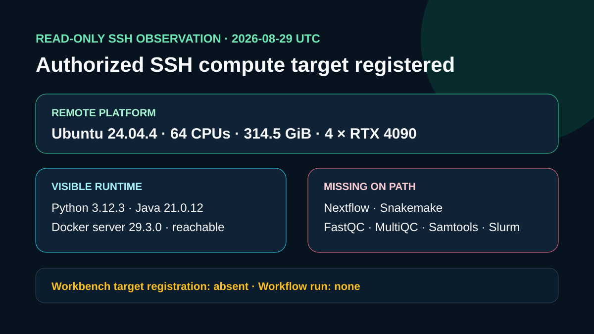

# SSH compute target registration and inspection

## Question

Can the authorized SSH compute target be registered through NGS Analysis Workbench, and what runtime facts remain after environment-specific connection fields are removed?

## Observed result

- OpenSSH BatchMode connected successfully with a 15-second timeout; no credential prompt was permitted.
- The remote platform reported Ubuntu 24.04.4 LTS, x86_64, 64 logical CPUs, 314.5 GiB of memory, and four NVIDIA GeForce RTX 4090 GPUs.
- Python 3.12.3, Java 21.0.12, Docker 29.3.0, and Git 2.43.0 were visible. The Docker server answered a read-only metadata query.
- Nextflow, Snakemake, FastQC, MultiQC, Samtools, `sbatch`, and `squeue` were not found on the noninteractive `PATH`; the Snakemake and MultiQC Python modules were also not runnable.
- `ngs-compute.configure_ssh_target` registered a case-owned target reference with the local-process executor and a temporary workspace reference.
- A post-registration inspection reached the target. The configured workspace did not yet exist, Python, Java, and Docker were ready, and Nextflow, Snakemake, FastQC, MultiQC, and Samtools were missing.

The exact safe arguments, response fields, timestamps, and omitted sensitive categories are retained in `outputs/configure-ssh-target-receipt.json`. The earlier sanitized probe remains in `outputs/ssh-target-observation.json`, and command availability is tabulated in `outputs/remote-runtime.csv`.

## Rosalind Workbench invocation

`mcp__rosalind__rosalind_open` returned `Rosalind Workbench is ready. Choose a research task in the app.` with `ready: true`. The exact response and timestamps are retained in `outputs/rosalind-open-observation.json`. This operation opened only the task chooser; it does not show that a Rosalind scientific task, remote workflow, or computation was selected or executed.

## Interpretation

The target registration succeeded and the alias is now callable through Workbench. The missing temporary workspace and absent workflow controllers still prevent this observation from supporting a plan or engine run.

## Limitations

An unactivated environment may contain additional software. Scheduler workers, filesystem sharing, container images, references, task software, and input data were not tested. The public receipts omit credentials, private addresses, usernames, host fingerprints, and host-specific executable paths.

## Reproduce

Follow `inputs/ssh-probe-plan.md`, register only the case-owned target ID, and compare the safe response fields with `outputs/configure-ssh-target-receipt.json`. Do not broaden inspection to file, process, user, container, image, or environment-variable listings.

## 2026-08-30 operation evidence review

The current review retains only operations with explicit successful responses as capabilities. The case-specific machine-readable record is `outputs/operation-evidence.json`.

- Successful operations: `ngs-compute.configure_ssh_target`, `ngs-compute.list_compute_targets`, `ngs-compute.inspect_compute_target`.
- Failed operations: `mcp__ngs_compute__configure_ssh_target`.
- Operations not executed: none.
- SSH and runtime responses are stored without private device names, user paths, task identifiers, or credentials.
