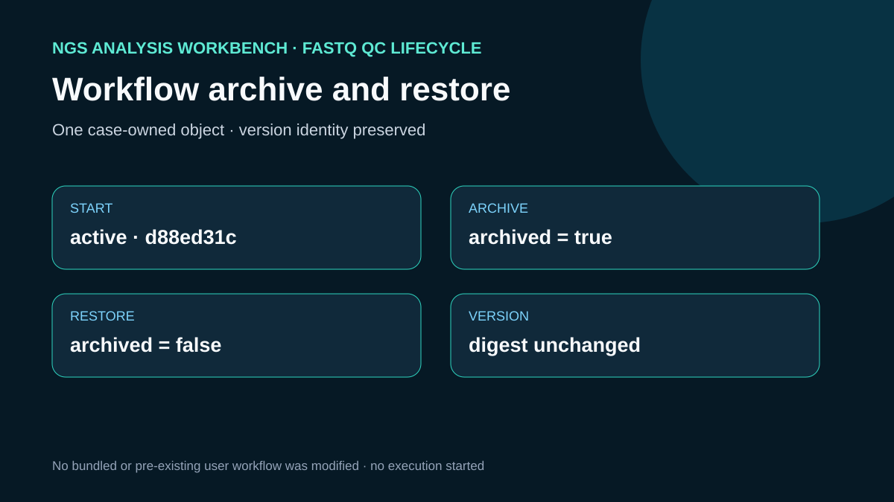

# Archive and restore the case workflow

## Scientific question

Can a disposable saved workflow be hidden and restored without losing its active version identity?

## Workbench observations

The case archived only `showcase_fastq_qc_lifecycle_20260830`, an object created moments earlier for these showcases. The archived listing returned `archived: true` while preserving `version-d88ed31c58ebee8c5667ddee257b846f` and its source digest. Restoration returned `archived: false` with the same version and digest.

## Rosalind Workbench invocation

The case called `mcp__rosalind__rosalind_open` at 2026-08-29T17:56:41.559Z (2026-08-30 01:56:41.559 +08:00) with the case-specific `task_context` retained in the observation file. The exact response was `Rosalind Workbench is ready. Choose a research task in the app.` with `ready: true` and `view: launcher`.

This operation only opened the Rosalind task chooser. It did not select or execute a Rosalind scientific task and does not support a scientific-result claim. `outputs/rosalind-open-observation.json` retains the exact response and the case-specific context.

## Interpretation

The observed lifecycle shows that archive changes discovery visibility while the saved version remains identifiable. The action neither ran the workflow nor altered public FASTQ data.

## Limitations

- This evidence applies to the disposable showcase object only.
- The case does not test deletion, cross-device transfer, concurrency, or engine execution.
- The final Workbench state is restored, so reproducing the archived interval requires repeating the safe sequence on a fresh case-owned object.

## Reproduce

1. Confirm that the exact workflow ID was created by the saved-workflow case.
2. Call `archive_workflow` for that identifier only.
3. Call `list_workflows(include_archived=true)` and retain the matching record.
4. Call `restore_workflow` immediately and list again.
5. Compare archived state, restored state, version ID, and digest with `outputs/workbench-archive-restore.json`.

## 2026-08-30 operation evidence review

The current review retains only operations with explicit successful responses as capabilities. The case-specific machine-readable record is `outputs/operation-evidence.json`.

- Successful operations: `ngs-analysis-workbench.archive_workflow`, `ngs-analysis-workbench.list_workflows`, `ngs-analysis-workbench.restore_workflow`.
- Failed operations: none.
- Operations not executed: none.
- SSH and runtime responses are stored without private device names, user paths, task identifiers, or credentials.
