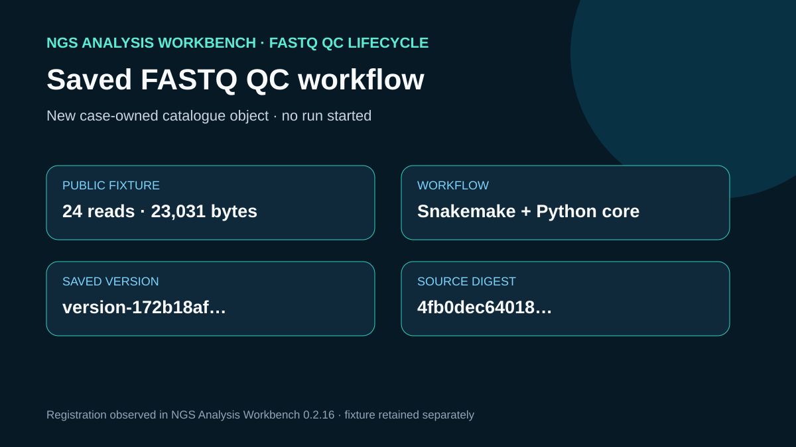

# Saved FASTQ QC workflow

## Scientific question

Can a transparent FASTQ QC definition be registered for reuse while keeping the public reads and generated results outside the saved workflow root?

## Source observations

The retained fixture contains the first 24 complete records from ENA run `DRR037765`. `outputs/fixture-provenance.json` records its 23,031 bytes and SHA-256 identity. Version 1 contains one `Snakefile`, one JSON configuration, and a standard-library Python QC core.

## Workbench observation

`ngs-analysis-workbench.save_workflow` created `showcase_fastq_qc_lifecycle_20260830` as a new user-catalog object. Workbench copied the workflow definition into version `version-172b18afc3346b8b037416f67893a9f5` and reported source digest `sha256:4fb0dec6401816294637a3100800dcebef20c9a8376f3b9e4fa86849864cb2ea`. It did not start a run.

## Rosalind Workbench invocation

The case called `mcp__rosalind__rosalind_open` at 2026-08-29T17:56:41.482Z (2026-08-30 01:56:41.482 +08:00) with the case-specific `task_context` retained in the observation file. The exact response was `Rosalind Workbench is ready. Choose a research task in the app.` with `ready: true` and `view: launcher`.

This operation only opened the Rosalind task chooser. It did not select or execute a Rosalind scientific task and does not support a scientific-result claim. `outputs/rosalind-open-observation.json` retains the exact response and the case-specific context.

## Interpretation

The saved definition keeps the engine instructions reproducible while the FASTQ fixture remains a separate input. Registration confirms catalogue persistence and identity; it does not confirm execution readiness or scientific quality.

## Limitations

- The 24-record fixture is a compact demonstration and cannot represent the complete ENA run.
- Saving a workflow does not validate the controller, task environment, or outputs.
- No sequence transformation, adapter classification, or contamination analysis was performed.

## Reproduce

1. Run `python showcases/ngs-analysis-workbench/cases/ngs-workflow-save/build_cases.py` from the repository root to recreate the fixture and local QC evidence.
2. Inspect `workflow/v1/Snakefile`, `workflow/v1/config/config.json`, and `workflow/v1/scripts/qc_core.py`.
3. Call `ngs-analysis-workbench.save_workflow` with workflow ID `showcase_fastq_qc_lifecycle_20260830`, engine `snakemake`, local root `workflow/v1`, and entrypoint `Snakefile` only when recreating this disposable showcase object.
4. Compare the returned version and digest with `outputs/workbench-save.json`. Do not reuse the identifier when it already exists.

## 2026-08-30 operation evidence review

The current review retains only operations with explicit successful responses as capabilities. The case-specific machine-readable record is `outputs/operation-evidence.json`.

- Successful operations: `ngs-analysis-workbench.list_workflows`, `ngs-analysis-workbench.save_workflow`.
- Failed operations: none.
- Operations not executed: none.
- SSH and runtime responses are stored without private device names, user paths, task identifiers, or credentials.
