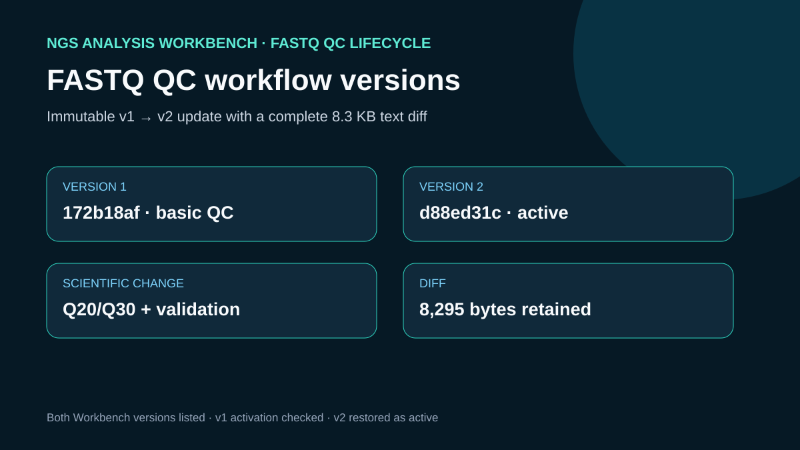

# FASTQ QC workflow versions

## Scientific question

Can a workflow revision add reviewable QC evidence while preserving both immutable Workbench versions and a visible text diff?

## Observed changes

`outputs/workflow-version.diff` compares every versioned workflow file. Version 2 adds configurable Q20/Q30 thresholds, validates the Phred+33 range, records N fraction and mean quality, adds per-read and per-cycle threshold fractions, and emits three local state events when the core runs directly.

## Workbench observations

`update_workflow` created `version-d88ed31c58ebee8c5667ddee257b846f` with digest `sha256:e45290e57e1babf0336acb0fd9a6657f3df69188f501cdbab2d62c806924f0cb`. `list_workflow_versions` returned both immutable versions. The case activated version 1 and then reactivated version 2, which remained the final active version. No run was started.

## Rosalind Workbench invocation

The case called `mcp__rosalind__rosalind_open` at 2026-08-29T17:56:41.522Z (2026-08-30 01:56:41.522 +08:00) with the case-specific `task_context` retained in the observation file. The exact response was `Rosalind Workbench is ready. Choose a research task in the app.` with `ready: true` and `view: launcher`.

This operation only opened the Rosalind task chooser. It did not select or execute a Rosalind scientific task and does not support a scientific-result claim. `outputs/rosalind-open-observation.json` retains the exact response and the case-specific context.

## Interpretation

The revision changes both QC measurements and validation behavior, so it is scientifically meaningful rather than a metadata-only edit. The retained diff explains the change independently of Workbench identifiers.

## Limitations

- The Workbench digest identifies its saved copy; the text diff explains the human-reviewable change.
- Neither version was launched by a workflow engine in this case.
- Additional assay-specific QC would be required before using these metrics for a biological decision.

## Reproduce

1. Run the saved case's `build_cases.py` to recreate `outputs/workflow-version.diff`.
2. Inspect version 1 under `../ngs-workflow-save/workflow/v1` and version 2 under `workflow/v2`.
3. On a fresh disposable workflow, call `update_workflow`, `list_workflow_versions`, and `activate_workflow_version` with the returned identifiers.
4. Confirm that version 2 is active and compare the response with `outputs/workbench-version-lifecycle.json`.

## 2026-08-30 operation evidence review

The current review retains only operations with explicit successful responses as capabilities. The case-specific machine-readable record is `outputs/operation-evidence.json`.

- Successful operations: `ngs-analysis-workbench.update_workflow`, `ngs-analysis-workbench.list_workflow_versions`, `ngs-analysis-workbench.activate_workflow_version`.
- Failed operations: none.
- Operations not executed: none.
- SSH and runtime responses are stored without private device names, user paths, task identifiers, or credentials.
