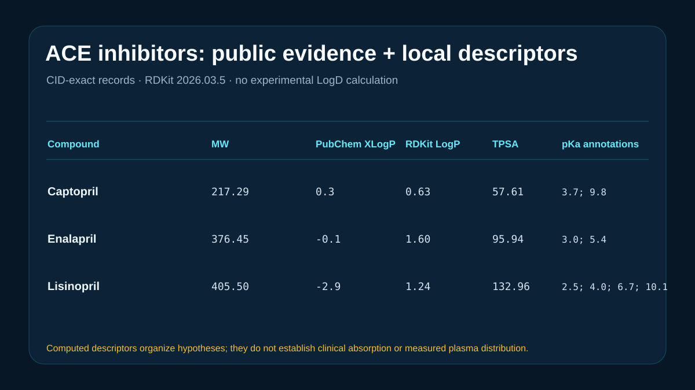

# Codex showcase lesson: ACE inhibitor LogD and pKa

## Session prompt

Use $showcase-teacher to import and teach the ready showcase `rosalind-ace-logd-pka` (ACE inhibitor LogD and pKa). Inspect its README, manifest, prompt, inputs, outputs, previews, and provenance records. Clearly distinguish source observations, computed results, scientific interpretation, and limitations, and show the preview when useful.

## Catalogue record

- Showcase ID: `rosalind-ace-logd-pka`
- Plugin: `rosalind-workbench` (Rosalind Workbench v0.2.2-research-preview)
- Status: `ready`
- Domain: `adme-and-developability`
- Case type: `analysis`
- Difficulty: `intermediate`
- Evidence level: `computed-result`
- Covered operations: `rosalind.rosalind_open`, `rosalind-workbench.public-evidence`
- Rosalind tasks: `predict-ace-inhibitor-logd-pka`
- Actual tools: `Rosalind Workbench mcp__rosalind__rosalind_open`, `PubChem PUG REST`, `Python 3.14`, `RDKit 2026.03.5`
- Summary: How do ionizable groups alter the qualitative property profile of public ACE inhibitors?
- Recorded next step: Recompute the ACE-inhibitor descriptors and ionization review from the exact retained PubChem compound identifiers.
- Plugin guide: `showcases/rosalind-workbench/README.md`

## Repository files to inspect

- case guide: `showcases/rosalind-workbench/cases/rosalind-ace-logd-pka/README.md`
- case manifest: `showcases/rosalind-workbench/cases/rosalind-ace-logd-pka/showcase.json`
- teaching prompt: `showcases/rosalind-workbench/cases/rosalind-ace-logd-pka/prompt.md`
- input: `showcases/rosalind-workbench/cases/rosalind-ace-logd-pka/inputs/public-source.md`
- input: `showcases/rosalind-workbench/cases/rosalind-ace-logd-pka/inputs/compounds.csv`
- input: `showcases/rosalind-workbench/cases/rosalind-ace-logd-pka/scripts/analyze.py`
- output: `showcases/rosalind-workbench/cases/rosalind-ace-logd-pka/outputs/descriptor-comparison.csv`
- output: `showcases/rosalind-workbench/cases/rosalind-ace-logd-pka/outputs/ionization-evidence.csv`
- output: `showcases/rosalind-workbench/cases/rosalind-ace-logd-pka/outputs/result-summary.json`
- output: `showcases/rosalind-workbench/cases/rosalind-ace-logd-pka/outputs/rosalind-open-observation.json`
- output: `showcases/rosalind-workbench/cases/rosalind-ace-logd-pka/outputs/teaching-bundle.md`
- preview: `showcases/rosalind-workbench/cases/rosalind-ace-logd-pka/previews/preview.svg`

## Public sources

- https://pubchem.ncbi.nlm.nih.gov/compound/44093
- https://pubchem.ncbi.nlm.nih.gov/compound/5388962
- https://pubchem.ncbi.nlm.nih.gov/compound/5362119

## Retained case guide

# ACE inhibitor ionization and lipophilicity



## Scientific question

How do ionizable groups and polarity differ among captopril, enalapril, and lisinopril when exact public compound records are combined with transparent local calculations?

## Source observations

- PubChem CIDs are 44093 (captopril), 5388962 (enalapril), and 5362119 (lisinopril).
- PubChem reports XLogP values of 0.3, -0.1, and -2.9 and TPSA values of 58.6, 95.9, and 133.0 Ų, respectively.
- Retained pKa annotations are 3.7/9.8 for captopril, 3.0/5.4 for enalapril, and 2.5/4.0/6.7/10.1 for lisinopril. The exact source notes appear in `inputs/compounds.csv`.
- The lisinopril page also lists -1.01 under LogP at pH 7. The case preserves that label and does not rename it LogD.

## Computed results

`scripts/analyze.py` uses RDKit 2026.03.5 to recompute molecular weight, MolLogP, TPSA, hydrogen-bond counts, rotatable bonds, rings, and fraction sp3. The complete tables are `outputs/descriptor-comparison.csv` and `outputs/ionization-evidence.csv`.

Lisinopril is the most polar member of this set by PubChem TPSA and XLogP. Captopril is the smallest. The macro-pKa values support a qualitative discussion of ionization at physiological pH, while the lisinopril site assignments remain underdetermined from the retained annotation.

## Interpretation

The three structures span markedly different neutral-structure lipophilicity and polarity estimates. These values are useful for organizing chemical hypotheses. They do not establish plasma LogD, membrane permeability, oral absorption, or clinical exposure.

## Rosalind Workbench observation

The genuine `mcp__rosalind__rosalind_open` call at `2026-08-29T17:56:31.299Z` returned `Rosalind Workbench is ready. Choose a research task in the app.` with `ready=true`. The case-specific arguments and exact observed response are retained in `outputs/rosalind-open-observation.json`.

This operation only opens the Rosalind task chooser. It does not prove that an ACE-property scientific task ran; the public records and deterministic local calculations above provide the scientific evidence in this case.

## Limitations

- PubChem XLogP and RDKit MolLogP are computed descriptors.
- A uniform experimental LogD at pH 7.4 was not found for all three records.
- Macro-pKa annotations do not uniquely specify every microspecies in a multi-ionizable compound.
- No formulation, transport, metabolism, permeability, pharmacokinetic, or clinical evidence was calculated.
- The Workbench chooser was opened, while no Rosalind scientific job was executed.

## Reproduce

```powershell
python showcases/rosalind-workbench/cases/rosalind-ace-logd-pka/scripts/analyze.py
```

Then compare `outputs/descriptor-comparison.csv`, `outputs/ionization-evidence.csv`, `outputs/result-summary.json`, `outputs/rosalind-open-observation.json`, and `previews/preview.svg` with the retained files.

## Retained execution prompt

# ACE inhibitor ionization and lipophilicity

Compare captopril, enalapril, and lisinopril using exact PubChem compound records, locally computed RDKit descriptors, and the experimental pKa annotations retained in `inputs/compounds.csv`.

Keep PubChem observations, local calculations, chemical interpretation, and experimental limitations distinct. Do not relabel XLogP or a pH-conditioned value as LogD, and do not infer clinical absorption from molecular descriptors.

Inspect `outputs/rosalind-open-observation.json` as the case-specific record of a genuine Rosalind Workbench `mcp__rosalind__rosalind_open` invocation. State that it opened only the task chooser and did not execute a scientific job; use the local tables as scientific evidence.

## Teaching note

Use this bundle to locate the evidence. Read the listed repository artifacts before presenting scientific claims, and keep observations, calculations, interpretation, and limitations distinct.
