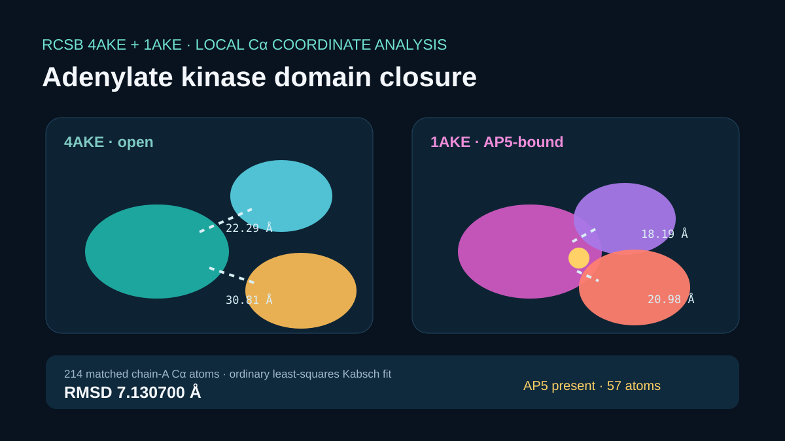

# Codex showcase lesson: Adenylate kinase conformations

## Session prompt

Use $showcase-teacher to import and teach the ready showcase `rosalind-adenylate-kinase` (Adenylate kinase conformations). Inspect its README, manifest, prompt, inputs, outputs, previews, and provenance records. Clearly distinguish source observations, computed results, scientific interpretation, and limitations, and show the preview when useful.

## Catalogue record

- Showcase ID: `rosalind-adenylate-kinase`
- Plugin: `rosalind-workbench` (Rosalind Workbench v0.2.2-research-preview)
- Status: `ready`
- Domain: `structure-and-sequence`
- Case type: `analysis`
- Difficulty: `advanced`
- Evidence level: `multi-tool-result`
- Covered operations: `rosalind-workbench.public-evidence`, `rosalind.rosalind_open`
- Rosalind tasks: none recorded
- Actual tools: `Rosalind Workbench mcp__rosalind__rosalind_open`, `RCSB PDB 4AKE and 1AKE with local Python NumPy Kabsch analysis`
- Summary: How does a paired-structure comparison illustrate open and ligand-bound conformations?
- Recorded next step: Open the case README and inspect the public source, receipt, preview, interpretation, and limitations.
- Plugin guide: `showcases/rosalind-workbench/README.md`

## Repository files to inspect

- case guide: `showcases/rosalind-workbench/cases/rosalind-adenylate-kinase/README.md`
- case manifest: `showcases/rosalind-workbench/cases/rosalind-adenylate-kinase/showcase.json`
- teaching prompt: `showcases/rosalind-workbench/cases/rosalind-adenylate-kinase/prompt.md`
- input: `showcases/rosalind-workbench/cases/rosalind-adenylate-kinase/build_case.py`
- input: `showcases/rosalind-workbench/cases/rosalind-adenylate-kinase/inputs/public-source.md`
- input: `showcases/rosalind-workbench/cases/rosalind-adenylate-kinase/inputs/4AKE.pdb`
- input: `showcases/rosalind-workbench/cases/rosalind-adenylate-kinase/inputs/1AKE.pdb`
- output: `showcases/rosalind-workbench/cases/rosalind-adenylate-kinase/outputs/conformation-summary.json`
- output: `showcases/rosalind-workbench/cases/rosalind-adenylate-kinase/outputs/domain-distance-comparison.csv`
- output: `showcases/rosalind-workbench/cases/rosalind-adenylate-kinase/outputs/provenance.json`
- output: `showcases/rosalind-workbench/cases/rosalind-adenylate-kinase/outputs/rosalind-open-observation.json`
- output: `showcases/rosalind-workbench/cases/rosalind-adenylate-kinase/bundle.md`
- preview: `showcases/rosalind-workbench/cases/rosalind-adenylate-kinase/previews/preview.svg`

## Public sources

- https://www.rcsb.org/structure/4AKE
- https://www.rcsb.org/structure/1AKE
- https://files.rcsb.org/download/4AKE.pdb
- https://files.rcsb.org/download/1AKE.pdb

## Retained case guide

# Adenylate kinase conformational comparison



## Scientific question

How do the public 4AKE open structure and AP5-bound 1AKE structure differ in a transparent chain-A coordinate comparison?

## Public coordinate sources

The case retains pinned RCSB PDB files for 4AKE and 1AKE. Their sizes and SHA-256 values match the repository's independently verified adenylate-kinase example. 4AKE contains 3,459 ATOM/HETATM records; 1AKE contains 3,816. Each chain A contributes 214 Cα atoms, and 1AKE contains 57 primary-conformer AP5 atoms in chain A.

No official Rosalind task describes an adenylate-kinase conformational comparison, so this case has no associated Rosalind task ID. Its recorded Workbench operation is limited to opening the task chooser.

## Executed deterministic analysis

`build_case.py` performs an ordinary least-squares Kabsch fit over all 214 matched chain-A Cα atoms. The resulting RMSD is 7.130700 Å and the maximum Cα residual is 18.336170 Å. This calculation differs from TM-align and is identified as a local coordinate result.

Using CORE residues 1–29, 60–121, and 160–214; NMP residues 30–59; and LID residues 122–159:

| Structure state | CORE–NMP centroid distance | CORE–LID centroid distance |
|---|---:|---:|
| 4AKE open | 22.287398 Å | 30.806052 Å |
| 1AKE AP5-bound after global fit | 18.185715 Å | 20.978079 Å |

The shorter domain-centroid distances in 1AKE describe closure in these coordinates. They are not binding, kinetic, or energetic measurements.

## Observed Rosalind Workbench invocation

`mcp__rosalind__rosalind_open` was genuinely invoked at `2026-08-29T18:20:51.563Z`. The exact response was `Rosalind Workbench is ready. Choose a research task in the app.` with `ready=true`. The 914-byte `outputs/rosalind-open-observation.json` retains the case-specific arguments, timestamps, response, and `scientific_job_executed=false`.

The launcher call did not receive either PDB file. The retained coordinate files and local NumPy calculation support the structural results.

## Limitations

- The all-correspondence Kabsch RMSD is sensitive to large domain motion and is distinct from a fold-aware TM-align score.
- Domain definitions are explicit teaching definitions and should be reviewed for another biological question.
- No Rosalind structure analysis, molecular simulation, binding experiment, or wet-lab procedure was executed.

## Reproduce

```powershell
python showcases/rosalind-workbench/cases/rosalind-adenylate-kinase/build_case.py
python scripts/showcase_session.py bundle rosalind-adenylate-kinase --output showcases/rosalind-workbench/cases/rosalind-adenylate-kinase/bundle.md
```

The script verifies both source digests, 214 matched Cα atoms, AP5 presence, output JSON, and the tabular domain distances.

## Retained execution prompt

# Adenylate kinase conformational comparison

Verify the retained RCSB 4AKE and 1AKE files, perform the documented 214-Cα Kabsch fit, and report RMSD, maximum residual, AP5 presence, and the CORE–NMP and CORE–LID centroid distances for both states. Distinguish coordinate observations from structural interpretation. No official Rosalind task ID corresponds to this adenylate-kinase comparison. Invoke `mcp__rosalind__rosalind_open` only to open the task chooser; cite the exact 914-byte `outputs/rosalind-open-observation.json` and state that neither structure was submitted to Rosalind.

## Teaching note

Use this bundle to locate the evidence. Read the listed repository artifacts before presenting scientific claims, and keep observations, calculations, interpretation, and limitations distinct.
