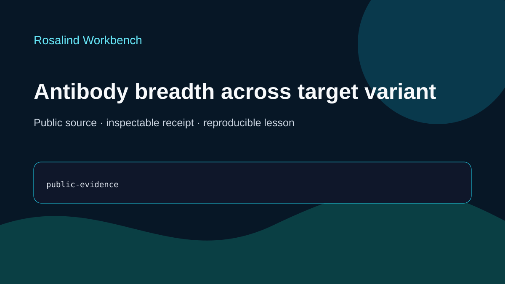

# Codex showcase lesson: Antibody breadth across target variants

## Session prompt

Use $showcase-teacher to import and teach the ready showcase `rosalind-antibody-breadth` (Antibody breadth across target variants). Inspect its README, manifest, prompt, inputs, outputs, previews, and provenance records. Clearly distinguish source observations, computed results, scientific interpretation, and limitations, and show the preview when useful.

## Catalogue record

- Showcase ID: `rosalind-antibody-breadth`
- Plugin: `rosalind-workbench` (Rosalind Workbench v0.2.2-research-preview)
- Status: `ready`
- Domain: `protein-and-antibody-design`
- Case type: `analysis`
- Difficulty: `advanced`
- Evidence level: `multi-tool-result`
- Covered operations: `rosalind.rosalind_open`
- Rosalind tasks: none recorded
- Actual tools: `UniProt public source sufficiency review`, `Rosalind Workbench mcp__rosalind__rosalind_open`
- Summary: Which conserved target residues should be retained when proposing broader antibody recognition?
- Recorded next step: Test whether the retained UniProt records are sufficient for residue-conservation claims before proposing broader recognition.
- Plugin guide: `showcases/rosalind-workbench/README.md`

## Repository files to inspect

- case guide: `showcases/rosalind-workbench/cases/rosalind-antibody-breadth/README.md`
- case manifest: `showcases/rosalind-workbench/cases/rosalind-antibody-breadth/showcase.json`
- teaching prompt: `showcases/rosalind-workbench/cases/rosalind-antibody-breadth/prompt.md`
- input: `showcases/rosalind-workbench/cases/rosalind-antibody-breadth/inputs/public-source.md`
- output: `showcases/rosalind-workbench/cases/rosalind-antibody-breadth/outputs/verification-receipt.json`
- output: `showcases/rosalind-workbench/cases/rosalind-antibody-breadth/outputs/provenance.json`
- output: `showcases/rosalind-workbench/cases/rosalind-antibody-breadth/outputs/rosalind-open-observation.json`
- output: `showcases/rosalind-workbench/cases/rosalind-antibody-breadth/outputs/session-bundle.md`
- preview: `showcases/rosalind-workbench/cases/rosalind-antibody-breadth/previews/preview.svg`

## Public sources

- https://www.uniprot.org/
- installed-plugin://rosalind-workbench/tool-contract

## Retained case guide

# Antibody breadth across target variants

This ready teaching case demonstrates how to test whether public evidence is specific enough for a residue-conservation claim. The retained materials do not define a target or support antibody design.

## Scientific question

Which conserved target residues should be retained when proposing broader antibody recognition?

## Source observations

- The retained source is the UniProt service homepage.
- No target accession, sequence version, variant set, alignment, residue mapping, antibody record, or experimental breadth measurement is retained.
- Consequently, the current artifacts do not support a reproducible claim about conserved target residues.

The dated, case-specific source-sufficiency review is stored in `outputs/verification-receipt.json`; acquisition details are in `inputs/public-source.md`.

## Rosalind Workbench observation

One genuine `mcp__rosalind__rosalind_open` call was made with this case's task context at `2026-08-29T18:23:14.162Z`. It returned `Rosalind Workbench is ready. Choose a research task in the app.` with `ready=true`. Exact arguments, UTC and local timestamps, and `scientific_job_executed=false` are retained in `outputs/rosalind-open-observation.json` and cited by `outputs/provenance.json`.

The launcher observation establishes only that the task chooser was ready. It does not establish a scientific run and supplied no target, sequence comparison, conservation calculation, or antibody result.

## Interpretation

This case makes absence of evidence inspectable. A defensible breadth analysis would first need named public targets and variants, stable sequence versions, an explicit comparison method, residue mapping, and orthogonal binding measurements.

## Reproduce

1. Read `prompt.md` and `inputs/public-source.md`.
2. Confirm that the retained source lacks the identifiers and artifacts needed for a residue-level claim.
3. Verify `outputs/rosalind-open-observation.json` separately from the source-sufficiency review.
4. Use `outputs/session-bundle.md` as the teaching index and review the preview.

## Limitations

- No target protein, pathogen, antibody, or variant set is identified.
- No sequence analysis or experimental breadth assessment was performed.
- The case supports a reproducibility lesson and no biological design conclusion.

## Retained execution prompt

# Antibody breadth across target variants

Audit the retained evidence for the proposed antibody-breadth question. Identify which target accessions, sequence versions, variant definitions, alignment method, residue mapping, and experimental measurements would be required before any conservation claim could be reproduced. Do not create, mutate, optimize, rank, or propose antibody or target sequences.

Cite `outputs/verification-receipt.json` for the case-specific source-sufficiency review and `outputs/rosalind-open-observation.json` for the genuine case-specific `mcp__rosalind__rosalind_open` response. The launcher observation records only a ready task chooser and does not establish that a scientific job ran.

## Teaching note

Use this bundle to locate the evidence. Read the listed repository artifacts before presenting scientific claims, and keep observations, calculations, interpretation, and limitations distinct.
